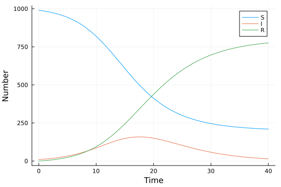

# Ordinary differential equation model using ModelingToolkit
Simon Frost (@sdwfrost), 2020-05-04

## Introduction

The classical ODE version of the SIR model is:

- Deterministic
- Continuous in time
- Continuous in state

This version, unlike the 'vanilla' ODE version, uses [ModelingToolkit](https://mtk.sciml.ai/). For small problems such as this, it doesn't make much of a difference for compute time, but it is a little more expressive and lends itself to extending a little better.

## Libraries

```julia
using DifferentialEquations
using ModelingToolkit
using OrdinaryDiffEq
using DataFrames
using StatsPlots
using BenchmarkTools
```


## Transitions

```julia
@parameters t β c γ
@variables S(t) I(t) R(t)
D = Differential(t)
N=S+I+R # This is recognized as a derived variable
eqs = [D(S) ~ -β*c*I/N*S,
       D(I) ~ β*c*I/N*S-γ*I,
       D(R) ~ γ*I];
```


```julia
@named sys = ODESystem(eqs);
```


## Time domain

We set the timespan for simulations, `tspan`.

```julia
δt = 0.1
tmax = 40.0
tspan = (0.0,tmax)
t = 0.0:δt:tmax;
```


## Initial conditions

In `ModelingToolkit`, the initial values are defined by a dictionary.

```julia
u0 = [S => 990.0,
      I => 10.0,
      R => 0.0];
```


## Parameter values

Similarly, the parameter values are also defined by a dictionary.

```julia
p = [β=>0.05,
     c=>10.0,
     γ=>0.25];
```


## Running the model

```julia
prob = ODEProblem(sys, u0, tspan, p; jac=true);
```


If we use `DifferentialEquations.jl`, we don't need to specify a solver, the package will choose it for us.

```julia
sol = solve(prob);
```


We can check which solver was chosen as follows.

```julia
sol.alg
```

```
OrdinaryDiffEq.CompositeAlgorithm{Tuple{OrdinaryDiffEq.Tsit5{typeof(Ordinar
yDiffEq.trivial_limiter!), typeof(OrdinaryDiffEq.trivial_limiter!), Static.
False}, OrdinaryDiffEq.Rosenbrock23{3, false, LinearSolve.GenericLUFactoriz
ation{LinearAlgebra.RowMaximum}, typeof(OrdinaryDiffEq.DEFAULT_PRECS), Val{
:forward}, true, nothing}}, OrdinaryDiffEq.AutoSwitchCache{OrdinaryDiffEq.T
sit5{typeof(OrdinaryDiffEq.trivial_limiter!), typeof(OrdinaryDiffEq.trivial
_limiter!), Static.False}, OrdinaryDiffEq.Rosenbrock23{0, false, Nothing, t
ypeof(OrdinaryDiffEq.DEFAULT_PRECS), Val{:forward}, true, nothing}, Rationa
l{Int64}, Int64}}((Tsit5(stage_limiter! = trivial_limiter!, step_limiter! =
 trivial_limiter!, thread = static(false)), OrdinaryDiffEq.Rosenbrock23{3, 
false, LinearSolve.GenericLUFactorization{LinearAlgebra.RowMaximum}, typeof
(OrdinaryDiffEq.DEFAULT_PRECS), Val{:forward}, true, nothing}(LinearSolve.G
enericLUFactorization{LinearAlgebra.RowMaximum}(LinearAlgebra.RowMaximum())
, OrdinaryDiffEq.DEFAULT_PRECS)), OrdinaryDiffEq.AutoSwitchCache{OrdinaryDi
ffEq.Tsit5{typeof(OrdinaryDiffEq.trivial_limiter!), typeof(OrdinaryDiffEq.t
rivial_limiter!), Static.False}, OrdinaryDiffEq.Rosenbrock23{0, false, Noth
ing, typeof(OrdinaryDiffEq.DEFAULT_PRECS), Val{:forward}, true, nothing}, R
ational{Int64}, Int64}(-17, 17, Tsit5(stage_limiter! = trivial_limiter!, st
ep_limiter! = trivial_limiter!, thread = static(false)), OrdinaryDiffEq.Ros
enbrock23{0, false, Nothing, typeof(OrdinaryDiffEq.DEFAULT_PRECS), Val{:for
ward}, true, nothing}(nothing, OrdinaryDiffEq.DEFAULT_PRECS), false, 10, 3,
 9//10, 9//10, 2, false, 5))
```


## Post-processing

We can convert the output to a dataframe for convenience.

```julia
df = DataFrame(sol(t))
rename!(df, [:t, :S, :I, :R]);
```


## Plotting

We can now plot the results.

```julia
@df df plot(:t,
    [:S :I :R],
    xlabel="Time",
    ylabel="Number")
```




## Benchmarking

```julia
@benchmark solve(prob)
```

```
BenchmarkTools.Trial: 10000 samples with 1 evaluation.
 Range (min … max):  22.833 μs …  10.160 ms  ┊ GC (min … max): 0.00% … 99.2
0%
 Time  (median):     24.250 μs               ┊ GC (median):    0.00%
 Time  (mean ± σ):   26.460 μs ± 143.073 μs  ┊ GC (mean ± σ):  7.62% ±  1.4
1%

          ▁ ▂▂█▄▄▄▂▆▁▁ ▁                                        
  ▂▂▂▂▃▃▄▆████████████▇█▅▅▄▄▃▃▃▃▃▂▂▂▂▂▂▂▂▂▂▂▂▂▂▂▂▂▂▂▂▂▂▂▂▂▁▂▂▂ ▃
  22.8 μs         Histogram: frequency by time         28.4 μs <

 Memory estimate: 33.22 KiB, allocs estimate: 280.
```


