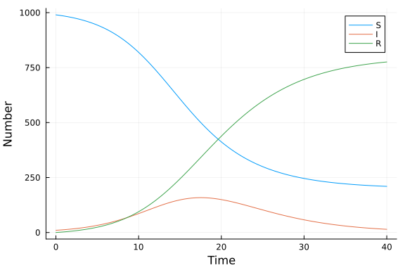
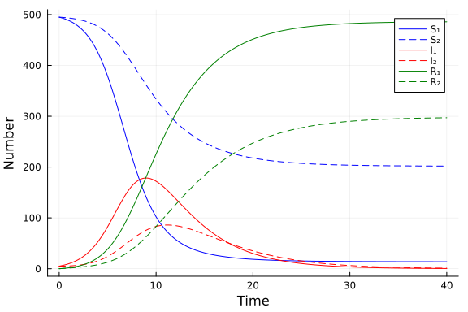

# A multigroup SIR ODE model
Simon Frost (@sdwfrost), 2023-02-15

## Introduction

The standard SIR model assumes that all individuals are identical; a more realistic approach is to consider multiple groups of individuals with different characteristics, such as different ages, contact rates, etc.. Here, we consider an SIR model with `K` groups, with proportionate mixing between the groups. See [Jacquez et al.](https://doi.org/10.1016/0025-5564(88)90031-4) for more details on different mixing patterns with simple parameterizations. We use [ModelingToolkit.jl](https://github.com/SciML/ModelingToolkit.jl) to compactly describe a multigroup model, demonstrating how to build and solve an ODE system, and to process the output.

## Libraries

```julia
using ModelingToolkit
using OrdinaryDiffEq
using Plots;
```


## Transitions

For simplicity, we will set the number of groups, `K`, to 2 to illustrate the model, although most of the below code does not depend on a specific value of `K`.

```julia
K = 2;
```


This is an ODE system, so we have a single independent variable and differential operator.

```julia
@parameters t
D = Differential(t);
```


In this extended SIR model, we assume that each group `i` has it's own contact rate, `c[i]`. The infection probability, `β`, and the recovery rate, `γ`, are assumed to be the same across groups, although it is straightforward to drop this assumption.

```julia
@parameters t β c[1:K] γ;
```


Next, we create equations for `S`, `I`, and `R` for each of our `K` groups. To keep the notation simple, we employ a group-specific force of infection, `λ`.

```julia
@variables (S(t))[1:K] (I(t))[1:K] (R(t))[1:K] (λ(t))[1:K]
state_eqs = [
       [D(S[i]) ~ -λ[i]*S[i],
        D(I[i]) ~ λ[i]*S[i]-γ*I[i],
        D(R[i]) ~ γ*I[i]]
            for i in 1:K]
# Turn into a 1D vector
state_eqs = vcat(state_eqs...);
```


We will assume proportionate mixing between groups i.e. the group-specific contacts weighted by the group size. For this, we need to define the total size of each group, `N[i]`, the group-specific contact rates, `c[i]`, and the proportion of contacts between groups `i` and `j`, `p[i,j]`.

```julia
@variables (N(t))[1:K] (p(t))[1:K,1:K]
variable_eqs = [
               [N[i] ~ S[i]+I[i]+R[i] for i in 1:K]...,
               [λ[i] ~ sum([β*c[i]*p[i,j]*I[j]/N[j] for j in 1:K]) for i in 1:K]...,
             [p[i,j] ~ c[j]*N[j]/sum([c[k]*N[k] for k in 1:K]) for j in 1:K for i in 1:K]...
               ];
```


We can now combine these equations to form an `ODESystem`.

```julia
@named sys = ODESystem([state_eqs;variable_eqs])
```

```
Model sys with 14 equations
States (14):
  (S(t))[1]
  (I(t))[1]
  (R(t))[1]
  (S(t))[2]
⋮
Parameters (4):
  γ
  c[1]
  β
  c[2]
```


This system is overspecified - we defined the intermediate variables `N`, `λ`, and `p` to make the models easier to write. We simplify the system as follows.

```julia
simpsys = structural_simplify(sys)
```

```
Model sys with 6 equations
States (6):
  (S(t))[1]
  (I(t))[1]
  (R(t))[1]
  (S(t))[2]
⋮
Parameters (4):
  γ
  c[1]
  β
  c[2]
Incidence matrix:6×12 SparseArrays.SparseMatrixCSC{Symbolics.Num, Int64} wi
th 32 stored entries:
 ×  ×  ×  ×  ×  ×  ×  ⋅  ⋅  ⋅  ⋅  ⋅
 ×  ×  ×  ×  ×  ×  ⋅  ×  ⋅  ⋅  ⋅  ⋅
 ⋅  ×  ⋅  ⋅  ⋅  ⋅  ⋅  ⋅  ×  ⋅  ⋅  ⋅
 ×  ×  ×  ×  ×  ×  ⋅  ⋅  ⋅  ×  ⋅  ⋅
 ×  ×  ×  ×  ×  ×  ⋅  ⋅  ⋅  ⋅  ×  ⋅
 ⋅  ⋅  ⋅  ⋅  ×  ⋅  ⋅  ⋅  ⋅  ⋅  ⋅  ×
```


This recovers the correct (3K) number of equations.

## Times, initial conditions and parameters

For this example, we'll set the population sizes and composition to be identical across groups.

```julia
u₀ = [[S[i] => 990.0/K for i in 1:K]...,
      [I[i] => 10.0/K for i in 1:K]...,
      [R[i] => 0.0 for i in 1:K]...];
```


Initially, we'll set all contact rates to be the same.

```julia
p = [β=>0.05, [c[i]=>10.0 for i in 1:K]..., γ=>0.25];
```


Finally, we set the timespan for the simulation.

```julia
δt = 0.1
tmax = 40.0
tspan = (0.0,tmax);
```


## Running the model

We solve the (simplified) problem as usual.

```julia
prob = ODEProblem(simpsys, u₀, tspan, p)
sol = solve(prob, Tsit5(), saveat=δt);
```


## Result processing

The above will generate a 3K × T matrix, where T is the number of timesteps (including the initial state). To recover the population totals of `S`, `I`, and `R`, we need to sum states across the rows of this matrix. The symbolic manipulations above necessitate the use of some extra code to match up the model symbols with the indices of this matrix. First, we extract the states of the system.

```julia
all_states = states(simpsys)
```

```
6-element Vector{Any}:
 (S(t))[1]
 (I(t))[1]
 (R(t))[1]
 (S(t))[2]
 (I(t))[2]
 (R(t))[2]
```


Next, we identify which of these states correspond to susceptible, infected, and recovered individuals.

```julia
indexof(sym,syms) = findfirst(isequal(sym),syms)
S_indexes = [indexof(S[k],all_states) for k in 1:K]
I_indexes = [indexof(I[k],all_states) for k in 1:K]
R_indexes = [indexof(R[k],all_states) for k in 1:K];
```


The following code produces separate matrices for susceptible, infected, and recovered individuals from the solution.

```julia
Smat = sol[S_indexes,:]
Imat = sol[I_indexes,:]
Rmat = sol[R_indexes,:];
```


Summing these matrices up at each timepoint gives the total numbers.

```julia
Stotal = sum(Smat,dims=1)'
Itotal = sum(Imat,dims=1)'
Rtotal = sum(Rmat,dims=1)';
```


## Plotting

```julia
times = sol.t
plot(times, Stotal, label="S", xlabel="Time", ylabel="Number")
plot!(times, Itotal, label="I")
plot!(times, Rtotal, label="R")
```




## Different contact rates

The above recovers the standard well-mixed, homogenous SIR model. With a multigroup model, we can set different contact rates per group; this will lead to a different mixing matrix, `p[i,j]` as a consequence of the proportionate mixing assumption.

```julia
p2 = [β=>0.05, c[1] => 20, c[2] => 5, γ=>0.25]
prob2 = remake(prob, p=p2)
sol2 = solve(prob2, Tsit5(), saveat=δt);
```


```julia
plot(times, sol2(times, idxs=S_indexes)', labels=["S₁" "S₂"], linecolor=:blue, linestyle=[:solid :dash])
plot!(times, sol2(times, idxs=I_indexes)', labels=["I₁" "I₂"], linecolor=:red, linestyle=[:solid :dash])
plot!(times, sol2(times, idxs=R_indexes)', labels=["R₁" "R₂"], linecolor=:green, linestyle=[:solid :dash])
xlabel!("Time")
ylabel!("Number")
```




This demonstrates the more rapid dynamics in the high-contact group.