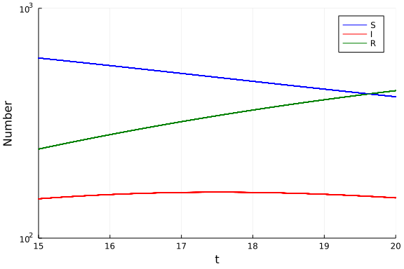
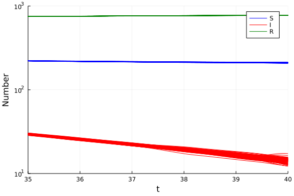

# Ordinary differential equation model with probabilistic integration using DiffEqUncertainty.jl
Simon Frost (@sdwfrost), 2022-02-23

## Introduction

The classical ODE version of the SIR model is:

- Deterministic
- Continuous in time
- Continuous in state

Integration of an ODE is subject to error; one way to capture this error is by probabilistic integration. This tutorial shows how to apply probabilistic integration to an ODE model using the [DiffEqUncertainty.jl](https://diffeq.sciml.ai/dev/analysis/uncertainty_quantification/) package. This package can also accommodate uncertainty in stochastic differential equations and delay differential equations.

## Libraries

```julia
using OrdinaryDiffEq
using DiffEqUncertainty
using DiffEqCallbacks
using Statistics
using Random
using Plots
using BenchmarkTools
```


## Transitions

The following function provides the derivatives of the model, which it changes in-place. State variables and parameters are unpacked from `u` and `p`.

```julia
function sir_ode!(du,u,p,t)
    (S,I,R) = u
    (β,c,γ) = p
    N = S+I+R
    @inbounds begin
        du[1] = -β*c*I/N*S
        du[2] = β*c*I/N*S - γ*I
        du[3] = γ*I
    end
    nothing
end;
```


## Callbacks

When we convert the ODE system to an SDE, it is possible for the stochastic jumps to result in negative numbers of infected individuals, which will throw an error. A `ContinuousCallback` is added that resets infected individuals, `I`, to zero if `I` becomes negative.

```julia
function condition(u,t,integrator) # Event when event_f(u,t) == 0
  u[2]
end;
```


```julia
function affect!(integrator)
  integrator.u[2] = 0.0
end;
```


```julia
positive_cb = ContinuousCallback(condition,affect!);
```


## Time domain

We set the timespan for simulations, `tspan`, initial conditions, `u0`, and parameter values, `p`.

```julia
tmax = 40.0
tspan = (0.0,tmax);
```


## Initial conditions

```julia
u0 = [990.0,10.0,0.0]; # S,I,R
```


## Parameter values

```julia
p = [0.05,10.0,0.25]; # β,c,γ
```


## Random number seed

```julia
Random.seed!(1234);
```


## Running the model

```julia
prob_ode = ODEProblem(sir_ode!, u0, tspan, p);
```


To use probabilistic integration with models from the `DifferentialEquations.jl` ecosystem, we first define a callback function that runs alongside our solver. We need to specify a numerical order (e.g. 4 if using a 4th order solver, e.g. `ROS34PW3`), but the callback will automatically determine the noise level introduced by the solver.

```julia
probint_cb_4th = AdaptiveProbIntsUncertainty(4);
```


The probint callback is applied to the ODE by specifying an `EnsembleProblem`. This involves the transformation of an ODE into an associated SDE where the noise is related to the timesteps and the order of the algorithm.

```julia
num_samples = 100
ensemble_prob_ode = EnsembleProblem(prob_ode)
```

```
EnsembleProblem with problem ODEProblem
```


We'll try the `ROS34PW3` solver from the `OrdinaryDiffEq.jl` package; SIR models are typically stiff problems, and solvers well suited for such problems are expected to have better accuracy.

```julia
samples_ode = solve(ensemble_prob_ode,
                             ROS34PW3(),
                             trajectories=num_samples,
                             callback=CallbackSet(positive_cb,probint_cb_4th));
```


## Post-processing

This computes the mean and standard deviation of the states at `t=20.0`.

```julia
s20 = [s(20.0) for s in samples_ode]
[[mean([s[i] for s in s20]) for i in 1:3] [std([s[i] for s in s20]) for i in 1:3]]
```

```
3×2 Matrix{Float64}:
 412.172  0.154427
 149.721  0.107043
 438.141  0.216379
```


## Plotting

We can now plot the results; first the solution of the ODE, then a sample of trajectories from the SDE associated with the error in the integration.

```julia
p = plot(samples_ode[1],
     label=["S" "I" "R"],
     color=[:blue :red :green],
     xlabel="Time",
     ylabel="Number")
for i in 2:num_samples
    plot!(p,
          samples_ode[i],
          label="",
          color=[:blue :red :green])
end;
```


The error becomes higher for `I` towards the end of the timespan, when the numbers become low.

```julia
plot(p,yaxis=:log10,xlim=(15,20),ylim=(100,1000))
```



```julia
plot(p,yaxis=:log10,xlim=(35,40),ylim=(10,1000))
```




## Benchmarking

```julia
@benchmark solve(ensemble_prob_ode,
                 ROS34PW3(),
                 trajectories=100,
                 callback=CallbackSet(positive_cb,probint_cb_4th))
```

```
BenchmarkTools.Trial: 255 samples with 1 evaluation.
 Range (min … max):  16.873 ms … 40.708 ms  ┊ GC (min … max): 0.00% … 50.40
%
 Time  (median):     18.968 ms              ┊ GC (median):    0.00%
 Time  (mean ± σ):   19.603 ms ±  4.529 ms  ┊ GC (mean ± σ):  4.91% ± 10.78
%

  ▁▆   ▅█                                                      
  ██▆▄▅███▅▃▃▁▁▃▁▁▁▁▁▁▁▁▁▁▁▁▁▁▁▁▁▁▁▁▁▁▁▁▁▁▁▁▁▁▁▁▁▁▁▁▁▁▁▂▂▁▃▂▃ ▃
  16.9 ms         Histogram: frequency by time        38.8 ms <

 Memory estimate: 8.05 MiB, allocs estimate: 86528.
```


