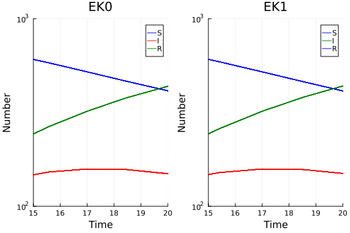
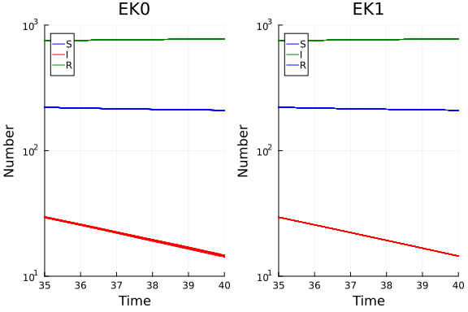

# Ordinary differential equation model with probabilistic integration using ProbNumDiffEq.jl
Simon Frost (@sdwfrost), 2022-02-23

## Introduction

The classical ODE version of the SIR model is:

- Deterministic
- Continuous in time
- Continuous in state

Integration of an ODE is subject to error; one way to capture this error is by probabilistic integration. This tutorial shows how to apply probabilistic integration to an ODE model using solvers from the [ProbNumDiffEq.jl](https://github.com/nathanaelbosch/ProbNumDiffEq.jl) package.

## Libraries

```julia
using ProbNumDiffEq
using Random
using Statistics
using Plots
using BenchmarkTools
```


## Transitions

The following function provides the derivatives of the model, which it changes in-place. State variables and parameters are unpacked from `u` and `p`; this incurs a slight performance hit, but makes the equations much easier to read.

```julia
function sir_ode!(du,u,p,t)
    (S,I,R) = u
    (β,c,γ) = p
    N = S+I+R
    @inbounds begin
        du[1] = -β*c*I/N*S
        du[2] = β*c*I/N*S - γ*I
        du[3] = γ*I
    end
    nothing
end;
```


## Time domain

We set the timespan for simulations, `tspan`, initial conditions, `u0`, and parameter values, `p`.

```julia
δt = 0.1
tmax = 40.0
tspan = (0.0,tmax);
```


## Initial conditions

```julia
u0 = [990.0,10.0,0.0]; # S, I, R
```


## Parameter values

```julia
p = [0.05,10.0,0.25]; # β, c, γ
```


## Random number seed

```julia
Random.seed!(1234);
```


## Running the model

```julia
prob = ODEProblem(sir_ode!, u0, tspan, p);
```


To use probabilistic integration, we just use one of the solvers from ProbNumDiffEq.jl. We'll use the `EK0` and the `EK1` solvers to compare their output. More information on the solvers can be found [here](https://nathanaelbosch.github.io/ProbNumDiffEq.jl/dev/solvers/).

```julia
sol_ek0 = solve(prob,
                EK0(prior=IWP(3), order=3, diffusionmodel=DynamicDiffusion(), smooth=true),
                dt=δt,
                abstol=1e-1,
                reltol=1e-2);
```


```julia
sol_ek1 = solve(prob,
                EK1(prior=IWP(3), order=3, diffusionmodel=DynamicDiffusion(), smooth=true),
                dt=δt,
                abstol=1e-1,
                reltol=1e-2);
```


## Post-processing

We can look at the mean and standard deviation by examining the `pu` field of the solution. The following gives the mean and covariance of `S`, `I`, and `R` at `t=20.0` for the two solvers.

```julia
s20_ek0 = sol_ek0(20.0)
mean(s20_ek0),cov(s20_ek0)
```

```
([412.3272415762977, 149.70107409364672, 437.9716843300547], 3x3 PSDMatrice
s.PSDMatrix{Float64, Matrix{Float64}}; R=[0.09502662562019484 0.0 0.0; 0.0 
0.0 0.0; … ; 0.0 0.0 0.0; 0.0 0.0 0.0])
```


```julia
s20_ek1 = sol_ek1(20.0)
mean(s20_ek1),cov(s20_ek1)
```

```
([412.1653392432258, 149.72708387675203, 438.10900691480066], 3x3 PSDMatric
es.PSDMatrix{Float64, Matrix{Float64}}; R=[-0.06811469048663515 0.015699730
101940465 0.044028396379241; 0.0 -0.029494698100947687 0.01113759904940917;
 … ; 0.0 0.0 0.0; 0.0 0.0 0.0])
```


We can also take samples from the trajectory using `ProbNumDiffEq.sample`.

```julia
num_samples = 100
samples_ek0 = ProbNumDiffEq.sample(sol_ek0, num_samples);
samples_ek1 = ProbNumDiffEq.sample(sol_ek1, num_samples);
```


## Plotting

We can now plot the results; there is a default plotting method (e.g. using `plot(sol_ek1)`), but the below accentuates the differences between samples (although it is low in this case, even on a log scale).

```julia
p_ek0 = plot(sol_ek0.t,
         samples_ek0[:, :, 1],
         label=["S" "I" "R"],
         color=[:blue :red :green],
         xlabel="Time",
         ylabel="Number",
         title="EK0")
for i in 2:num_samples
    plot!(p_ek0,
          sol_ek0.t,
          samples_ek0[:, :, i],
          label="",
          color=[:blue :red :green])
end;
```


```julia
p_ek1 = plot(sol_ek1.t,
         samples_ek1[:, :, 1],
         label=["S" "I" "R"],
         color=[:blue :green],
         xlabel="Time",
         ylabel="Number",
         title="EK1")
for i in 2:num_samples
    plot!(p_ek1,
          sol_ek1.t,
          samples_ek1[:, :, i],
          label="",
          color=[:blue :red :green],)
end;
```


This shows the simulations around the peak.

```julia
plot(p_ek0, p_ek1, layout = (1,2), xlim=(15,20), ylim=(100,1000), yaxis=:log10)
```




This shows the simulations around the end of the timespan.

```julia
plot(p_ek0, p_ek1, layout = (1,2), xlim=(35,40), ylim=(10,1000), yaxis=:log10)
```




## Benchmarking

```julia
@benchmark solve(prob,
                 EK0(prior=IWP(3), order=3, diffusionmodel=DynamicDiffusion(), smooth=true),
                 abstol=1e-1,
                 reltol=1e-2)
```

```
BenchmarkTools.Trial: 2390 samples with 1 evaluation.
 Range (min … max):  1.944 ms …  13.459 ms  ┊ GC (min … max): 0.00% … 83.89
%
 Time  (median):     2.076 ms               ┊ GC (median):    0.00%
 Time  (mean ± σ):   2.090 ms ± 398.394 μs  ┊ GC (mean ± σ):  0.67% ±  2.97
%

                                            ▄▇██▇▆▅▃▁▁        ▁
  ▄▁▄▅▅▄▅▁▄▁▁▁▁▁▁▁▁▁▁▁▄▄▇▇▇▆▆▄▄▁▄▄▁▄▄▄▄▄▁▁▅████████████▇▅▅▆▅▇ █
  1.94 ms      Histogram: log(frequency) by time      2.12 ms <

 Memory estimate: 319.02 KiB, allocs estimate: 1757.
```


```julia
@benchmark solve(prob,
                 EK1(prior=IWP(3), order=3, diffusionmodel=DynamicDiffusion(), smooth=true),
                 abstol=1e-1,
                 reltol=1e-2)
```

```
BenchmarkTools.Trial: 2640 samples with 1 evaluation.
 Range (min … max):  1.758 ms …  13.903 ms  ┊ GC (min … max): 0.00% … 86.00
%
 Time  (median):     1.878 ms               ┊ GC (median):    0.00%
 Time  (mean ± σ):   1.891 ms ± 397.595 μs  ┊ GC (mean ± σ):  0.70% ±  2.88
%

                    ▁▁            ▂▅▇██▇▆▅▄▃▂▂▁▂              ▁
  ▆▇█▇▇▆▁▅▁▄▁▄▅▁▁▁▇████▇▆▅▅▆▇▆▄▄▅▄███████████████▆▇▆▆▇▅▆▇▆▄▆▆ █
  1.76 ms      Histogram: log(frequency) by time      1.95 ms <

 Memory estimate: 282.69 KiB, allocs estimate: 1567.
```


