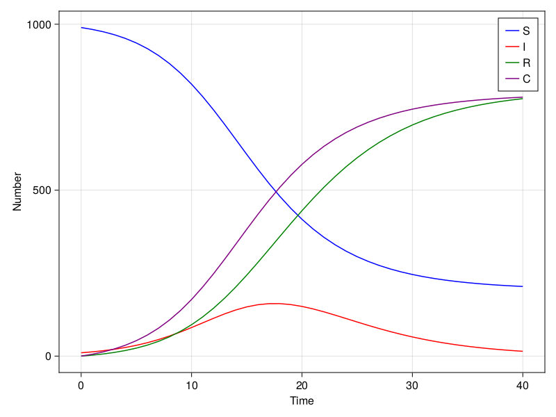
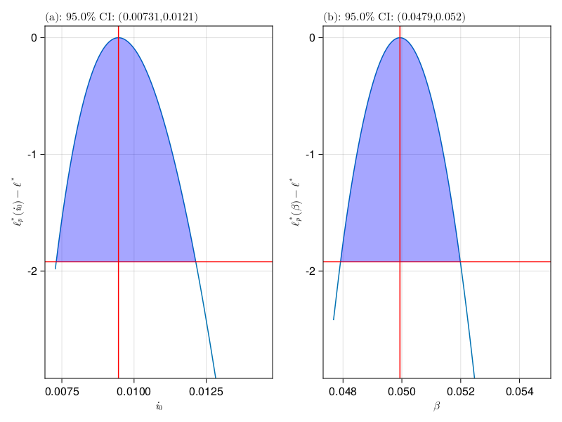
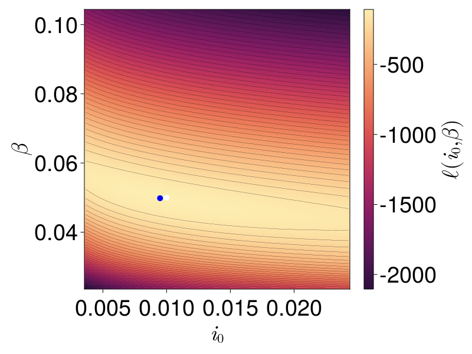
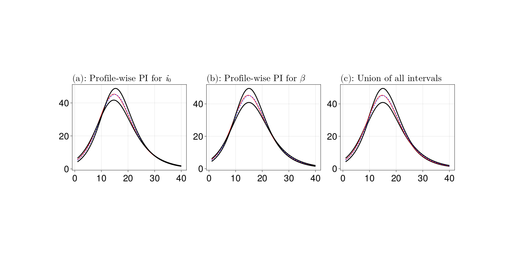

# Ordinary differential equation model with profile likelihood using ProfileLikelihood.jl
Simon Frost (@sdwfrost), 2022-12-22

## Introduction

The classical ODE version of the SIR model is:

- Deterministic
- Continuous in time
- Continuous in state

In this notebook, we try to infer the parameter values from a simulated dataset using [profile likelihood](https://en.wikipedia.org/wiki/Likelihood_function#Profile_likelihood) to capture uncertainty in parameter estimates, using [ProfileLikelihood.jl](https://github.com/DanielVandH/ProfileLikelihood.jl).

## Libraries

```julia
using OrdinaryDiffEq
using ProfileLikelihood
using StatsFuns
using Random
using Distributions
using Optimization
using OptimizationOptimJL
using QuasiMonteCarlo
using CairoMakie
using LaTeXStrings
using DataFrames
```


## Transitions

The following function provides the derivatives of the model, which it changes in-place. A variable is included for the cumulative number of infections, $C$.

```julia
function sir_ode!(du, u, p, t)
    (S, I, R, C) = u
    (β, c, γ) = p
    N = S+I+R
    infection = β*c*I/N*S
    recovery = γ*I
    @inbounds begin
        du[1] = -infection
        du[2] = infection - recovery
        du[3] = recovery
        du[4] = infection
    end
    nothing
end;
```


## Time domain

We set the timespan for simulations, `tspan`, initial conditions, `u0`, and parameter values, `p` (which are unpacked above as `[β, c, γ]`).

```julia
δt = 1.0
tmax = 40.0
tspan = (0.0,tmax);
```


## Initial conditions

```julia
u₀ = [990.0, 10.0, 0.0, 0.0]; # S, I, R, C
```


## Parameter values

```julia
p = [0.05,10.0,0.25]; # β, c, γ
```


## Running the model

```julia
prob_ode = ODEProblem(sir_ode!, u₀, tspan, p)
sol_ode = solve(prob_ode, Tsit5(), saveat=δt);
```


We convert the output to an `Array` for further processing.

```julia
out = Array(sol_ode);
```


## Plotting the solution

The following code demonstrates how to plot the time series using [Makie.jl](https://github.com/MakieOrg/Makie.jl).

```julia
colors = [:blue, :red, :green, :purple]
legends = ["S", "I", "R", "C"]
fig = Figure()
ax = Axis(fig[1, 1])
for i = 1:4
    lines!(ax, sol_ode.t, out[i,:], label = legends[i], color = colors[i])
end
axislegend(ax)
ax.xlabel = "Time"
ax.ylabel = "Number"
fig
```




## Generating data

The cumulative counts are extracted, and the new cases per day are calculated from the cumulative counts.

```julia
C = out[4,:];
X = C[2:end] .- C[1:(end-1)];
```


Although the ODE system is deterministic, we can add measurement error to the counts of new cases. Here, a Poisson distribution is used, although a negative binomial could also be used (which would introduce an additional parameter for the variance).

```julia
Random.seed!(1234);
data = rand.(Poisson.(X));
```


## Optimization

ProfileLikelihood.jl expects a log-likelihood function with the parameter vector, `θ`, the data, and the integrator used for the model - see the documentation on [the integrator interface of `DifferentialEquations.jl`](https://docs.sciml.ai/DiffEqDocs/stable/basics/integrator/) for more details.

```julia
function ll(θ, data, integrator)
    (i0,β) = θ
    integrator.p[1] = β
    integrator.p[2] = 10.0
    integrator.p[3] = 0.25
    I = i0*1000.0
    u₀=[1000.0-I,I,0.0,0.0]
    reinit!(integrator, u₀)
    solve!(integrator)
    sol = integrator.sol
    out = Array(sol)
    C = out[4,:]
    X = C[2:end] .- C[1:(end-1)]
    nonpos = sum(X .<= 0)
    if nonpos > 0
        return Inf
    end
    sum(logpdf.(Poisson.(X),data))
end;
```


We specify the lower and upper bounds of the parameter values, `lb` and `ub` respectively, and the initial parameter values, `θ₀`.

```julia
lb = [0.0, 0.0]
ub = [1.0, 1.0]
θ = [0.01, 0.05]
θ₀ = [0.01, 0.1];
```


The following shows how to obtain a single log-likelihood value for a set of parameter values using the integrator interface.

```julia
integrator = init(prob_ode, Tsit5(); saveat = δt) # takes the same arguments as `solve`
ll(θ₀, data, integrator)
```

```
-1709.5158069805168
```


We use the log-likelihood function, `ll`, to define a `LikelihoodProblem`, along with initial parameter values, `θ₀`, the function describing the model, `sir_ode!`, the initial conditions, `u₀`, and the maximum time.

```julia
syms = [:i₀, :β]
prob = LikelihoodProblem(
    ll, θ₀, sir_ode!, u₀, tmax; 
    syms=syms,
    data=data,
    ode_parameters=p, # temp values for p
    ode_kwargs=(verbose=false, saveat=δt),
    f_kwargs=(adtype=Optimization.AutoFiniteDiff(),),
    prob_kwargs=(lb=lb, ub=ub),
    ode_alg=Tsit5()
);
```


Now that we have defined the `LikelihoodProblem`, we can obtain the maximum likelhood estimate of the parameters using one of the algorithms in `Optimization.jl`. Here, we use `NelderMead` from `Optim.jl`, imported with `using OptimizationOptimJL` at the beginning of the notebook.

```julia
sol = mle(prob, NelderMead())
θ̂ = get_mle(sol);
```


Similar code can be used to obtain the profile likelihood intervals.

```julia
prof = profile(prob, sol; alg=NelderMead(), parallel=false)
confints = get_confidence_intervals(prof);
```


```julia
fig = plot_profiles(prof; latex_names=[L"i_0", L"\beta"])
fig
```




The following shows the fitted parameter estimates and the 95% confidence intervals based on profile likelihood.

```julia
ENV["COLUMNS"]=80
df_res = DataFrame(
    Parameters = [:i₀, :β], 
    CILower = [confints[i][1] for i in 1:2],
    CIUpper = [confints[i][2] for i in 1:2],
    FittedValues = θ̂,
    TrueValues = [0.01,0.05],
    NominalStartValues = θ₀
)
df_res
```

```
2×6 DataFrame
 Row │ Parameters  CILower     CIUpper    FittedValues  TrueValues  Nominal
Sta ⋯
     │ Symbol      Float64     Float64    Float64       Float64     Float64
    ⋯
─────┼─────────────────────────────────────────────────────────────────────
─────
   1 │ i₀          0.00730514  0.0121367    0.00946008        0.01         
    ⋯
   2 │ β           0.0479153   0.0519872    0.0499348         0.05
                                                                1 column om
itted
```


## Grid search

`ProfileLikelihood.jl` also provides methods to find maximum likelihood estimates using a grid search, which can also produce a full likelihood region. We can compare the profile likelihood intervals with a grid search of likelihood values. We consider bounds of `i₀` and `β` wider than the profile likelihood values.

```julia
lb2 = [confints[i][1] for i in 1:2]*0.5
ub2 = [confints[i][2] for i in 1:2]*2;
```


### Regular grid

We use a regular grid of parameter values to conduct a quick search of parameter space.

```julia
regular_grid = RegularGrid(lb2, ub2, 100);
```


```julia
gs, loglik_vals = grid_search(prob, regular_grid; save_vals=Val(true), parallel = Val(true));
```


```julia
fig = Figure(fontsize=38)
i₀_grid = get_range(regular_grid, 1)
β_grid = get_range(regular_grid, 2)
ax = Axis(fig[1, 1],
    xlabel=L"i_0", ylabel=L"\beta")
co = heatmap!(ax, i₀_grid, β_grid, loglik_vals, colormap=Reverse(:matter))
contour!(ax, i₀_grid, β_grid, loglik_vals, levels=40, color=:black, linewidth=1 / 4)
scatter!(ax, [θ[1]], [θ[2]], color=:white, markersize=14)
scatter!(ax, [gs[:i₀]], [gs[:β]], color=:blue, markersize=14)
clb = Colorbar(fig[1, 2], co, label=L"\ell(i_0, \beta)", vertical=true)
fig
```




### Latin hypercube sampling

A more thorough search of parameter space can be conducted using [Latin Hypercube Sampling](https://en.wikipedia.org/wiki/Latin_hypercube_sampling); for completeness, the code to conduct LHS is below.

```julia
n_samples = 10000
parameter_vals = QuasiMonteCarlo.sample(n_samples, lb2, ub2, LatinHypercubeSample());
```


```julia
irregular_grid = IrregularGrid(lb2, ub2, parameter_vals);
```


```julia
gs_ir, loglik_vals_ir = grid_search(prob, irregular_grid; save_vals=Val(true), parallel = Val(true));
```


## Generating prediction intervals

`ProfileLikelihood.jl` also provides a function to generate prediction intervals based on the profile likelihood intervals for individual parameters, and to combine the parameter-wise intervals to create a single interval. This requires a function that takes a vector of parameters, `θ`, with a second argument that can be used to pass information such as the time span and the number of data points. 

```julia
function prediction_function(θ, data)
    (i0,β) = θ
    tspan = data["tspan"]
    npts = data["npts"]
    t2 = LinRange(tspan[1]+1, tspan[2], npts)
    t1 = LinRange(tspan[1], tspan[2]-1, npts)
    I = i0*1000.0
    prob = remake(prob_ode,u0=[1000.0-I,I,0.0,0.0],p=[β,10.0,0.25],tspan=tspan)
    sol = solve(prob,Tsit5())
    return sol(t2)[4,:] .- sol(t1)[4,:]
end;
```


```julia
npts = 1000
t_pred = LinRange(tspan[1]+1, tspan[2], npts)
d = Dict("tspan" => tspan, "npts" => npts);
```


```julia
exact_soln = prediction_function([0.01,0.05], d)
mle_soln = prediction_function(θ̂, d);
```


```julia
parameter_wise, union_intervals, all_curves, param_range =
    get_prediction_intervals(prediction_function,
                             prof,
                             d);
```


The following figure shows individual intervals and the combined interval.

```julia
fig = Figure(fontsize=32, resolution=(1800, 900))
alp = join('a':'b')
latex_names = [L"i_0", L"\beta"]
for i in 1:2
    ax = Axis(fig[1, i], title=L"(%$(alp[i])): Profile-wise PI for %$(latex_names[i])",
        titlealign=:left, width=400, height=300)
    lines!(ax, t_pred, exact_soln, color=:red)
    lines!(ax, t_pred, mle_soln, color=:blue, linestyle=:dash)
    lines!(ax, t_pred, getindex.(parameter_wise[i], 1), color=:black, linewidth=3)
    lines!(ax, t_pred, getindex.(parameter_wise[i], 2), color=:black, linewidth=3)
end
ax = Axis(fig[1,3], title=L"(c):$ $ Union of all intervals",
    titlealign=:left, width=400, height=300)
#band!(ax, t_pred, getindex.(union_intervals, 1), getindex.(union_intervals, 2), color=:grey)
lines!(ax, t_pred, getindex.(union_intervals, 1), color=:black, linewidth=3)
lines!(ax, t_pred, getindex.(union_intervals, 2), color=:black, linewidth=3)
lines!(ax, t_pred, exact_soln, color=:red)
lines!(ax, t_pred, mle_soln, color=:blue, linestyle=:dash)
fig
```


