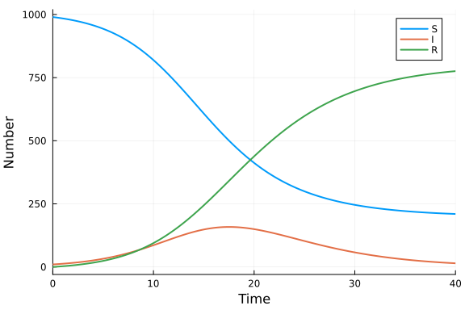

# Ordinary differential equation model with the vector field defined in Python
Simon Frost (@sdwfrost), 2024-06-03

## Introduction

While Julia is a high-level language, it is possible to define the vector field for an ordinary differential equation (ODE) in another language and call it from Julia. This can be useful if the vector field is already defined in Python, for example, in another codebase. We use the `PythonCall` library to interface Julia with Python.

## Libraries

```julia
using OrdinaryDiffEq
using PythonCall
using Plots
using BenchmarkTools
```


## Transitions

### Out-of-place version

We define the vector field in Python, firstly using an out-of-place definition.

```julia
@pyexec """
def sir_ode_op_py(u,p,t):
    S = u[0]
    I = u[1]
    R = u[2]
    N = S+I+R
    beta = p[0]
    c = p[1]
    gamma = p[2]
    dS = -beta*c*I/N*S
    dI = beta*c*I/N*S - gamma*I
    dR = gamma*I
    return [dS,dI,dR]
""" => sir_ode_op_py;
```


We can then define the ODE function in Python to Julia, converting the output of the above `sir_ode_op_py` to an `Array`.

```julia
sir_ode_op_jl(u,p,t) = pyconvert(Array, sir_ode_op_py(u, p, t));
```


We can then proceed to solve the ODE using the `sir_ode_jl` function as we would if the vector field were defined in Julia.

```julia
δt = 0.1
tmax = 40.0
tspan = (0.0,tmax);
u0 = [990.0,10.0,0.0] # S,I,R
p = [0.05,10.0,0.25]; # β,c,γ
```


To ensure that the out-of-place version works, we specify `ODEProblem{false}`.

```julia
prob_ode_op = ODEProblem{false}(sir_ode_op_jl, u0, tspan, p)
sol_ode_op = solve(prob_ode_op, Tsit5(), dt = δt)
plot(sol_ode_op, labels=["S" "I" "R"], lw=2, xlabel="Time", ylabel="Number")
```




### In-place version

We now define the vector field in Python using an in-place definition.

```julia
@pyexec """
def sir_ode_ip_py(du,u,p,t):
    S = u[0]
    I = u[1]
    R = u[2]
    N = S+I+R
    beta = p[0]
    c = p[1]
    gamma = p[2]
    du[0] = dS = -beta*c*I/N*S
    du[1] = dI = beta*c*I/N*S - gamma*I
    du[2] = dR = gamma*I
""" => sir_ode_ip_py;
```


```julia
prob_ode_ip = ODEProblem{true}(sir_ode_ip_py, u0, tspan, p)
sol_ode_ip = solve(prob_ode_ip, Tsit5(), dt = δt)
plot(sol_ode_ip, labels=["S" "I" "R"], lw=2, xlabel="Time", ylabel="Number")
```


## Benchmarking

### Out-of-place version

```julia
@benchmark solve(prob_ode_op, Tsit5(), dt = δt)
```

```
BenchmarkTools.Trial: 6865 samples with 1 evaluation.
 Range (min … max):  554.291 μs … 34.511 ms  ┊ GC (min … max): 0.00% … 54.9
7%
 Time  (median):     583.500 μs              ┊ GC (median):    0.00%
 Time  (mean ± σ):   715.420 μs ±  1.866 ms  ┊ GC (mean ± σ):  8.20% ±  3.0
8%

     ▁▃▆▇█▆▄▄▁                                                  
  ▃▄▆█████████▇▆▄▃▃▃▃▃▂▂▂▂▂▂▂▂▂▂▁▂▂▂▂▁▂▁▁▁▂▁▂▂▂▁▁▂▂▂▂▂▂▂▂▂▂▃▂▂ ▃
  554 μs          Histogram: frequency by time          774 μs <

 Memory estimate: 188.28 KiB, allocs estimate: 6733.
```


### In-place version

```julia
@benchmark solve(prob_ode_ip, Tsit5(), dt = δt)
```

```
BenchmarkTools.Trial: 8912 samples with 1 evaluation.
 Range (min … max):  411.500 μs … 49.526 ms  ┊ GC (min … max): 0.00% … 37.1
5%
 Time  (median):     438.292 μs              ┊ GC (median):    0.00%
 Time  (mean ± σ):   554.350 μs ±  2.222 ms  ┊ GC (mean ± σ):  7.13% ±  1.7
6%

       ▂██▄▃▃▁                                                  
  ▂▂▃▄▆███████▇▄▄▃▃▂▂▂▂▂▂▂▂▂▂▁▂▁▁▂▂▁▁▂▁▂▂▁▂▁▂▂▁▁▁▁▁▁▂▂▂▂▂▂▂▃▂▂ ▃
  412 μs          Histogram: frequency by time          604 μs <

 Memory estimate: 102.77 KiB, allocs estimate: 5613.
```


### Julia in-place version

We can compare the performance of the Python-based ODE with the Julia-based ODE.

```julia
function sir_ode!(du,u,p,t)
    (S,I,R) = u
    (β,c,γ) = p
    N = S+I+R
    @inbounds begin
        du[1] = -β*c*I/N*S
        du[2] = β*c*I/N*S - γ*I
        du[3] = γ*I
    end
    nothing
end
prob_ode_julia = ODEProblem(sir_ode!, u0, tspan, p)
sol_ode_julia = solve(prob_ode_julia, Tsit5(), dt = δt)
@benchmark solve(prob_ode_julia, Tsit5(), dt = δt)
```

```
BenchmarkTools.Trial: 10000 samples with 1 evaluation.
 Range (min … max):   8.542 μs …  3.873 ms  ┊ GC (min … max): 0.00% … 98.62
%
 Time  (median):     10.666 μs              ┊ GC (median):    0.00%
 Time  (mean ± σ):   12.002 μs ± 66.742 μs  ┊ GC (mean ± σ):  9.53% ±  1.71
%

            ▁ ▃▅▁▅▇█▂▆▅▄ ▂                                     
  ▁▁▁▁▂▂▃▃▅▇█▇█████████████▆▇▆▅▄▄▄▃▂▃▂▂▂▂▂▁▂▁▁▁▁▁▁▁▁▁▁▁▁▁▁▁▁▁ ▃
  8.54 μs         Histogram: frequency by time        15.2 μs <

 Memory estimate: 15.08 KiB, allocs estimate: 173.
```


On my machine, the Julia code runs 40-50 times faster than the Python code; this reflects both the slower Python code plus the overhead of the foreign function calls.

## Using modelingtoolkitize to convert a vector field in Python to Julia

Rather than calling the Python code from Julia, another approach, at least for some models, is to convert the Python code to Julia using `modelingtoolkitize`. At the time of writing, the `modelingtoolkitize` function does not allow specifying the state, parameter, or independent variable names.

```julia
using ModelingToolkit
@named sys_mtk = modelingtoolkitize(prob_ode_op);
prob_mtk = ODEProblem(sys_mtk, u0, tspan, p)
sol_mtk = solve(prob_mtk, Tsit5(), dt = δt)
plot(sol_mtk, labels=["S" "I" "R"], lw=2, xlabel="Time", ylabel="Number")
```


One of the advantages is that the generated code is in Julia, and consequently runs much faster than the Python version.

```julia
@benchmark solve(prob_mtk, Tsit5(), dt = $δt)
```

```
BenchmarkTools.Trial: 10000 samples with 1 evaluation.
 Range (min … max):   9.792 μs …  3.536 ms  ┊ GC (min … max):  0.00% … 98.8
2%
 Time  (median):     12.167 μs              ┊ GC (median):     0.00%
 Time  (mean ± σ):   13.806 μs ± 70.349 μs  ┊ GC (mean ± σ):  10.09% ±  1.9
7%

            ▄▆▄██▅█▆▁▃▁                                        
  ▁▁▁▁▂▃▃▅▇▇███████████▆▆▅▄▄▄▂▂▂▂▁▂▁▁▁▁▁▁▁▁▁▁▁▁▁▁▁▁▁▁▁▁▁▁▁▁▁▁ ▃
  9.79 μs         Histogram: frequency by time        18.8 μs <

 Memory estimate: 17.66 KiB, allocs estimate: 172.
```


