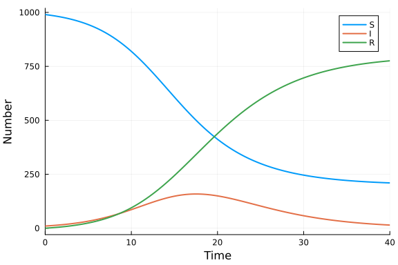

# Ordinary differential equation model with the vector field defined in R
Simon Frost (@sdwfrost), 2024-06-03

## Introduction

While Julia is a high-level language, it is possible to define the vector field for an ordinary differential equation (ODE) in another language and call it from Julia. This can be useful if the vector field is already defined in R, for example, in another codebase. As code in R may be slow, there is a package [`odin`](https://mrc-ide.github.io/odin), which allows C code to be emitted from an R-like domain specific langugage; this can result in much faster simulations. We use the `RCall` library to interface Julia with the `odin` package R. This notebook requires an R installation, with the `odin` package installed.

## Libraries

```julia
using OrdinaryDiffEq
using RCall
using Plots
using BenchmarkTools
```


## Transitions

Models written in `odin` look a lot like R code, making it relatively easy to define the vector field in R. Here we define a simple SIR model in `odin`. The use of `user` allows initial conditions and model parameters to be modified. Unlike standard R code, we do not explicitly return the derivatives.

```julia
R"""
sir_ode_odin <- odin::odin({
    ## Derivatives
    deriv(S) <- -beta*cee*S*I/N
    deriv(I) <- beta*cee*S*I/N-gamma*I
    deriv(R) <- gamma*I
    N <- S + I + R
    
    ## Initial conditions
    u[] <- user()
    dim(u) <- 3
    initial(S) <- u[1]
    initial(I) <- u[2]
    initial(R) <- u[3]
  
    ## Parameters
    p[] <- user()
    dim(p) <- 3
    beta <- p[1]
    cee <- p[2]
    gamma <- p[3]
  }, verbose=FALSE, target="c")
""";
```


The above code compiles an R6 class that can be used to run the model in R. To access it from Julia, we write some R wrapper code that returns the vector field in a form that can be more easily called from Julia, and avoids the overhead of creating new instances of the R6 class.

```julia
R"""
sir_ode_odin_model <- sir_ode_odin$new(user=list(u=c(990.0,10.0,0.0),
                                       p=c(0.05,10.0,0.25)))

sir_ode_odin_f <- function(u,p,t){
    sir_ode_odin_model$set_user(user=list(u=u,p=p))
    return(sir_ode_odin_model$deriv(t,u))
}
""";
```


We then wrap the R function in a Julia function, converting the output to an `Array`.

```julia
function sir_ode_odin_jl(u,p,t)
    robj = rcall(:sir_ode_odin_f, u, p, t)
    return convert(Array,robj)
end;
```


We can then proceed to solve the ODE using the `sir_ode_odin_jl` function as we would if the vector field were defined in Julia.

```julia
δt = 0.1
tmax = 40.0
tspan = (0.0,tmax);
u0 = [990.0,10.0,0.0] # S,I,R
p = [0.05,10.0,0.25]; # β,c,γ
```


To ensure that the above out-of-place version works, we specify `ODEProblem{false}`.

```julia
prob_ode_odin = ODEProblem{false}(sir_ode_odin_jl, u0, tspan, p)
sol_ode_odin = solve(prob_ode_odin, Tsit5(), dt = δt)
plot(sol_ode_odin, labels=["S" "I" "R"], lw=2, xlabel="Time", ylabel="Number")
```




## Benchmarking

### odin version

```julia
@benchmark solve(prob_ode_odin, Tsit5(), dt = δt)
```

```
BenchmarkTools.Trial: 1724 samples with 1 evaluation.
 Range (min … max):  2.419 ms … 47.645 ms  ┊ GC (min … max): 0.00% … 0.00%
 Time  (median):     2.492 ms              ┊ GC (median):    0.00%
 Time  (mean ± σ):   2.849 ms ±  1.561 ms  ┊ GC (mean ± σ):  1.70% ± 4.69%

  ██▄▄▂                                                       
  █████▇▇▄▅▄▄▁▅▅▁▅▅▁▅▃▁▆█▆▅▆▄▅▆▆▅▅▆▆██▇▇▆▅▆▃▅▅▄▇▅▇▃▁▃▄▅▄▁▅▁▄ █
  2.42 ms      Histogram: log(frequency) by time     5.96 ms <

 Memory estimate: 244.73 KiB, allocs estimate: 6563.
```


### Julia out-of-place version

We can compare the performance of the R-based ODE with the (in-place) Julia-based ODE.

```julia
function sir_ode_julia!(du,u,p,t)
    (S,I,R) = u
    (β,c,γ) = p
    N = S+I+R
    du[1] = dS = -β*c*I/N*S
    du[2] = dI = β*c*I/N*S - γ*I
    du[3] = dR = γ*I
end
prob_ode_julia = ODEProblem(sir_ode_julia!, u0, tspan, p)
sol_ode_julia = solve(prob_ode_julia, Tsit5(), dt = δt)
@benchmark solve(prob_ode_julia, Tsit5(), dt = δt)
```

```
BenchmarkTools.Trial: 10000 samples with 1 evaluation.
 Range (min … max):   8.708 μs …  4.100 ms  ┊ GC (min … max): 0.00% … 98.66
%
 Time  (median):     10.916 μs              ┊ GC (median):    0.00%
 Time  (mean ± σ):   12.394 μs ± 69.902 μs  ┊ GC (mean ± σ):  9.67% ±  1.71
%

           ▅▆█▆▇█▇▂▃▁                                          
  ▁▁▂▂▃▄▆█████████████▆▄▄▄▃▂▂▂▂▂▂▂▂▁▂▁▁▁▁▁▁▁▁▁▁▁▁▁▁▁▁▁▁▁▁▁▁▁▁ ▃
  8.71 μs         Histogram: frequency by time          18 μs <

 Memory estimate: 15.08 KiB, allocs estimate: 173.
```


On my machine, the Julia code runs faster than the R code; this in part reflects the overhead of the foreign function calls into R. We can also run the simulation entirely within R, reducing the number of calls from Julia to R to 1.

```julia
R"""
sir_ode_model <- sir_ode_odin$new(user=list(u=c(990.0,10.0,0.0),
                                       p=c(0.05,10.0,0.25)))
sir_ode_run <- function(t){
    return(sir_ode_model$run(t))
}
""";
```


```julia
out = rcall(:sir_ode_run, collect(0:δt:tmax))
@benchmark rcall(:sir_ode_run, collect(0:δt:tmax))
```

```
BenchmarkTools.Trial: 10000 samples with 1 evaluation.
 Range (min … max):  200.916 μs …  50.876 ms  ┊ GC (min … max): 0.00% … 0.0
0%
 Time  (median):     220.292 μs               ┊ GC (median):    0.00%
 Time  (mean ± σ):   239.198 μs ± 556.540 μs  ┊ GC (mean ± σ):  0.22% ± 0.7
5%

     ▄█▇▅▁                                                       
  ▁▂▆█████▆▅▄▄▄▆▆▆▅▆▆▆▅▅▄▄▄▃▃▃▃▂▂▂▂▂▂▂▁▂▁▁▁▁▁▁▁▁▁▁▁▁▁▁▁▁▁▁▁▁▁▁▁ ▃
  201 μs           Histogram: frequency by time          305 μs <

 Memory estimate: 4.00 KiB, allocs estimate: 29.
```


While this is not as fast as the Julia code, it is much faster than repeatedly calling the R function from Julia.