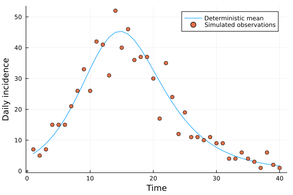
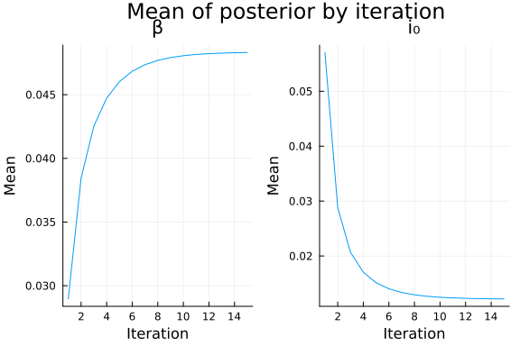
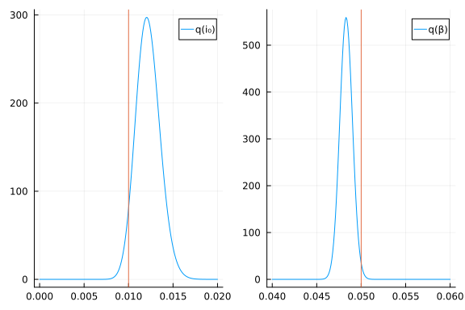
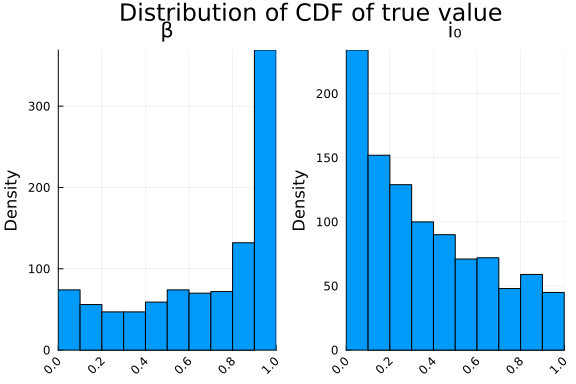
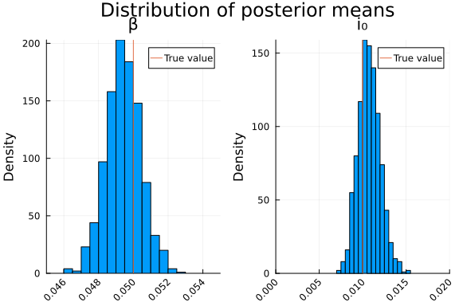

# Inference for a deterministic ODE model using RxInfer.jl
Simon Frost (@sdwfrost), 2024-07-26

## Introduction

[`RxInfer.jl`](https://rxinfer.ml) is a reactive probabilistic programming library that allows for the definition of probabilistic models in a modular way. It uses (mostly) the same dynamic language, GraphPPL, as [Turing.jl](https://turing.ml), but the internal workings are very different. RxInfer.jl primarily uses message passing algorithms in order to achieve high performance. This notebook shows how to infer the parameters of a simple SIR model (as an ordinary differential equation) using `RxInfer.jl` and `OrdinaryDiffEq.jl`. For more technical information on how `RxInfer.jl` works, please see the [PhD thesis](https://pure.tue.nl/ws/portalfiles/portal/313860204/20231219_Bagaev_hf.pdf) of Dmitry Bagaev.

## Libraries


```julia
using RxInfer
using OrdinaryDiffEq
using ExponentialFamilyProjection
using Optimisers
using StableRNGs
using StatsFuns
using StaticArrays
using Plots
using BenchmarkTools
import BayesBase;
```


## Transitions

We describe the transitions of the SIR model using the following ordinary differential equations; for efficiency, we use the `StaticArrays` package to define the state vector.

```julia
function sir_ode(u, p, t)
    (S,I,R,C) = u
    (β,c,γ) = p
    N = S+I+R
    infection = β*c*I/N*S
    recovery = γ*I
    return @SArray([
         -infection,
        infection - recovery,
        recovery,
        infection
    ]) # S, I, R, C
end;
```


## Generative model

This function takes an existing `ODEProblem`, the length of the data, `l`, the proportion of the population that is initially infected, `i₀`, and the infectivity parameter, `β`, and outputs the daily incidence by taking the difference between cumulative cases.

```julia
function sir_ode_solve(problem, l, i₀, β)
    I = i₀*1000.0
    S = 1000.0 - I
    u0 = @SArray([S, I, 0.0, 0.0])
    p = @SArray([β, 10.0, 0.25])
    prob = remake(problem; u0=u0, p=p)
    sol = solve(prob, Tsit5(), saveat = 1.0)
    sol_C = view(sol, 4, :) # Cumulative cases
    sol_X = Array{eltype(sol_C)}(undef, l)
    @inbounds @simd for i in 1:length(sol_X)
        sol_X[i] = sol_C[i + 1] - sol_C[i]
    end
    return sol_X
end;
```


We assume that the daily incidence is Poisson-distributed with the mean given by the output of the ODE. The following function generates simulated data.

```julia
function simulate_data(l, i₀, β)
    prob = ODEProblem(sir_ode, @SArray([990.0, 10.0, 0.0, 0.0]), (0.0, l), @SArray([β, 10.0, 0.25]))
    X = sir_ode_solve(prob, l, i₀, β)
    Y = rand.(Poisson.(X))
    return X, Y
end;
```


## Inference

To make inference using RxInfer.jl efficient, we will treat the output of the ODE as a single node in the factor graph.

### Defining a node

We first define a new node type, `ODEFused`, that takes the initial proportion of the population that is infected, `i₀`, the infectivity parameter, `β`, the length of the data, `l`, and the `ODEProblem` as fields.

```julia
struct ODEFused{I, B, L, F} <: DiscreteMultivariateDistribution
    i₀::I
    β::B
    l::L
    problem::F
end;
```


The following function defines the log-likelihood of the node, which is the sum of the log-likelihoods of the Poisson-distributed observations for each day.

```julia
function BayesBase.logpdf(ode::ODEFused, y::Vector)
    sol_X = sir_ode_solve(ode.problem, ode.l, ode.i₀, ode.β)
    # `sum` over individual entries of the result of the `ODE` solver
    sumlpdf = sum(zip(sol_X, y)) do (x_i, y_i)
        return logpdf(Poisson(abs(x_i)), y_i)
    end
    # `clamp` to avoid infinities in the beginning, where 
    # priors are completely off
    return clamp(sumlpdf, -100000, Inf)
end;
```


```julia
function BayesBase.insupport(ode::ODEFused, y::Vector)
    return true
end

function BayesBase.mean(p::PointMass{D}) where { D <: ODEProblem }
    return p.point
end;
```


We can then define a new node, using the `@node` macro.

```julia
@node ODEFused Stochastic [ y, i₀, β, l, problem ];
```


### Defining the problem

Now that we have defined a node for the differential equation, we can define the model. We use a `Beta(1,1)` prior for the initial proportion of the population that is infected, `i₀`, and the infectivity parameter, `β`; these are vague priors in that the density is flat, and bounded between 0 and 1.

```julia
@model function bayes_sir(y)
    l = length(y)
    prob = ODEProblem(sir_ode, @SArray([990.0, 10.0, 0.0, 0.0]), (0.0, l), @SArray([0.05, 10.0, 0.25]))    
    i₀ ~ Beta(1.0, 1.0)
    β  ~ Beta(1.0, 1.0)
    y  ~ ODEFused(i₀, β, l, prob)
end;
```


### Constraints

Although a beta prior for the parameters `i₀` and `β` may seem reasonable, it complicates inference, as a Beta prior is not conjugate to the Poisson likelihood. We can use the `ExponentialFamilyProjection` package to project the posterior of the parameters to a more tractable distribution (see [here](https://reactivebayes.github.io/RxInfer.jl/stable/manuals/inference/nonconjugate/) for more details). The projection constraint must be specified using the @constraints macro; In this case, we use the `ControlVariateStrategy`. The number of samples used is a balance between accuracy and time; when the number of samples is too low, inference can fail, while if the number of samples is high, then inference takes a long time. After a little experimentation, 200 samples was found to give stable inference with a reasonable running time. The `MeanField` constraint assumes that the variables `i₀` and `β` are independent.

```julia
@constraints function sir_constraints()
    parameters = ProjectionParameters(
        strategy = ExponentialFamilyProjection.ControlVariateStrategy(nsamples = 200)
    )

    # In principle different parameters can be used for different states
    q(i₀) :: ProjectedTo(Beta; parameters = parameters)
    q(β) :: ProjectedTo(Beta; parameters = parameters)

    # `MeanField` is required for `NodeFunctionRuleFallback`
    q(i₀, β) = MeanField()
end;
```


### Initialization

We initialize the distributions of the parameters `i₀` and `β` using a `Beta(1,1)` distribution for each.

```julia
@initialization function sir_initialization()
    q(β)  = Beta(1, 1)
    q(i₀) = Beta(1, 1)
end;
```


## Fitting the model

### Simulating data

```julia
β_true = 0.05
i₀_true = 0.01
l = 40
X, Y = simulate_data(l, i₀_true, β_true);
```


```julia
ts = 1.0:1.0:l
plot(ts, X, label="Deterministic mean", xlabel="Time", ylabel="Daily incidence")
scatter!(ts, Y, label="Simulated observations")
```




### Inference

```julia
niter = 15
result = infer(
        model = bayes_sir(),
        data  = (y = Y, ),
        constraints = sir_constraints(),
        initialization = sir_initialization(),
        iterations = niter,
        showprogress = false,
        options = (
            # Read `https://reactivebayes.github.io/RxInfer.jl/stable/manuals/inference/undefinedrules/`
            rulefallback = NodeFunctionRuleFallback(),
        )
);
```


## Processing the results

We can check whether enough iterations were used by plotting the mean of the posterior distributions of `i₀` and `β` by iteration.

```julia
pl_β_mean_i = plot(1:15, [mean(x) for x in result.posteriors[:β]], label=false, xlabel="Iteration", ylabel="Mean", title="β")
pl_i₀_mean_i = plot(1:15, [mean(x) for x in result.posteriors[:i₀]], label=false, xlabel="Iteration", ylabel="Mean", title="i₀")
plot(pl_β_mean_i, pl_i₀_mean_i, layout=(1,2), plot_title="Mean of posterior by iteration")
```




We take the estimates of `i₀` and `β` from the last iteration.

```julia
posterior_i₀ = result.posteriors[:i₀][end]
posterior_β = result.posteriors[:β][end];
```


```julia
mean_var(posterior_i₀) # Should be 0.01
```

```
(0.012186631850661718, 1.8175768826176395e-6)
```


```julia
mean_var(posterior_β) # Should be 0.05
```

```
(0.048310996594906196, 5.087224237584305e-7)
```


## Plotting the results

The following code plots the posterior distributions of the parameters `i₀` and `β`; in both cases, the model appears to give reasonable estimates.

```julia
p1 = plot(0.0:0.0001:0.02, x -> pdf(posterior_i₀, x); label="q(i₀)")
vline!(p1, [i₀_true], label=false)
p2 = plot(0.04:0.0001:0.06, x -> pdf(posterior_β, x); label="q(β)")
vline!(p2, [β_true], label=false)
plot(p1, p2)
```




## Benchmarking

The following code demonstrates that inference using RxInfer is very fast for this example, in addition to giving good parameter estimates.

```julia
@benchmark infer(
        model = bayes_sir(),
        data  = (y = Y, ),
        constraints = sir_constraints(),
        initialization = sir_initialization(),
        iterations = niter,
        showprogress = false,
        options = (
            # Read `https://reactivebayes.github.io/RxInfer.jl/stable/manuals/inference/undefinedrules/`
            rulefallback = NodeFunctionRuleFallback(),
        )
)
```

```
BenchmarkTools.Trial: 2 samples with 1 evaluation.
 Range (min … max):  4.193 s …  4.198 s  ┊ GC (min … max): 3.93% … 3.92%
 Time  (median):     4.196 s             ┊ GC (median):    3.93%
 Time  (mean ± σ):   4.196 s ± 3.239 ms  ┊ GC (mean ± σ):  3.93% ± 0.01%

  █                                                      █  
  █▁▁▁▁▁▁▁▁▁▁▁▁▁▁▁▁▁▁▁▁▁▁▁▁▁▁▁▁▁▁▁▁▁▁▁▁▁▁▁▁▁▁▁▁▁▁▁▁▁▁▁▁▁▁█ ▁
  4.19 s        Histogram: frequency by time         4.2 s <

 Memory estimate: 2.06 GiB, allocs estimate: 11308946.
```


## Coverage

We can get a better idea of the accuracy of the inference by generating multiple simulated datasets and fitting the model. The rapid inference allows us to repeat the process for many simulated datasets. To speed up these calculations, we will split the computation up over multiple threads. We first need to load the `Base.Threads` module.

```julia
using Base.Threads
```


We can check the number of threads available.

```julia
Threads.nthreads()
```

```
8
```


We can now use the `Threads.@threads` macro to parallelize the simulation and inference process.

```julia
nsims = 1000
i₀_mean = Array{Float64}(undef, nsims)
β_mean = Array{Float64}(undef, nsims)
i₀_coverage = Array{Float64}(undef, nsims)
β_coverage = Array{Float64}(undef, nsims)
Threads.@threads for i in 1:nsims
    X_sim, Y_sim = simulate_data(l, i₀_true, β_true)
    r = infer(
              model = bayes_sir(),
              data  = (y = Y_sim, ),
              constraints = sir_constraints(),
              initialization = sir_initialization(),
              iterations = niter,
              showprogress = false,
              options = ( rulefallback = NodeFunctionRuleFallback(), ))
    i0 = r.posteriors[:i₀][end]
    i₀_mean[i] = mean(i0)
    i0_cov = cdf(i0, i₀_true)
    b = r.posteriors[:β][end]
    β_mean[i] = mean(b)
    b_cov = cdf(b, β_true)
    i₀_coverage[i] = i0_cov
    β_coverage[i] = b_cov
end;
```


If the credible intervals are well calibrated, we expect that the distribution of the CDF of the true value (across multiple simulated datasets) should be uniform.

```julia
# Convenience function to check if the true value is within the credible interval
function in_credible_interval(x, lwr=0.025, upr=0.975)
    return x >= lwr && x <= upr
end;
```


```julia
pl_β_coverage = histogram(β_coverage, bins=0:0.1:1.0, label=false, title="β", ylabel="Density", density=true, xrotation=45, xlim=(0.0,1.0))
pl_i₀_coverage = histogram(i₀_coverage, bins=0:0.1:1.0, label=false, title="i₀", ylabel="Density", density=true, xrotation=45, xlim=(0.0,1.0))
plot(pl_β_coverage, pl_i₀_coverage, layout=(1,2), plot_title="Distribution of CDF of true value")
```




The coverage of the 95% credible intervals is given by the proportion of simulations where the true value is within the interval.

```julia
sum(in_credible_interval.(β_coverage)) / nsims
```

```
0.757
```


```julia
sum(in_credible_interval.(i₀_coverage)) / nsims
```

```
0.911
```


We can also look at the distribution of the posterior means, which should fall around the true value.

```julia
pl_β_mean = histogram(β_mean, label=false, title="β", ylabel="Density", density=true, xrotation=45, xlim=(0.045, 0.055))
vline!([β_true], label="True value")
pl_i₀_mean = histogram(i₀_mean, label=false, title="i₀", ylabel="Density", density=true, xrotation=45, xlim=(0.0,0.02))
vline!([i₀_true], label="True value")
plot(pl_β_mean, pl_i₀_mean, layout=(1,2), plot_title="Distribution of posterior means")
```




From the above, we can see that there is a (small) bias in the parameter estimates, contributing to the non-uniform nature of the coverage plots above. It may be worth looking into methods (e.g. Bayesian conformal prediction) to try to quantify uncertainty more accurately.