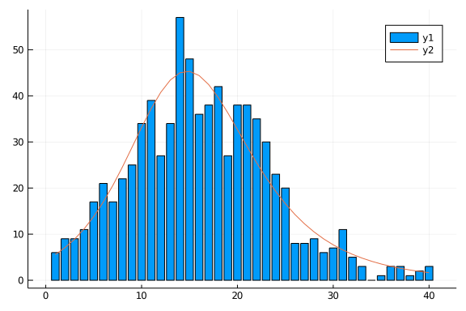
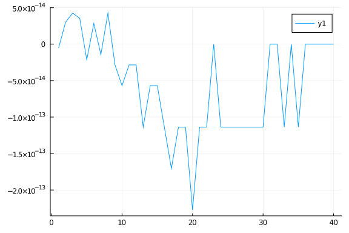
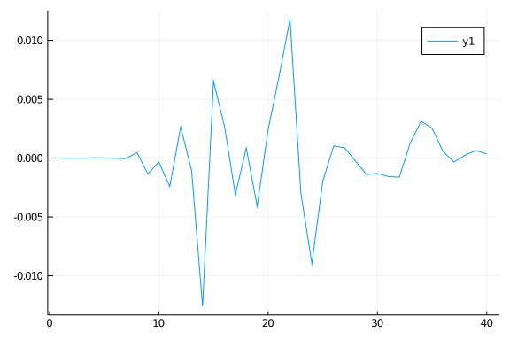
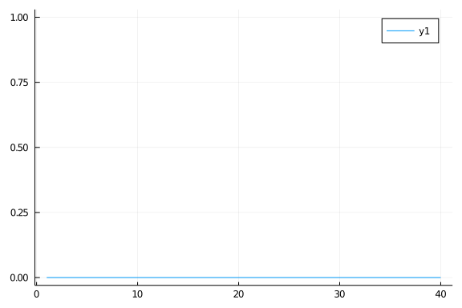
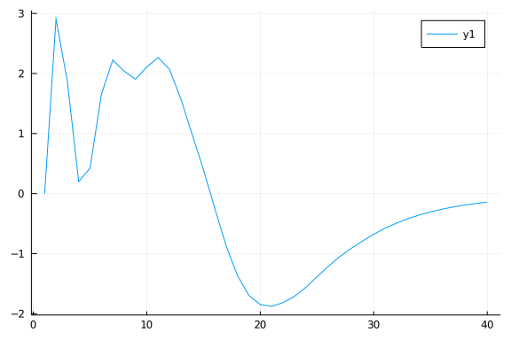
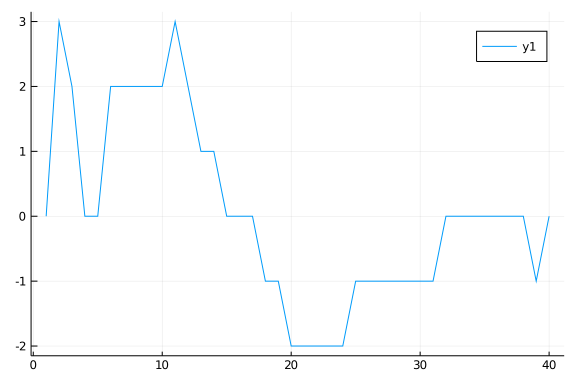

# Generating simulated data using ODE models
Simon Frost (@sdwfrost), 2020-04-27

## Introduction

In this notebook, different ways of generating the number of new cases per day are described.

## Libraries

````julia
using DifferentialEquations
using SimpleDiffEq
using DiffEqCallbacks
using Random
using Distributions
using Plots
````


## Method 1: Calculate cumulative infections and post-process

A variable is included for the cumulative number of infections, $C$.

````julia
function sir_ode!(du,u,p,t)
    (S,I,R,C) = u
    (β,c,γ) = p
    N = S+I+R
    infection = β*c*I/N*S
    recovery = γ*I
    @inbounds begin
        du[1] = -infection
        du[2] = infection - recovery
        du[3] = recovery
        du[4] = infection
    end
    nothing
end;
````


````
sir_ode! (generic function with 1 method)
````


````julia
tmax = 40.0
δt = 1.0
tspan = (0.0,tmax)
obstimes = 1.0:δt:tmax;
u0 = [990.0,10.0,0.0,0.0]; # S,I.R,C
p = [0.05,10.0,0.25]; # β,c,γ
````


````
3-element Array{Float64,1}:
  0.05
 10.0
  0.25
````


````julia
prob_ode = ODEProblem(sir_ode!,u0,tspan,p)
sol_ode_cumulative = solve(prob_ode,Tsit5(),saveat=δt);
````


````
retcode: Success
Interpolation: 1st order linear
t: 41-element Array{Float64,1}:
  0.0
  1.0
  2.0
  3.0
  4.0
  5.0
  6.0
  7.0
  8.0
  9.0
  ⋮
 32.0
 33.0
 34.0
 35.0
 36.0
 37.0
 38.0
 39.0
 40.0
u: 41-element Array{Array{Float64,1},1}:
 [990.0, 10.0, 0.0, 0.0]
 [984.4093729820466, 12.759075298665039, 2.83155171928832, 5.59062701795335
75]
 [977.3332026510055, 16.22814554943427, 6.438651799560168, 12.6667973489944
34]
 [968.4242204222029, 20.558426973853646, 11.017352603943419, 21.57577957779
7064]
 [957.2822747333526, 25.91440777703591, 16.80331748961151, 32.7177252666474
1]
 [943.4628419127473, 32.463172502357864, 24.073985584894846, 46.53715808725
271]
 [926.497065600148, 40.35593403853616, 33.14700036131587, 63.50293439985202
]
 [905.9269551962524, 49.699931631668576, 44.37311317207904, 84.073044803747
64]
 [881.3585392131616, 60.52139921718387, 58.12006156965444, 108.641460786838
32]
 [852.5274163604042, 72.72290972680412, 74.74967391279168, 137.472583639595
8]
 ⋮
 [233.6919415512116, 44.46580488532527, 721.8422535634633, 756.308058448788
4]
 [228.88046764765463, 38.871629484210395, 732.247902868135, 761.11953235234
55]
 [224.76186839108456, 33.90671598976695, 741.3314156191486, 765.23813160891
54]
 [221.23300305457357, 29.522228842544973, 749.2447681028816, 768.7669969454
265]
 [218.20665229931438, 25.662350534147386, 756.1309971665382, 771.7933477006
857]
 [215.6107449890835, 22.274515459755385, 762.1147395511612, 774.38925501091
65]
 [213.3843905024685, 19.310740281779456, 767.3048692157521, 776.61560949753
15]
 [211.47427574879592, 16.72457203571691, 771.8011522154873, 778.52572425120
41]
 [209.83434778204648, 14.47208748405588, 775.6935647338977, 780.16565221795
35]
````


The cumulative counts are extracted.

````julia
out = Array(sol_ode_cumulative)
C = out[4,:];
````


````
41-element Array{Float64,1}:
   0.0
   5.5906270179533575
  12.666797348994434
  21.575779577797064
  32.71772526664741
  46.53715808725271
  63.50293439985202
  84.07304480374764
 108.64146078683832
 137.4725836395958
   ⋮
 756.3080584487884
 761.1195323523455
 765.2381316089154
 768.7669969454265
 771.7933477006857
 774.3892550109165
 776.6156094975315
 778.5257242512041
 780.1656522179535
````


The new cases per day are calculated from the cumulative counts.

````julia
X = C[2:end] .- C[1:(end-1)];
````


````
40-element Array{Float64,1}:
  5.5906270179533575
  7.076170331041077
  8.90898222880263
 11.141945688850349
 13.8194328206053
 16.96577631259931
 20.57011040389561
 24.568415983090688
 28.831122852757474
 33.14329091787582
  ⋮
  5.623429741450877
  4.811473903557044
  4.118599256569951
  3.528865336511103
  3.026350755259159
  2.595907310230814
  2.226354486615037
  1.9101147536725875
  1.639927966749383
````


Although the ODE system is deterministic, we can add measurement error to the counts of new cases. Here, a Poisson distribution is used, although a negative binomial could also be used (which would introduce an additional parameter for the variance).

````julia
Random.seed!(1234);
````


````
Random.MersenneTwister(UInt32[0x000004d2], Random.DSFMT.DSFMT_state(Int32[-
1393240018, 1073611148, 45497681, 1072875908, 436273599, 1073674613, -20437
16458, 1073445557, -254908435, 1072827086  …  -599655111, 1073144102, 36765
5457, 1072985259, -1278750689, 1018350124, -597141475, 249849711, 382, 0]),
 [0.0, 0.0, 0.0, 0.0, 0.0, 0.0, 0.0, 0.0, 0.0, 0.0  …  0.0, 0.0, 0.0, 0.0, 
0.0, 0.0, 0.0, 0.0, 0.0, 0.0], UInt128[0x00000000000000000000000000000000, 
0x00000000000000000000000000000000, 0x00000000000000000000000000000000, 0x0
0000000000000000000000000000000, 0x00000000000000000000000000000000, 0x0000
0000000000000000000000000000, 0x00000000000000000000000000000000, 0x0000000
0000000000000000000000000, 0x00000000000000000000000000000000, 0x0000000000
0000000000000000000000  …  0x00000000000000000000000000000000, 0x0000000000
0000000000000000000000, 0x00000000000000000000000000000000, 0x0000000000000
0000000000000000000, 0x00000000000000000000000000000000, 0x0000000000000000
0000000000000000, 0x00000000000000000000000000000000, 0x0000000000000000000
0000000000000, 0x00000000000000000000000000000000, 0x0000000000000000000000
0000000000], 1002, 0)
````


````julia
Y = rand.(Poisson.(X))
````


````
40-element Array{Int64,1}:
  6
  9
  9
 11
 17
 21
 17
 22
 25
 34
  ⋮
  5
  3
  0
  1
  3
  3
  1
  2
  3
````


````julia
bar(obstimes,Y)
plot!(obstimes,X)
````





For this particular model, the decline in susceptibles matches the increase in infections. Here is a comparison of the two.

````julia
S = out[1,:]
Cpred = 990.0 .- S
Cdiff = Cpred .- C
plot(obstimes,Cdiff[2:end])
````





Note that the difference between these two curves is at the limit of machine precision.

## Method 2: convert cumulative counts to daily counts using a callback

In order to fit counts of new infections every time unit, we add a callback that sets $C$ to zero at the observation times. This will result in two observations (one with non-zero `C`, one with `C`=0) at each observation time. However, the standard saving behaviour is turned off, so we don't need to have a special saving callback.

````julia
affect!(integrator) = integrator.u[4] = 0.0
cb_zero = PresetTimeCallback(obstimes,affect!)
````


````
DiffEqBase.DiscreteCallback{DiffEqCallbacks.var"#53#56"{StepRangeLen{Float6
4,Base.TwicePrecision{Float64},Base.TwicePrecision{Float64}}},DiffEqCallbac
ks.var"#54#57"{typeof(Main.##WeaveSandBox#793.affect!)},DiffEqCallbacks.var
"#55#58"{typeof(DiffEqBase.INITIALIZE_DEFAULT),Bool,StepRangeLen{Float64,Ba
se.TwicePrecision{Float64},Base.TwicePrecision{Float64}},typeof(Main.##Weav
eSandBox#793.affect!)}}(DiffEqCallbacks.var"#53#56"{StepRangeLen{Float64,Ba
se.TwicePrecision{Float64},Base.TwicePrecision{Float64}}}(1.0:1.0:40.0), Di
ffEqCallbacks.var"#54#57"{typeof(Main.##WeaveSandBox#793.affect!)}(Main.##W
eaveSandBox#793.affect!), DiffEqCallbacks.var"#55#58"{typeof(DiffEqBase.INI
TIALIZE_DEFAULT),Bool,StepRangeLen{Float64,Base.TwicePrecision{Float64},Bas
e.TwicePrecision{Float64}},typeof(Main.##WeaveSandBox#793.affect!)}(DiffEqB
ase.INITIALIZE_DEFAULT, true, 1.0:1.0:40.0, Main.##WeaveSandBox#793.affect!
), Bool[1, 1])
````


The callback that resets `C` is added to `solve`. Note that this requires `DiffEqCallbacks`. If multiple callbacks are required, then a `CallbackSet` can be passed instead.

````julia
sol_ode_cb = solve(prob_ode,Tsit5(),saveat=δt,callback=cb_zero);
````


````
retcode: Success
Interpolation: 1st order linear
t: 81-element Array{Float64,1}:
  0.0
  1.0
  1.0
  2.0
  2.0
  3.0
  3.0
  4.0
  4.0
  5.0
  ⋮
 36.0
 37.0
 37.0
 38.0
 38.0
 39.0
 39.0
 40.0
 40.0
u: 81-element Array{Array{Float64,1},1}:
 [990.0, 10.0, 0.0, 0.0]
 [984.4093729528591, 12.759075463490184, 2.8315515836506275, 5.590627047140
812]
 [984.4093729528591, 12.759075463490184, 2.8315515836506275, 0.0]
 [977.3332016509414, 16.228146587606428, 6.438651761452043, 7.0761713019176
61]
 [977.3332016509414, 16.228146587606428, 6.438651761452043, 0.0]
 [968.4242211477185, 20.55842544602246, 11.01735340625888, 8.90898050322286
7]
 [968.4242211477185, 20.55842544602246, 11.01735340625888, 0.0]
 [957.2822511642978, 25.914417933339145, 16.80333090236293, 11.141969983420
731]
 [957.2822511642978, 25.914417933339145, 16.80333090236293, 0.0]
 [943.4628021310956, 32.463195694391096, 24.074002174513108, 13.81944903320
2128]
 ⋮
 [218.20787301998945, 25.66373329519949, 756.1283936848109, 0.0]
 [215.61229424401364, 22.27616524756678, 762.1115405084195, 2.5955787759757
976]
 [215.61229424401364, 22.27616524756678, 762.1115405084195, 0.0]
 [213.3857061722601, 19.312500522282374, 767.3017933054574, 2.2265880717535
4]
 [213.3857061722601, 19.312500522282374, 767.3017933054574, 0.0]
 [211.4749483263679, 16.725852658521724, 771.7991990151103, 1.9107578458921
968]
 [211.4749483263679, 16.725852658521724, 771.7991990151103, 0.0]
 [209.834667019888, 14.472822400047164, 775.6925105800648, 1.64028130647990
62]
 [209.834667019888, 14.472822400047164, 775.6925105800648, 0.0]
````


We cannot simply convert the solution to an `Array`, as this will give us duplicated timepoints when `C` is reset. Calling the solution with the observation times generates the output before the callback.

````julia
X_cb = sol_ode_cb(obstimes)[4,:]
````


````
40-element Array{Float64,1}:
  5.590627047140812
  7.076171301917661
  8.908980503222867
 11.141969983420731
 13.819449033202128
 16.965754500089613
 20.570071719615733
 24.56888198999368
 28.829775559131477
 33.14295680421392
  ⋮
  5.621804243916972
  4.812757841608534
  4.121732761706001
  3.531405344640113
  3.026916542217029
  2.5955787759757976
  2.22658807175354
  1.9107578458921968
  1.6402813064799062
````


````julia
Random.seed!(1234)
````


````
Random.MersenneTwister(UInt32[0x000004d2], Random.DSFMT.DSFMT_state(Int32[-
1393240018, 1073611148, 45497681, 1072875908, 436273599, 1073674613, -20437
16458, 1073445557, -254908435, 1072827086  …  -599655111, 1073144102, 36765
5457, 1072985259, -1278750689, 1018350124, -597141475, 249849711, 382, 0]),
 [0.0, 0.0, 0.0, 0.0, 0.0, 0.0, 0.0, 0.0, 0.0, 0.0  …  0.0, 0.0, 0.0, 0.0, 
0.0, 0.0, 0.0, 0.0, 0.0, 0.0], UInt128[0x00000000000000000000000000000000, 
0x00000000000000000000000000000000, 0x00000000000000000000000000000000, 0x0
0000000000000000000000000000000, 0x00000000000000000000000000000000, 0x0000
0000000000000000000000000000, 0x00000000000000000000000000000000, 0x0000000
0000000000000000000000000, 0x00000000000000000000000000000000, 0x0000000000
0000000000000000000000  …  0x00000000000000000000000000000000, 0x0000000000
0000000000000000000000, 0x00000000000000000000000000000000, 0x0000000000000
0000000000000000000, 0x00000000000000000000000000000000, 0x0000000000000000
0000000000000000, 0x00000000000000000000000000000000, 0x0000000000000000000
0000000000000, 0x00000000000000000000000000000000, 0x0000000000000000000000
0000000000], 1002, 0)
````


````julia
Y_cb = rand.(Poisson.(X_cb))
````


````
40-element Array{Int64,1}:
  6
  9
  9
 11
 17
 21
 17
 22
 25
 34
  ⋮
  5
  3
  0
  1
  3
  3
  1
  2
  3
````


````julia
X_diff_cb = X_cb .- X
plot(obstimes,X_diff_cb)
````




````julia
Y_diff_cb = Y_cb .- Y
plot(obstimes,Y_diff_cb)
````





## Method 3: Use a delay differential equation to track daily counts

````julia
function sir_dde!(du,u,h,p,t)
    (S,I,R,C) = u
    (β,c,γ) = p
    N = S+I+R
    infection = β*c*I/N*S
    recovery = γ*I
    e = oneunit(t)
    history = h(p, t-e)*inv(e)
    @inbounds begin
        du[1] = -infection
        du[2] = infection - recovery
        du[3] = recovery
        du[4] = infection - history[4]
    end
    nothing
end;
````


````
sir_dde! (generic function with 1 method)
````


````julia
function sir_history(p, t; idxs = 5)
    zero(t)
end
````


````
sir_history (generic function with 1 method)
````


````julia
prob_dde = DDEProblem(DDEFunction(sir_dde!),
        u0,
        sir_history,
        tspan,
        p;
        constant_lags = [1.0])
````


````
DDEProblem with uType Array{Float64,1} and tType Float64. In-place: true
timespan: (0.0, 40.0)
u0: [990.0, 10.0, 0.0, 0.0]
````


````julia
sol_dde = solve(prob_dde,MethodOfSteps(Tsit5()));
````


````
retcode: Success
Interpolation: specialized 4th order "free" interpolation
t: 29-element Array{Float64,1}:
  0.0
  0.00025500744028082863
  0.0028050818430891146
  0.028305825871171975
  0.26073498995506483
  0.879745906272606
  1.0
  1.6085137638559268
  2.0
  2.9308896503291617
  ⋮
 11.144121569993754
 13.23887126636355
 16.371288498283
 19.08604036659849
 22.437262138310654
 27.013159801557237
 30.476873643258337
 34.81498291099989
 40.0
u: 29-element Array{Array{Float64,1},1}:
 [990.0, 10.0, 0.0, 0.0]
 [989.9987376745428, 10.000624786941064, 0.0006375385161680651, 0.001262325
4572314987]
 [989.9861101700155, 10.006874715124146, 0.007015114860333896, 0.0138898299
84480533]
 [989.859409227541, 10.069580289573166, 0.07101048288583331, 0.140590772458
99926]
 [988.6681819993325, 10.658729802298323, 0.6730881983691819, 1.331818000667
5044]
 [985.153961706524, 12.392534359288648, 2.453503934187351, 4.84603829347599
8]
 [984.4093729528591, 12.759075463490184, 2.8315515836506275, 5.590627047140
812]
 [980.3013361862652, 14.77619740366821, 4.922466410066549, 8.73602398361900
8]
 [977.3332016509414, 16.228146587606428, 6.438651761452043, 9.9822507921238
67]
 [969.1068895425301, 20.228096389872913, 10.665014067596923, 10.77812105495
7998]
 ⋮
 [776.4831640301527, 102.05184356506876, 121.46499240477858, 40.04257954632
951]
 [687.3081074372269, 130.23077650271352, 182.4611160600596, 45.355355922364
13]
 [547.2047436355919, 156.3554299915223, 296.4398263728858, 43.3008424986929
7]
 [441.91428281281145, 154.79214457342434, 403.2935726137642, 34.28164738830
273]
 [347.5216036583105, 129.03930570774347, 523.4390906339461, 22.266291288938
696]
 [272.86938081201185, 82.78056798842971, 644.3500511995585, 11.165626208317
512]
 [242.62602954857115, 54.28801175339438, 703.0859586980346, 6.5022661176636
44]
 [221.84360094717258, 30.29523800152054, 747.861161051307, 3.31709458043676
26]
 [209.832372685221, 14.472743560427837, 775.6948837543513, 1.49733046562551
33]
````


````julia
X_dde = sol_dde(obstimes)[4,:]
````


````
40-element Array{Float64,1}:
  5.590627047140808
  9.982250792123864
 10.776743543432254
 11.340519563920862
 14.245190927531473
 18.617542233289676
 22.79407294682196
 26.608418126177416
 30.73536035623979
 35.25247714960398
  ⋮
  5.130983936398667
  4.392107684416049
  3.7613432982724557
  3.2241380875606995
  2.7660092314723475
  2.3731567884102707
  2.0350989803197
  1.7445320909041702
  1.4973304656255257
````


````julia
Random.seed!(1234);
Y_dde = rand.(Poisson.(X_dde))
````


````
40-element Array{Int64,1}:
  6
 12
 11
 11
 17
 23
 19
 24
 27
 36
  ⋮
  5
  3
  0
  1
  3
  3
  1
  1
  3
````


The following plots show that there is a difference both in the underlying model output as well as the simulated (Poisson) data using the delay differential equation.

````julia
X_diff_dde = X_dde .- X
plot(X_diff_dde)
````




````julia
Y_diff_dde = Y_dde .- Y
plot(obstimes, Y_diff_dde)
````





## Summary

While all three methods are mathematically equivalent, the first method, while not directly producing daily counts of cases, results in fewer numerical issues and more easily lends itself to automatic differentiation.


## Appendix
### Computer Information
```
Julia Version 1.4.1
Commit 381693d3df* (2020-04-14 17:20 UTC)
Platform Info:
  OS: Linux (x86_64-pc-linux-gnu)
  CPU: Intel(R) Core(TM) i7-1065G7 CPU @ 1.30GHz
  WORD_SIZE: 64
  LIBM: libopenlibm
  LLVM: libLLVM-8.0.1 (ORCJIT, icelake-client)
Environment:
  JULIA_NUM_THREADS = 4

```

### Package Information

```
Status `~/.julia/environments/v1.4/Project.toml`
[80f14c24-f653-4e6a-9b94-39d6b0f70001] AbstractMCMC 1.0.1
[537997a7-5e4e-5d89-9595-2241ea00577e] AbstractPlotting 0.12.3
[46ada45e-f475-11e8-01d0-f70cc89e6671] Agents 3.2.1
[4f99eebe-17bf-4e98-b6a1-2c4f205a959b] AlgebraicPetri 0.3.1
[f5f396d3-230c-5e07-80e6-9fadf06146cc] ApproxBayes 0.3.2
[c52e3926-4ff0-5f6e-af25-54175e0327b1] Atom 0.12.16
[fbb218c0-5317-5bc6-957e-2ee96dd4b1f0] BSON 0.2.6
[6e4b80f9-dd63-53aa-95a3-0cdb28fa8baf] BenchmarkTools 0.5.0
[a134a8b2-14d6-55f6-9291-3336d3ab0209] BlackBoxOptim 0.5.0
[2d3116d5-4b8f-5680-861c-71f149790274] Bridge 0.11.3
[1aa9af3a-2424-508f-bb7e-0626de155470] BridgeDiffEq 0.1.0
[46d747a0-b9e1-11e9-14b5-615c73e45078] BridgeSDEInference 0.3.2
[336ed68f-0bac-5ca0-87d4-7b16caf5d00b] CSV 0.7.3
[49dc2e85-a5d0-5ad3-a950-438e2897f1b9] Calculus 0.5.1
[134e5e36-593f-5add-ad60-77f754baafbe] Catlab 0.7.1
[aaaa29a8-35af-508c-8bc3-b662a17a0fe5] Clustering 0.14.1
[2445eb08-9709-466a-b3fc-47e12bd697a2] DataDrivenDiffEq 0.3.1
[a93c6f00-e57d-5684-b7b6-d8193f3e46c0] DataFrames 0.21.4
[7806a523-6efd-50cb-b5f6-3fa6f1930dbb] DecisionTree 0.10.6
[bcd4f6db-9728-5f36-b5f7-82caef46ccdb] DelayDiffEq 5.24.1
[2b5f629d-d688-5b77-993f-72d75c75574e] DiffEqBase 6.40.7
[ebbdde9d-f333-5424-9be2-dbf1e9acfb5e] DiffEqBayes 2.16.0
[eb300fae-53e8-50a0-950c-e21f52c2b7e0] DiffEqBiological 4.3.0
[459566f4-90b8-5000-8ac3-15dfb0a30def] DiffEqCallbacks 2.13.3
[aae7a2af-3d4f-5e19-a356-7da93b79d9d0] DiffEqFlux 1.17.0
[c894b116-72e5-5b58-be3c-e6d8d4ac2b12] DiffEqJump 6.9.3
[1130ab10-4a5a-5621-a13d-e4788d82bd4c] DiffEqParamEstim 1.16.0
[41bf760c-e81c-5289-8e54-58b1f1f8abe2] DiffEqSensitivity 6.23.0
[0c46a032-eb83-5123-abaf-570d42b7fbaa] DifferentialEquations 6.15.0
[b4f34e82-e78d-54a5-968a-f98e89d6e8f7] Distances 0.9.0
[31c24e10-a181-5473-b8eb-7969acd0382f] Distributions 0.23.4
[634d3b9d-ee7a-5ddf-bec9-22491ea816e1] DrWatson 1.14.4
[f6006082-12f8-11e9-0c9c-0d5d367ab1e5] EvoTrees 0.4.9
[587475ba-b771-5e3f-ad9e-33799f191a9c] Flux 0.10.4
[f6369f11-7733-5829-9624-2563aa707210] ForwardDiff 0.10.12
[38e38edf-8417-5370-95a0-9cbb8c7f171a] GLM 1.3.9
[28b8d3ca-fb5f-59d9-8090-bfdbd6d07a71] GR 0.50.1
[891a1506-143c-57d2-908e-e1f8e92e6de9] GaussianProcesses 0.12.1
[ea4f424c-a589-11e8-07c0-fd5c91b9da4a] Gen 0.3.5
[523d8e89-b243-5607-941c-87d699ea6713] Gillespie 0.1.0
[e850a1a4-d859-11e8-3d54-a195e6d045d3] GpABC 0.1.1
[7073ff75-c697-5162-941a-fcdaad2a7d2a] IJulia 1.21.2
[a98d9a8b-a2ab-59e6-89dd-64a1c18fca59] Interpolations 0.12.10
[c8e1da08-722c-5040-9ed9-7db0dc04731e] IterTools 1.3.0
[4076af6c-e467-56ae-b986-b466b2749572] JuMP 0.21.3
[e5e0dc1b-0480-54bc-9374-aad01c23163d] Juno 0.8.2
[b1bec4e5-fd48-53fe-b0cb-9723c09d164b] LIBSVM 0.4.0
[b964fa9f-0449-5b57-a5c2-d3ea65f4040f] LaTeXStrings 1.1.0
[2ee39098-c373-598a-b85f-a56591580800] LabelledArrays 1.3.0
[23fbe1c1-3f47-55db-b15f-69d7ec21a316] Latexify 0.13.5
[7acf609c-83a4-11e9-1ffb-b912bcd3b04a] LightGBM 0.3.1
[093fc24a-ae57-5d10-9952-331d41423f4d] LightGraphs 1.3.3
[30fc2ffe-d236-52d8-8643-a9d8f7c094a7] LossFunctions 0.6.2
[c7f686f2-ff18-58e9-bc7b-31028e88f75d] MCMCChains 4.0.1
[add582a8-e3ab-11e8-2d5e-e98b27df1bc7] MLJ 0.12.0
[094fc8d1-fd35-5302-93ea-dabda2abf845] MLJFlux 0.1.2
[6ee0df7b-362f-4a72-a706-9e79364fb692] MLJLinearModels 0.5.0
[d491faf4-2d78-11e9-2867-c94bc002c0b7] MLJModels 0.11.0
[1914dd2f-81c6-5fcd-8719-6d5c9610ff09] MacroTools 0.5.5
[5424a776-8be3-5c5b-a13f-3551f69ba0e6] Mamba 0.12.4
[ff71e718-51f3-5ec2-a782-8ffcbfa3c316] MixedModels 3.0.0-DEV
[961ee093-0014-501f-94e3-6117800e7a78] ModelingToolkit 3.13.0
[6f286f6a-111f-5878-ab1e-185364afe411] MultivariateStats 0.7.0
[76087f3c-5699-56af-9a33-bf431cd00edd] NLopt 0.6.0
[9bbee03b-0db5-5f46-924f-b5c9c21b8c60] NaiveBayes 0.4.0
[b8a86587-4115-5ab1-83bc-aa920d37bbce] NearestNeighbors 0.4.6
[41ceaf6f-1696-4a54-9b49-2e7a9ec3782e] NestedSamplers 0.4.0
[47be7bcc-f1a6-5447-8b36-7eeeff7534fd] ORCA 0.4.0
[429524aa-4258-5aef-a3af-852621145aeb] Optim 0.21.0
[1dea7af3-3e70-54e6-95c3-0bf5283fa5ed] OrdinaryDiffEq 5.41.0
[42b8e9d4-006b-409a-8472-7f34b3fb58af] ParallelKMeans 0.1.8
[4259d249-1051-49fa-8328-3f8ab9391c33] Petri 1.1.0
[91a5bcdd-55d7-5caf-9e0b-520d859cae80] Plots 1.5.4
[c3e4b0f8-55cb-11ea-2926-15256bba5781] Pluto 0.10.6
[d330b81b-6aea-500a-939a-2ce795aea3ee] PyPlot 2.9.0
[1a8c2f83-1ff3-5112-b086-8aa67b057ba1] Query 0.12.3-DEV
[6f49c342-dc21-5d91-9882-a32aef131414] RCall 0.13.7
[e6cf234a-135c-5ec9-84dd-332b85af5143] RandomNumbers 1.4.0
[c5292f4c-5179-55e1-98c5-05642aab7184] ResumableFunctions 0.5.1
[37e2e3b7-166d-5795-8a7a-e32c996b4267] ReverseDiff 1.2.0
[3646fa90-6ef7-5e7e-9f22-8aca16db6324] ScikitLearn 0.6.2
[f5ac2a72-33c7-5caf-b863-f02fefdcf428] SemanticModels 0.3.0
[428bdadb-6287-5aa5-874b-9969638295fd] SimJulia 0.8.0
[05bca326-078c-5bf0-a5bf-ce7c7982d7fd] SimpleDiffEq 1.1.0
[276daf66-3868-5448-9aa4-cd146d93841b] SpecialFunctions 0.10.3
[5a560754-308a-11ea-3701-ef72685e98d6] Splines2 0.1.0
[2913bbd2-ae8a-5f71-8c99-4fb6c76f3a91] StatsBase 0.33.0
[f3b207a7-027a-5e70-b257-86293d7955fd] StatsPlots 0.14.6
[789caeaf-c7a9-5a7d-9973-96adeb23e2a0] StochasticDiffEq 6.24.0
[92b13dbe-c966-51a2-8445-caca9f8a7d42] TaylorIntegration 0.8.3
[9f7883ad-71c0-57eb-9f7f-b5c9e6d3789c] Tracker 0.2.8
[fce5fe82-541a-59a6-adf8-730c64b5f9a0] Turing 0.13.0
[1986cc42-f94f-5a68-af5c-568840ba703d] Unitful 1.3.0
[276b4fcb-3e11-5398-bf8b-a0c2d153d008] WGLMakie 0.2.5
[29a6e085-ba6d-5f35-a997-948ac2efa89a] Wavelets 0.9.2
[44d3d7a6-8a23-5bf8-98c5-b353f8df5ec9] Weave 0.10.2
[009559a3-9522-5dbb-924b-0b6ed2b22bb9] XGBoost 1.1.1
```
