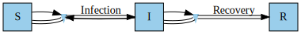
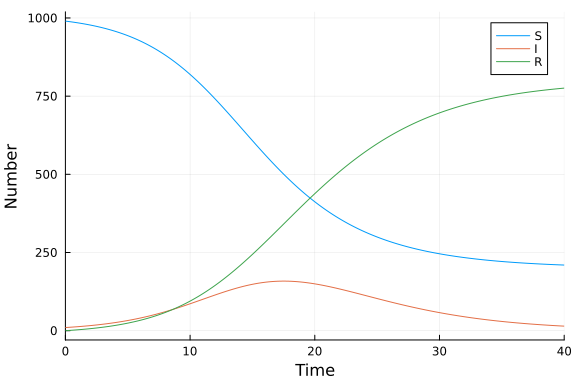
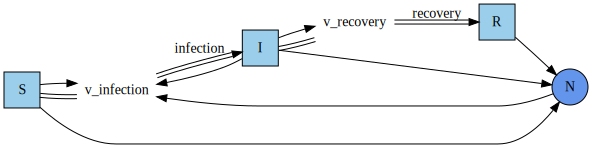
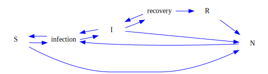

# Ordinary differential equation model constructed with a stock and flow model using StockFlow.jl
Simon Frost (@sdwfrost), 2023-05-17

## Introduction

This example uses [`StockFlow.jl`](https://github.com/AlgebraicJulia/StockFlow.jl) to develop an SIR model using a [stock and flow](https://en.wikipedia.org/wiki/Stock_and_flow) approach, in which the model compartments (`S`, `I`, and `R`) are considered as stocks, and the processes of infection and recovery are considered as flows. The stock and flow model can then be converted to an ordinary differential equation model to solve numerically. See [this paper](https://arxiv.org/abs/2205.08373) and [this book chapter](https://arxiv.org/abs/2211.01290) for more mathematical details on stock-and-flow models applied to epidemiology, and the `StockFlow.jl` repository for [more complex examples](https://github.com/AlgebraicJulia/StockFlow.jl/tree/master/examples).

## Libraries

```julia
using StockFlow
using LabelledArrays
using OrdinaryDiffEq
using GraphViz
using Plots;
```


## Transitions

We firstly define the SIR model using a simple schema. Firstly, we define functions of flows in the SIR model in terms of the model state, `u`, the model parameters, `p`, and time, `t`.

```julia
fInfection(u, p, t) = p.β * p.c * u.S * u.I/(u.S + u.I + u.R)
fRecovery(u, p, t) = p.γ * u.I;
```


A stock and flow model can be defined using the following primitive schema.

```
StockAndFlowp(stocks,
              (flow=>function, upstream=>downstream) => stocks linked)
```

In this model, `S`, `I`, and `R` are the stocks (defined as a `Tuple` of `Symbol`s), and infection and recovery are the flows. Each flow is defined by a label (here, `:Infection` and `:Recovery`), which is associated with a function that defines the rate. We define how the flows change the stocks - for example, infection results in a flow from `S` to `I` - and which stocks are linked by the flows.

```julia
sirp = StockAndFlowp((:S, :I, :R), 
   ((:Infection =>  fInfection, :S=>:I) =>  (:S,:I),
    (:Recovery  =>  fRecovery, :I=>:R)  =>  :I)
)
```

```
StockFlow.StockAndFlowp with elements Flow = 1:2, Stock = 1:3, Link = 1:3
┌──────┬───┬───┬───────────┬────────────┐
│ Flow │ u │ d │     fname │         ϕf │
├──────┼───┼───┼───────────┼────────────┤
│    1 │ 1 │ 2 │ Infection │ fInfection │
│    2 │ 2 │ 3 │  Recovery │  fRecovery │
└──────┴───┴───┴───────────┴────────────┘
┌───────┬───────┐
│ Stock │ sname │
├───────┼───────┤
│     1 │     S │
│     2 │     I │
│     3 │     R │
└───────┴───────┘
┌──────┬───┬───┐
│ Link │ s │ t │
├──────┼───┼───┤
│    1 │ 1 │ 1 │
│    2 │ 2 │ 1 │
│    3 │ 2 │ 2 │
└──────┴───┴───┘
```


A graph of the stock and flow model can be generated using `Graph`.

```julia
Graph(sirp)
```




In order to generate a system that can be passed to `ODEProblem`, we generate a vector field from the stock and flow model.

```julia
vfp = vectorfield(sirp);
```


## Time domain

```julia
tmax = 40.0
tspan = (0, tmax)
δt = 0.1;
```


## Initial conditions

Initial conditions are defined using a labelled vector.

```julia
u0 = LVector(S=990, I=10, R=0);
```


## Parameter values

Parameter values are also defined using a labelled vector.

```julia
p = LVector(β=0.05, c=10, γ=0.25);
```


## Running the model

Constructing the `ODEProblem` and solving uses the standard SciML pattern.

```julia
prob_p = ODEProblem(vfp, u0, tspan, p)
sol_p = solve(prob_p, Tsit5(), saveat=δt);
```


## Plotting

```julia
plot(sol_p, xlabel="Time", ylabel="Number")
```




## Full schema example

The full schema in `StockFlow.jl` allows more sophisticated manipulations of the model, such as composition and stratification. Compared to the primitive schema above, the functions that define the flow rates include an argument `uN` for *sum variables* i.e. variables that are generated by summing multiple states in the model.

```julia
fInfection(u, uN, p, t) = p.β * p.c * u.S * u.I/uN.N(u,t)
fRecovery(u, uN, p, t) = p.γ * u.I;
```


The following describes the complex schema. We have variables that describe the flows (independent of the actual rates defined by the functions), and sum variables.

```
(stock_name=>(inflows, outflows, variables, svariables))
     ## if a stock has no inflow or no outflow, use keyword ":F_NONE"
     ## if a stock has no variables connect to, use keyword ":V_NONE"
     ## if a stock has no sum_variables connect to, use keyword ":SV_NONE"
(flow=>variable)
(variable=>function)
(svariable=>variable)
     ## if sum_variable contributes to no variables, use keywork ":SVV_NONE"
```

The SIR model can be written using the above schema as follows. Julia's multiple dispatch mechanism ensures that the correct rate functions are called (with the `uN` argument), rather than those defined for the primitive schema.

```julia
sir=StockAndFlow(
    (:S=>(:F_NONE, :infection , :v_infection, :N),
     :I=>(:infection, :recovery, (:v_infection, :v_recovery), :N),
     :R=>(:recovery, :F_NONE, :V_NONE, :N)),
    (:infection => :v_infection, :recovery => :v_recovery),
    (:v_infection => fInfection, :v_recovery => fRecovery),
    (:N => (:v_infection))
)
```

```
StockFlow.StockAndFlow with elements S = 1:3, SV = 1:1, LS = 1:3, F = 1:2, 
I = 1:2, O = 1:2, V = 1:2, LV = 1:3, LSV = 1:1
┌───┬───────┐
│ S │ sname │
├───┼───────┤
│ 1 │     S │
│ 2 │     I │
│ 3 │     R │
└───┴───────┘
┌────┬────────┐
│ SV │ svname │
├────┼────────┤
│  1 │      N │
└────┴────────┘
┌────┬─────┬──────┐
│ LS │ lss │ lssv │
├────┼─────┼──────┤
│  1 │   1 │    1 │
│  2 │   2 │    1 │
│  3 │   3 │    1 │
└────┴─────┴──────┘
┌───┬────┬───────────┐
│ F │ fv │     fname │
├───┼────┼───────────┤
│ 1 │  1 │ infection │
│ 2 │  2 │  recovery │
└───┴────┴───────────┘
┌───┬─────┬────┐
│ I │ ifn │ is │
├───┼─────┼────┤
│ 1 │   1 │  2 │
│ 2 │   2 │  3 │
└───┴─────┴────┘
┌───┬─────┬────┐
│ O │ ofn │ os │
├───┼─────┼────┤
│ 1 │   1 │  1 │
│ 2 │   2 │  2 │
└───┴─────┴────┘
┌───┬─────────────┬────────────┐
│ V │       vname │  funcDynam │
├───┼─────────────┼────────────┤
│ 1 │ v_infection │ fInfection │
│ 2 │  v_recovery │  fRecovery │
└───┴─────────────┴────────────┘
┌────┬─────┬─────┐
│ LV │ lvs │ lvv │
├────┼─────┼─────┤
│  1 │   1 │   1 │
│  2 │   2 │   1 │
│  3 │   2 │   2 │
└────┴─────┴─────┘
┌─────┬───────┬──────┐
│ LSV │ lsvsv │ lsvv │
├─────┼───────┼──────┤
│   1 │     1 │    1 │
└─────┴───────┴──────┘
```


Once we have defined the model in terms of stocks and flows using the full schema, we proceed in the same way as for the primitive schema.

```julia
vf = vectorfield(sir)
prob = ODEProblem(vf, u0, tspan, p)
sol = solve(prob, Tsit5(), saveat=δt);
```


```julia
plot(sol, xlabel="Time", ylabel="Number")
```


## Graphical output for the full schema

We can produce a graph of the model as per the primitive schema.

```julia
Graph(sir)
```




In addition, we can convert the model generated from the full schema to a causal loop.

```julia
sir_causalloop = convertToCausalLoop(sir)
```

```
StockFlow.CausalLoop with elements E = 1:11, N = 1:6
┌────┬───┬───┐
│  E │ s │ t │
├────┼───┼───┤
│  1 │ 1 │ 6 │
│  2 │ 2 │ 6 │
│  3 │ 3 │ 6 │
│  4 │ 6 │ 4 │
│  5 │ 1 │ 4 │
│  6 │ 2 │ 4 │
│  7 │ 2 │ 5 │
│  8 │ 4 │ 2 │
│  9 │ 5 │ 3 │
│ 10 │ 4 │ 1 │
│ 11 │ 5 │ 2 │
└────┴───┴───┘
┌───┬───────────┐
│ N │     nname │
├───┼───────────┤
│ 1 │         S │
│ 2 │         I │
│ 3 │         R │
│ 4 │ infection │
│ 5 │  recovery │
│ 6 │         N │
└───┴───────────┘
```


```julia
Graph(sir_causalloop)
```




Alternatively, we can capture just the system structure as follows.

```julia
sir_structure = convertStockFlowToSystemStructure(sir)
```

```
StockFlow.StockAndFlowStructure with elements S = 1:3, SV = 1:1, LS = 1:3, 
F = 1:2, I = 1:2, O = 1:2, V = 1:2, LV = 1:3, LSV = 1:1
┌───┬───────┐
│ S │ sname │
├───┼───────┤
│ 1 │     S │
│ 2 │     I │
│ 3 │     R │
└───┴───────┘
┌────┬────────┐
│ SV │ svname │
├────┼────────┤
│  1 │      N │
└────┴────────┘
┌────┬─────┬──────┐
│ LS │ lss │ lssv │
├────┼─────┼──────┤
│  1 │   1 │    1 │
│  2 │   2 │    1 │
│  3 │   3 │    1 │
└────┴─────┴──────┘
┌───┬────┬───────────┐
│ F │ fv │     fname │
├───┼────┼───────────┤
│ 1 │  1 │ infection │
│ 2 │  2 │  recovery │
└───┴────┴───────────┘
┌───┬─────┬────┐
│ I │ ifn │ is │
├───┼─────┼────┤
│ 1 │   1 │  2 │
│ 2 │   2 │  3 │
└───┴─────┴────┘
┌───┬─────┬────┐
│ O │ ofn │ os │
├───┼─────┼────┤
│ 1 │   1 │  1 │
│ 2 │   2 │  2 │
└───┴─────┴────┘
┌───┬─────────────┐
│ V │       vname │
├───┼─────────────┤
│ 1 │ v_infection │
│ 2 │  v_recovery │
└───┴─────────────┘
┌────┬─────┬─────┐
│ LV │ lvs │ lvv │
├────┼─────┼─────┤
│  1 │   1 │   1 │
│  2 │   2 │   1 │
│  3 │   2 │   2 │
└────┴─────┴─────┘
┌─────┬───────┬──────┐
│ LSV │ lsvsv │ lsvv │
├─────┼───────┼──────┤
│   1 │     1 │    1 │
└─────┴───────┴──────┘
```


```julia
Graph(sir_structure)
```


## Discussion

While the above code demonstrates how to build an SIR model using stocks and flows, the real strength of the approach lies in the ability to manipulate the model structure, in order to create larger models by composing small models or by stratifying a model.