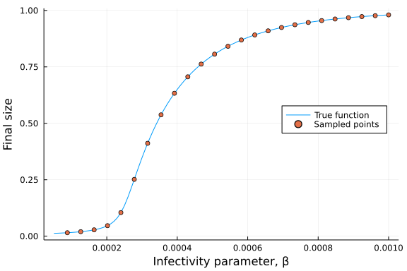
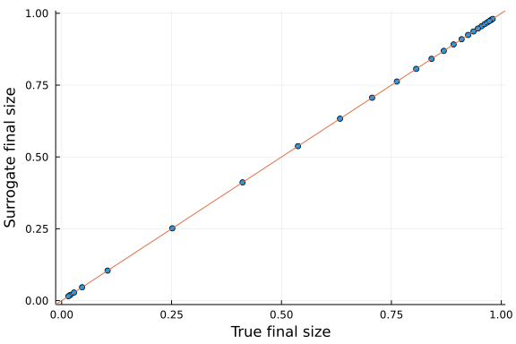
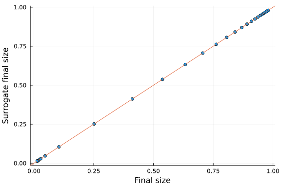
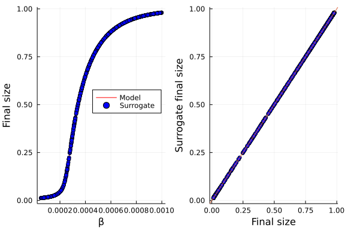
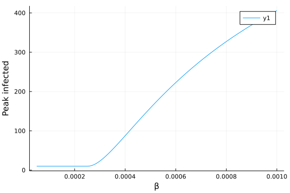
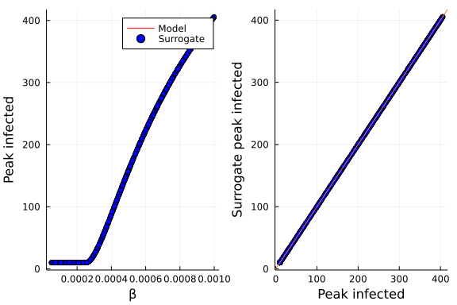
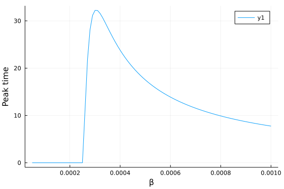
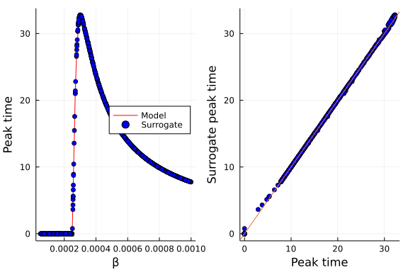

# Surrogate models of an ordinary differential equation model
Simon Frost (@sdwfrost), 2022-03-12

## Introduction

In this notebook, we use `Surrogates.jl` to make a surrogate model or *emulator* of the SIR model (deterministic, using an ODE) with a single input (infectivity). We train surrogate models on three different targets: the final size, the peak number of infected individuals, and the timing of the peak.

## Libraries

```julia
using OrdinaryDiffEq
using DiffEqCallbacks
using Surrogates
using Random
using Optim
using Plots
using BenchmarkTools
```


## Transitions

```julia
function sir_ode!(du,u,p,t)
    (S,I,R) = u
    (β,γ) = p
    @inbounds begin
        du[1] = -β*S*I
        du[2] = β*S*I - γ*I
        du[3] = γ*I
    end
    nothing
end;
```


## Time domain

We set the timespan to be high, as we will be using a callback in order to stop the integration early.

```julia
tmax = 10000.0
tspan = (0.0,tmax);
```


## Callbacks

This callback allows the model to be run until steady state is reached.

```julia
cb_ss = TerminateSteadyState();
```


## Initial conditions

We need to run the model for lots of initial conditions and parameter values.

```julia
n_train = 25 # Number of samples
n_test = 1000; # Number of samples
```


We specify lower (`lb`) and upper (`ub`) bounds for each parameter.

```julia
# Parameters are β
lb = 0.00005
ub = 0.001;
```


## Running the model

```julia
N = 1000.0
u0 = [990.0,10.0,0.0]
p = [0.0005,0.25]
prob_ode = ODEProblem(sir_ode!,u0,tspan,p);
```


## Creating surrogate models

We will create three separate surrogate models, in increasing order of difficulty for the emulators.

### Final size

We start by sampling values of β between the lower and upper bounds using Latin hypercube sampling, which will give more uniform coverage than a uniform sample given the low number of initial points.

```julia
Random.seed!(123)
sampler = LatinHypercubeSample();
```


β will be changed in-place, so we make a copy of the initial sample.

```julia
β = Surrogates.sample(n_train,lb,ub,sampler)
β₀ = copy(β);
```


```julia
final_size = function(β)
  p = prob_ode.p
  p[1] = β
  prob = remake(prob_ode;p=p)
  sol = solve(prob, ROS34PW3(),callback=cb_ss)
  fsp = sol[end][3]/N
  fsp
end;
```


We now compute the final size for our initial sample of β values.

```julia
fs = final_size.(β);
```


This illustrates the initial sampling points.

```julia
β_grid = lb:0.00001:ub
plot(β_grid,final_size.(β_grid),label="True function",xlab="Infectivity parameter, β",ylab="Final size")
scatter!(β,fs,legend=:right,label="Sampled points")
```




We use a `RadialBasis` as a surrogate model for `β`→`fs` between a lower bound, `lb`, and an upper bound, `ub`.

```julia
fs_surrogate = RadialBasis(β, fs, lb, ub, rad=cubicRadial);
```


```julia
scatter(fs,
        fs_surrogate.(β),
        legend=false,
        xlabel="True final size",
        ylabel="Surrogate final size")
Plots.abline!(1.0,0.0)
```




Optimization of this surrogate uses a sequential radial basis function (`SRBF`) approach to search parameter space and generate new samples where needed.

```julia
surrogate_optimize(final_size,
                   SRBF(),
                   lb,
                   ub,
                   fs_surrogate,
                   sampler;
                   maxiters=1000,
                   num_new_samples=1000);
```

```
Exiting, scale too big
```


The above function changes β in-place; the below compares the length of the original number of samples with the optimized surrogate.

```julia
β₁ = copy(β)
length(β₀),length(β)
```

```
(25, 29)
```


The below shows that the surrogate is a good fit, at least for the original plus optimized sampled points.

```julia
fs_opt = final_size.(β)
scatter(fs_opt,fs_surrogate.(β), xlabel="Final size", ylabel="Surrogate final size",legend=false)
Plots.abline!(1.0, 0.0)
```




We now apply our optimized sampler to a finer grid of β in order to assess how well the surrogate model performs for out-of-sample parameter values.

```julia
β_test = sample(n_test,lb,ub,UniformSample())
fs_test = final_size.(β_test)
fs_test_pred = fs_surrogate.(β_test);
```


```julia
l = @layout [a b]
pl1 = plot(β_grid,final_size.(β_grid),color=:red,label="Model",xlabel="β",ylabel="Final size")
scatter!(pl1, β_test,fs_test_pred,color=:blue,label="Surrogate")
pl2 = scatter(fs_test,fs_test_pred,color=:blue,legend=false,xlabel="Final size",ylabel="Surrogate final size")
Plots.abline!(pl2,1.0,0.0)
plot(pl1,pl2,layout=l)
```




Although this is a toy example, where the model runs quickly, the emulator is orders of magnitude faster.

```julia
@benchmark final_size(0.0005)
```

```
BenchmarkTools.Trial: 10000 samples with 1 evaluation.
 Range (min … max):  273.173 μs … 71.132 ms  ┊ GC (min … max): 0.00% … 99.2
9%
 Time  (median):     380.820 μs              ┊ GC (median):    0.00%
 Time  (mean ± σ):   465.401 μs ±  1.216 ms  ┊ GC (mean ± σ):  4.47% ±  1.7
2%

  ▂ ▂█▆▂▁▁                                                      
  █▆███████▇▆▅▅▄▄▄▃▃▂▂▂▂▂▂▂▂▂▂▂▂▂▂▂▂▂▂▂▂▁▁▁▁▁▁▁▁▁▁▁▁▁▁▁▁▁▁▁▁▁▁ ▂
  273 μs          Histogram: frequency by time         1.18 ms <

 Memory estimate: 125.98 KiB, allocs estimate: 1357.
```


```julia
@benchmark fs_surrogate(0.0005)
```

```
BenchmarkTools.Trial: 10000 samples with 9 evaluations.
 Range (min … max):  2.777 μs …   7.800 ms  ┊ GC (min … max):  0.00% … 99.9
0%
 Time  (median):     4.821 μs               ┊ GC (median):     0.00%
 Time  (mean ± σ):   7.449 μs ± 109.684 μs  ┊ GC (mean ± σ):  20.81% ±  1.4
1%

   ▆█▄▁                                                        
  █████▇▆▅▅▅▇▇▆▅▅▄▃▃▃▃▃▃▃▂▂▂▂▂▂▂▂▂▂▂▂▁▁▂▁▁▁▂▁▂▁▁▁▁▁▁▁▁▁▁▁▁▁▁▁ ▂
  2.78 μs         Histogram: frequency by time        18.2 μs <

 Memory estimate: 8.92 KiB, allocs estimate: 96.
```


## Peak infected

To determine the peak number of infected individuals, we make use of the feature where solutions of DiffEq models can be interpolated, and so we can use the solution in a function to maximize `I`, the number of infected individuals (strictly speaking, minimize `-I`).

```julia
peak_infected = function(β)
  p = prob_ode.p
  p[1] = β
  prob = remake(prob_ode;p=p)
  sol = solve(prob, ROS34PW3(),callback=cb_ss)
  tss = sol.t[end]
  f = (t) -> -sol(t,idxs=2)
  opt = Optim.optimize(f,0.0,tss)
  pk = -opt.minimum
  pk
end
```

```
#3 (generic function with 1 method)
```


The peak infected is more difficult to emulate than the final size, due to the discontinuity; when the basic reproductive number, R₀,  is less than 1, the number of infected individuals decreases, and peak infected is I(0) regardless of β.

```julia
plot(β_grid, peak_infected,xlabel="β",ylabel="Peak infected")
```




The workflow we used to generate a surrogate for final size is repeated here.

```julia
pk = peak_infected.(β)
pk_surrogate = RadialBasis(β,pk,lb,ub,rad = cubicRadial)
surrogate_optimize(peak_infected,
                   SRBF(),
                   lb,
                   ub,
                   pk_surrogate,
                   sampler;
                   maxiters=1000,
                   num_new_samples=1000)
pk_test = peak_infected.(β_test)
pk_test_pred = pk_surrogate.(β_test);
```

```
Exiting, scale too big
```


```julia
l = @layout [a b]
pl1 = plot(β_grid,peak_infected.(β_grid),color=:red,label="Model",xlabel="β",ylabel="Peak infected")
scatter!(pl1, β_test,pk_test_pred,color=:blue,label="Surrogate")
pl2 = scatter(pk_test,pk_test_pred,color=:blue,legend=false,xlabel="Peak infected",ylabel="Surrogate peak infected")
Plots.abline!(pl2,1.0,0.0)
plot(pl1,pl2,layout=l)
```



```julia
@benchmark peak_infected(0.0005)
```

```
BenchmarkTools.Trial: 9925 samples with 1 evaluation.
 Range (min … max):  275.047 μs … 85.287 ms  ┊ GC (min … max): 0.00% … 99.3
0%
 Time  (median):     417.096 μs              ┊ GC (median):    0.00%
 Time  (mean ± σ):   495.418 μs ±  1.412 ms  ┊ GC (mean ± σ):  4.89% ±  1.7
2%

    ▁▇██▆▇▇▆▃▄▂▁                                                
  ▆▇████████████▇▆▅▄▃▃▃▃▂▃▂▃▂▂▂▂▂▂▂▂▂▂▂▂▂▂▂▂▂▂▂▁▂▁▁▁▁▁▁▁▁▁▁▁▁▁ ▃
  275 μs          Histogram: frequency by time         1.21 ms <

 Memory estimate: 126.56 KiB, allocs estimate: 1367.
```


```julia
@benchmark pk_surrogate(0.0005)
```

```
BenchmarkTools.Trial: 10000 samples with 8 evaluations.
 Range (min … max):  3.511 μs …   8.639 ms  ┊ GC (min … max):  0.00% … 99.8
4%
 Time  (median):     5.392 μs               ┊ GC (median):     0.00%
 Time  (mean ± σ):   8.205 μs ± 121.846 μs  ┊ GC (mean ± σ):  20.98% ±  1.4
1%

   ▁▄▄▄█▆▅▄                                                    
  ▆██████████▆▆▅▄▄▃▃▃▄▅▆▅▄▄▃▅▅▆▆▆▅▄▄▄▃▄▃▃▃▃▂▂▂▂▂▂▂▂▁▂▁▁▁▁▁▁▁▁ ▃
  3.51 μs         Histogram: frequency by time        13.4 μs <

 Memory estimate: 11.17 KiB, allocs estimate: 120.
```


## Peak time

Peak time shows strong nonlinearity with β, and so is harder to emulate; we reuse the function for peak infected above, but return the minimizer rather than the minimum value.

```julia
peak_time = function(β)
  p = prob_ode.p
  p[1] = β
  prob = remake(prob_ode;p=p)
  sol = solve(prob, ROS34PW3(),callback=cb_ss)
  tss = sol.t[end]
  f = (t) -> -sol(t,idxs=2)
  opt = Optim.optimize(f,0.0,tss)
  pt = opt.minimizer
  pt
end
```

```
#7 (generic function with 1 method)
```


```julia
plot(β_grid,peak_time,xlabel="β",ylabel="Peak time")
```



```julia
pt = peak_time.(β)
pt_surrogate = RadialBasis(β,pt,lb,ub,rad = cubicRadial)
surrogate_optimize(peak_time,
                   SRBF(),
                   lb,
                   ub,
                   pt_surrogate,
                   sampler;
                   maxiters=1000,
                   num_new_samples=1000)
pt_test = peak_time.(β_test)
pt_test_pred = pt_surrogate.(β_test);
```

```
Exiting, scale too big
```


```julia
l = @layout [a b]
pl1 = plot(β_grid,peak_time.(β_grid),color=:red,label="Model",xlabel="β",ylabel="Peak time")
scatter!(pl1, β_test,pt_test_pred,color=:blue,label="Surrogate")
pl2 = scatter(pt_test,pt_test_pred,color=:blue,legend=false,xlabel="Peak time",ylabel="Surrogate peak time")
Plots.abline!(pl2,1.0,0.0)
plot(pl1,pl2,layout=l)
```



```julia
@benchmark peak_time(0.0005)
```

```
BenchmarkTools.Trial: 10000 samples with 1 evaluation.
 Range (min … max):  273.684 μs … 68.865 ms  ┊ GC (min … max): 0.00% … 99.3
9%
 Time  (median):     357.782 μs              ┊ GC (median):    0.00%
 Time  (mean ± σ):   394.097 μs ±  1.183 ms  ┊ GC (mean ± σ):  5.18% ±  1.7
2%

   ▄ ▃ ▂  ▄▇▇███▆▅▄▄▂▂▁▁                                        
  ▇█▇█▇██▇██████████████████▇▆▆▇▆▆▅▆▄▅▄▄▄▄▃▃▃▃▂▂▂▂▂▂▂▂▂▁▁▁▁▁▁▁ ▄
  274 μs          Histogram: frequency by time          590 μs <

 Memory estimate: 126.55 KiB, allocs estimate: 1366.
```


```julia
@benchmark pt_surrogate(0.0005)
```

```
BenchmarkTools.Trial: 10000 samples with 6 evaluations.
 Range (min … max):   5.179 μs …  10.916 ms  ┊ GC (min … max):  0.00% … 99.
87%
 Time  (median):      8.090 μs               ┊ GC (median):     0.00%
 Time  (mean ± σ):   12.325 μs ± 186.504 μs  ┊ GC (mean ± σ):  26.19% ±  1.
73%

  ▃▅▆█▆▅▃▁               ▁▁                                     
  █████████▇▆▆▅▄▄▄▃▃▃▃▃▄▇████▆▅▆▅▅▅▄▄▄▃▃▃▃▃▃▃▂▃▂▂▂▂▂▂▂▂▁▁▁▁▁▁▁ ▃
  5.18 μs         Histogram: frequency by time         18.2 μs <

 Memory estimate: 16.52 KiB, allocs estimate: 177.
```


## Discussion

With a fairly small number of actual model simulations, the above code generates surrogate models for three separate outputs that work well across the range of parameter inputs and are several orders of magnitude faster than the original model.
