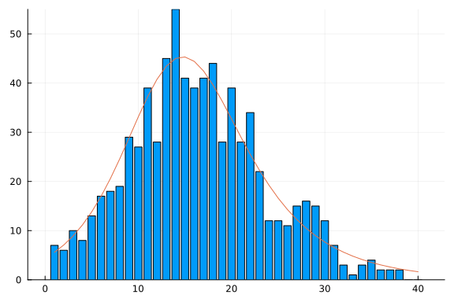
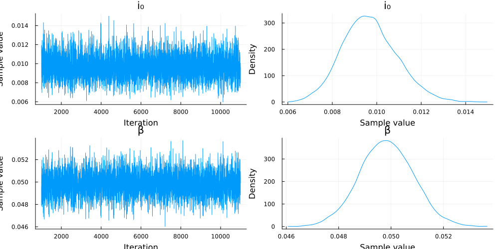
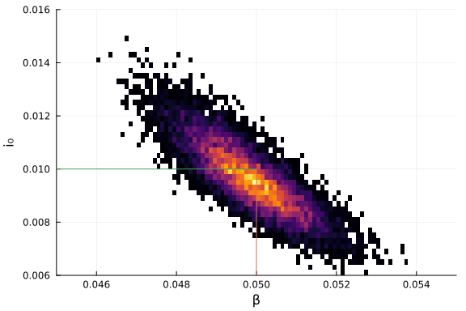

# Ordinary differential equation model with inference using Turing.jl
Simon Frost (@sdwfrost), 2020-05-27

## Introduction

In this notebook, we try to infer the parameter values from a simulated dataset using [Turing.jl](https://turing.ml).

## Libraries

````julia
using DifferentialEquations
using DiffEqSensitivity
using Random
using Distributions
using Turing
using DataFrames
using StatsPlots
````


## The model

The following is a standard SIR model, where we keep track of the cumulative number of infected individuals, `C`.

````julia
function sir_ode!(du,u,p,t)
    (S,I,R,C) = u
    (β,c,γ) = p
    N = S+I+R
    infection = β*c*I/N*S
    recovery = γ*I
    @inbounds begin
        du[1] = -infection
        du[2] = infection - recovery
        du[3] = recovery
        du[4] = infection
    end
    nothing
end;
````


````
sir_ode! (generic function with 1 method)
````


````julia
tmax = 40.0
tspan = (0.0,tmax)
obstimes = 1.0:1.0:tmax
u0 = [990.0,10.0,0.0,0.0] # S,I.R,C
p = [0.05,10.0,0.25]; # β,c,γ
````


````
3-element Array{Float64,1}:
  0.05
 10.0
  0.25
````


````julia
prob_ode = ODEProblem(sir_ode!,u0,tspan,p)
````


````
ODEProblem with uType Array{Float64,1} and tType Float64. In-place: true
timespan: (0.0, 40.0)
u0: [990.0, 10.0, 0.0, 0.0]
````


````julia
sol_ode = solve(prob_ode,
            Tsit5(),
            saveat = 1.0);
````


````
retcode: Success
Interpolation: 1st order linear
t: 41-element Array{Float64,1}:
  0.0
  1.0
  2.0
  3.0
  4.0
  5.0
  6.0
  7.0
  8.0
  9.0
  ⋮
 32.0
 33.0
 34.0
 35.0
 36.0
 37.0
 38.0
 39.0
 40.0
u: 41-element Array{Array{Float64,1},1}:
 [990.0, 10.0, 0.0, 0.0]
 [984.4093729820466, 12.759075298665039, 2.83155171928832, 5.59062701795335
75]
 [977.3332026510055, 16.22814554943427, 6.438651799560168, 12.6667973489944
34]
 [968.4242204222029, 20.558426973853646, 11.017352603943419, 21.57577957779
7064]
 [957.2822747333526, 25.91440777703591, 16.80331748961151, 32.7177252666474
1]
 [943.4628419127473, 32.463172502357864, 24.073985584894846, 46.53715808725
271]
 [926.497065600148, 40.35593403853616, 33.14700036131587, 63.50293439985202
]
 [905.9269551962524, 49.699931631668576, 44.37311317207904, 84.073044803747
64]
 [881.3585392131616, 60.52139921718387, 58.12006156965444, 108.641460786838
32]
 [852.5274163604042, 72.72290972680412, 74.74967391279168, 137.472583639595
8]
 ⋮
 [233.6919415512116, 44.46580488532527, 721.8422535634633, 756.308058448788
4]
 [228.88046764765463, 38.871629484210395, 732.247902868135, 761.11953235234
55]
 [224.76186839108456, 33.90671598976695, 741.3314156191486, 765.23813160891
54]
 [221.23300305457357, 29.522228842544973, 749.2447681028816, 768.7669969454
265]
 [218.20665229931438, 25.662350534147386, 756.1309971665382, 771.7933477006
857]
 [215.6107449890835, 22.274515459755385, 762.1147395511612, 774.38925501091
65]
 [213.3843905024685, 19.310740281779456, 767.3048692157521, 776.61560949753
15]
 [211.47427574879592, 16.72457203571691, 771.8011522154873, 778.52572425120
41]
 [209.83434778204648, 14.47208748405588, 775.6935647338977, 780.16565221795
35]
````


## Generating data

The data are assumed to be of daily new cases, which we can obtain from the cumulative number, `C`.

````julia
C = Array(sol_ode)[4,:] # Cumulative cases
X = C[2:end] - C[1:(end-1)]
````


````
40-element Array{Float64,1}:
  5.5906270179533575
  7.076170331041077
  8.90898222880263
 11.141945688850349
 13.8194328206053
 16.96577631259931
 20.57011040389561
 24.568415983090688
 28.831122852757474
 33.14329091787582
  ⋮
  5.623429741450877
  4.811473903557044
  4.118599256569951
  3.528865336511103
  3.026350755259159
  2.595907310230814
  2.226354486615037
  1.9101147536725875
  1.639927966749383
````


We generate some random Poisson noise for the measurement error to generate the observations, `Y`.

````julia
Random.seed!(1234)
Y = rand.(Poisson.(X))
````


````
40-element Array{Int64,1}:
  6
  9
  9
 11
 17
 21
 17
 22
 25
 34
  ⋮
  5
  3
  0
  1
  3
  3
  1
  2
  3
````


````julia
bar(obstimes,Y,legend=false)
plot!(obstimes,X,legend=false)
````





## Model specification using Turing

This model estimates the initial proportion of the population that is infected, `i₀`, and the infection probability, `β`, assuming uniform priors on each, with the remaining parameters fixed.

````julia
@model bayes_sir(y) = begin
  # Calculate number of timepoints
  l = length(y)
  i₀  ~ Uniform(0.0,1.0)
  β ~ Uniform(0.0,1.0)
  I = i₀*1000.0
  u0=[1000.0-I,I,0.0,0.0]
  p=[β,10.0,0.25]
  tspan = (0.0,float(l))
  prob = ODEProblem(sir_ode!,
          u0,
          tspan,
          p)
  sol = solve(prob,
              Tsit5(),
              saveat = 1.0)
  sol_C = Array(sol)[4,:] # Cumulative cases
  sol_X = sol_C[2:end] - sol_C[1:(end-1)]
  l = length(y)
  for i in 1:l
    y[i] ~ Poisson(sol_X[i])
  end
end;
````


````
DynamicPPL.ModelGen{Main.##WeaveSandBox#1161.var"###generator#1178",(:y,),(
),Tuple{}}(Main.##WeaveSandBox#1161.##generator#1178, NamedTuple())
````


### Fit using NUTS

The following fits the model using the No U-Turn Sampler.

````julia
ode_nuts = sample(bayes_sir(Y),NUTS(0.65),10000);
````


````
Chains MCMC chain (9000×14×1 Array{Float64,3}):

Iterations        = 1:9000
Thinning interval = 1
Chains            = 1
Samples per chain = 9000
parameters        = i₀, β
internals         = acceptance_rate, hamiltonian_energy, hamiltonian_energy
_error, is_accept, log_density, lp, max_hamiltonian_energy_error, n_steps, 
nom_step_size, numerical_error, step_size, tree_depth

Summary Statistics
  parameters      mean       std   naive_se      mcse       ess      rhat  
      Symbol   Float64   Float64    Float64   Float64   Float64   Float64  
                                                                           
          i₀    0.0102    0.0013     0.0000    0.0000    0.0052    0.9999  
           β    0.0496    0.0010     0.0000    0.0000    0.0031    0.9999  

Quantiles
  parameters      2.5%     25.0%     50.0%     75.0%     97.5%  
      Symbol   Float64   Float64   Float64   Float64   Float64  
                                                                
          i₀    0.0079    0.0093    0.0102    0.0110    0.0128  
           β    0.0477    0.0489    0.0496    0.0503    0.0515
````


The `describe` function displays some summary statistics of the output.

````julia
describe(ode_nuts)
````


````
2-element Array{MCMCChains.ChainDataFrame,1}:
 Summary Statistics (2 x 7)
 Quantiles (2 x 6)
````


````julia
plot(ode_nuts)
````





### Further plotting

The MCMC chains can be converted into a `DataFrame` for further plotting.

````julia
posterior = DataFrame(ode_nuts);
````


````
9000×16 DataFrame. Omitted printing of 12 columns
│ Row  │ iteration │ chain │ acceptance_rate │ hamiltonian_energy │
│      │ Int64     │ Int64 │ Float64         │ Float64            │
├──────┼───────────┼───────┼─────────────────┼────────────────────┤
│ 1    │ 1         │ 1     │ 0.891005        │ 121.135            │
│ 2    │ 2         │ 1     │ 0.970918        │ 120.094            │
│ 3    │ 3         │ 1     │ 0.6191          │ 121.477            │
│ 4    │ 4         │ 1     │ 0.97886         │ 121.329            │
│ 5    │ 5         │ 1     │ 0.992556        │ 119.753            │
│ 6    │ 6         │ 1     │ 0.81227         │ 120.129            │
│ 7    │ 7         │ 1     │ 0.992927        │ 120.097            │
⋮
│ 8993 │ 8993      │ 1     │ 0.844172        │ 123.458            │
│ 8994 │ 8994      │ 1     │ 0.985191        │ 123.682            │
│ 8995 │ 8995      │ 1     │ 1.0             │ 120.036            │
│ 8996 │ 8996      │ 1     │ 0.992742        │ 119.612            │
│ 8997 │ 8997      │ 1     │ 0.888915        │ 120.299            │
│ 8998 │ 8998      │ 1     │ 0.936733        │ 120.515            │
│ 8999 │ 8999      │ 1     │ 0.998423        │ 119.904            │
│ 9000 │ 9000      │ 1     │ 0.898376        │ 120.049            │
````


````julia
histogram2d(posterior[!,:β],posterior[!,:i₀],
                bins=80,
                xlabel="β",
                ylab="i₀",
                ylim=[0.006,0.016],
                xlim=[0.045,0.055],
                legend=false)
plot!([0.05,0.05],[0.0,0.01])
plot!([0.0,0.05],[0.01,0.01])
````





### Generate predictions

The following code generates predicted dynamics by sampling parameter values from the posterior distribution and running the model.

````julia
function predict(y,chain)
    # Length of data
    l = length(y)
    # Length of chain
    m = length(chain)
    # Choose random
    idx = sample(1:m)
    i₀ = chain[:i₀].value[idx]
    β = chain[:β].value[idx]
    I = i₀*1000.0
    u0=[1000.0-I,I,0.0,0.0]
    p=[β,10.0,0.25]
    tspan = (0.0,float(l))
    prob = ODEProblem(sir_ode!,
            u0,
            tspan,
            p)
    sol = solve(prob,
                Tsit5(),
                saveat = 1.0)
    out = Array(sol)
    sol_X = [0.0; out[4,2:end] - out[4,1:(end-1)]]
    hcat(sol_ode.t,out',sol_X)
end;
````


````
predict (generic function with 1 method)
````


Here is a plot of ten samples of the posterior for the number of daily cases against the simulated data.

````julia
Xp = []
for i in 1:10
    pred = predict(Y,ode_nuts)
    push!(Xp,pred[2:end,6])
end
````


````
Error: type AxisArray has no field value
````


````julia
scatter(obstimes,Y,legend=false)
plot!(obstimes,Xp,legend=false)
````


````
Error: BoundsError: attempt to access 0-element Array{Float64,1} at index [
1:40]
````


## Appendix
### Computer Information
```
Julia Version 1.4.1
Commit 381693d3df* (2020-04-14 17:20 UTC)
Platform Info:
  OS: Linux (x86_64-pc-linux-gnu)
  CPU: Intel(R) Core(TM) i7-1065G7 CPU @ 1.30GHz
  WORD_SIZE: 64
  LIBM: libopenlibm
  LLVM: libLLVM-8.0.1 (ORCJIT, icelake-client)
Environment:
  JULIA_NUM_THREADS = 4

```

### Package Information

```
Status `~/.julia/environments/v1.4/Project.toml`
[80f14c24-f653-4e6a-9b94-39d6b0f70001] AbstractMCMC 1.0.1
[537997a7-5e4e-5d89-9595-2241ea00577e] AbstractPlotting 0.12.3
[46ada45e-f475-11e8-01d0-f70cc89e6671] Agents 3.2.1
[4f99eebe-17bf-4e98-b6a1-2c4f205a959b] AlgebraicPetri 0.3.1
[f5f396d3-230c-5e07-80e6-9fadf06146cc] ApproxBayes 0.3.2
[c52e3926-4ff0-5f6e-af25-54175e0327b1] Atom 0.12.16
[fbb218c0-5317-5bc6-957e-2ee96dd4b1f0] BSON 0.2.6
[6e4b80f9-dd63-53aa-95a3-0cdb28fa8baf] BenchmarkTools 0.5.0
[a134a8b2-14d6-55f6-9291-3336d3ab0209] BlackBoxOptim 0.5.0
[2d3116d5-4b8f-5680-861c-71f149790274] Bridge 0.11.3
[1aa9af3a-2424-508f-bb7e-0626de155470] BridgeDiffEq 0.1.0
[46d747a0-b9e1-11e9-14b5-615c73e45078] BridgeSDEInference 0.3.2
[336ed68f-0bac-5ca0-87d4-7b16caf5d00b] CSV 0.7.3
[49dc2e85-a5d0-5ad3-a950-438e2897f1b9] Calculus 0.5.1
[134e5e36-593f-5add-ad60-77f754baafbe] Catlab 0.7.1
[aaaa29a8-35af-508c-8bc3-b662a17a0fe5] Clustering 0.14.1
[2445eb08-9709-466a-b3fc-47e12bd697a2] DataDrivenDiffEq 0.3.1
[a93c6f00-e57d-5684-b7b6-d8193f3e46c0] DataFrames 0.21.4
[7806a523-6efd-50cb-b5f6-3fa6f1930dbb] DecisionTree 0.10.6
[bcd4f6db-9728-5f36-b5f7-82caef46ccdb] DelayDiffEq 5.24.1
[2b5f629d-d688-5b77-993f-72d75c75574e] DiffEqBase 6.40.7
[ebbdde9d-f333-5424-9be2-dbf1e9acfb5e] DiffEqBayes 2.16.0
[eb300fae-53e8-50a0-950c-e21f52c2b7e0] DiffEqBiological 4.3.0
[459566f4-90b8-5000-8ac3-15dfb0a30def] DiffEqCallbacks 2.13.3
[aae7a2af-3d4f-5e19-a356-7da93b79d9d0] DiffEqFlux 1.17.0
[c894b116-72e5-5b58-be3c-e6d8d4ac2b12] DiffEqJump 6.9.3
[1130ab10-4a5a-5621-a13d-e4788d82bd4c] DiffEqParamEstim 1.16.0
[41bf760c-e81c-5289-8e54-58b1f1f8abe2] DiffEqSensitivity 6.23.0
[0c46a032-eb83-5123-abaf-570d42b7fbaa] DifferentialEquations 6.15.0
[b4f34e82-e78d-54a5-968a-f98e89d6e8f7] Distances 0.9.0
[31c24e10-a181-5473-b8eb-7969acd0382f] Distributions 0.23.4
[634d3b9d-ee7a-5ddf-bec9-22491ea816e1] DrWatson 1.14.4
[f6006082-12f8-11e9-0c9c-0d5d367ab1e5] EvoTrees 0.4.9
[587475ba-b771-5e3f-ad9e-33799f191a9c] Flux 0.10.4
[f6369f11-7733-5829-9624-2563aa707210] ForwardDiff 0.10.12
[38e38edf-8417-5370-95a0-9cbb8c7f171a] GLM 1.3.9
[28b8d3ca-fb5f-59d9-8090-bfdbd6d07a71] GR 0.50.1
[891a1506-143c-57d2-908e-e1f8e92e6de9] GaussianProcesses 0.12.1
[ea4f424c-a589-11e8-07c0-fd5c91b9da4a] Gen 0.3.5
[523d8e89-b243-5607-941c-87d699ea6713] Gillespie 0.1.0
[e850a1a4-d859-11e8-3d54-a195e6d045d3] GpABC 0.1.1
[7073ff75-c697-5162-941a-fcdaad2a7d2a] IJulia 1.21.2
[a98d9a8b-a2ab-59e6-89dd-64a1c18fca59] Interpolations 0.12.10
[c8e1da08-722c-5040-9ed9-7db0dc04731e] IterTools 1.3.0
[4076af6c-e467-56ae-b986-b466b2749572] JuMP 0.21.3
[e5e0dc1b-0480-54bc-9374-aad01c23163d] Juno 0.8.2
[b1bec4e5-fd48-53fe-b0cb-9723c09d164b] LIBSVM 0.4.0
[b964fa9f-0449-5b57-a5c2-d3ea65f4040f] LaTeXStrings 1.1.0
[2ee39098-c373-598a-b85f-a56591580800] LabelledArrays 1.3.0
[23fbe1c1-3f47-55db-b15f-69d7ec21a316] Latexify 0.13.5
[7acf609c-83a4-11e9-1ffb-b912bcd3b04a] LightGBM 0.3.1
[093fc24a-ae57-5d10-9952-331d41423f4d] LightGraphs 1.3.3
[30fc2ffe-d236-52d8-8643-a9d8f7c094a7] LossFunctions 0.6.2
[c7f686f2-ff18-58e9-bc7b-31028e88f75d] MCMCChains 4.0.1
[add582a8-e3ab-11e8-2d5e-e98b27df1bc7] MLJ 0.12.0
[094fc8d1-fd35-5302-93ea-dabda2abf845] MLJFlux 0.1.2
[6ee0df7b-362f-4a72-a706-9e79364fb692] MLJLinearModels 0.5.0
[d491faf4-2d78-11e9-2867-c94bc002c0b7] MLJModels 0.11.0
[1914dd2f-81c6-5fcd-8719-6d5c9610ff09] MacroTools 0.5.5
[5424a776-8be3-5c5b-a13f-3551f69ba0e6] Mamba 0.12.4
[ff71e718-51f3-5ec2-a782-8ffcbfa3c316] MixedModels 3.0.0-DEV
[961ee093-0014-501f-94e3-6117800e7a78] ModelingToolkit 3.13.0
[6f286f6a-111f-5878-ab1e-185364afe411] MultivariateStats 0.7.0
[76087f3c-5699-56af-9a33-bf431cd00edd] NLopt 0.6.0
[9bbee03b-0db5-5f46-924f-b5c9c21b8c60] NaiveBayes 0.4.0
[b8a86587-4115-5ab1-83bc-aa920d37bbce] NearestNeighbors 0.4.6
[41ceaf6f-1696-4a54-9b49-2e7a9ec3782e] NestedSamplers 0.4.0
[47be7bcc-f1a6-5447-8b36-7eeeff7534fd] ORCA 0.4.0
[429524aa-4258-5aef-a3af-852621145aeb] Optim 0.21.0
[1dea7af3-3e70-54e6-95c3-0bf5283fa5ed] OrdinaryDiffEq 5.41.0
[42b8e9d4-006b-409a-8472-7f34b3fb58af] ParallelKMeans 0.1.8
[4259d249-1051-49fa-8328-3f8ab9391c33] Petri 1.1.0
[91a5bcdd-55d7-5caf-9e0b-520d859cae80] Plots 1.5.4
[c3e4b0f8-55cb-11ea-2926-15256bba5781] Pluto 0.10.6
[d330b81b-6aea-500a-939a-2ce795aea3ee] PyPlot 2.9.0
[1a8c2f83-1ff3-5112-b086-8aa67b057ba1] Query 0.12.3-DEV
[6f49c342-dc21-5d91-9882-a32aef131414] RCall 0.13.7
[e6cf234a-135c-5ec9-84dd-332b85af5143] RandomNumbers 1.4.0
[c5292f4c-5179-55e1-98c5-05642aab7184] ResumableFunctions 0.5.1
[37e2e3b7-166d-5795-8a7a-e32c996b4267] ReverseDiff 1.2.0
[3646fa90-6ef7-5e7e-9f22-8aca16db6324] ScikitLearn 0.6.2
[f5ac2a72-33c7-5caf-b863-f02fefdcf428] SemanticModels 0.3.0
[428bdadb-6287-5aa5-874b-9969638295fd] SimJulia 0.8.0
[05bca326-078c-5bf0-a5bf-ce7c7982d7fd] SimpleDiffEq 1.1.0
[276daf66-3868-5448-9aa4-cd146d93841b] SpecialFunctions 0.10.3
[5a560754-308a-11ea-3701-ef72685e98d6] Splines2 0.1.0
[2913bbd2-ae8a-5f71-8c99-4fb6c76f3a91] StatsBase 0.33.0
[f3b207a7-027a-5e70-b257-86293d7955fd] StatsPlots 0.14.6
[789caeaf-c7a9-5a7d-9973-96adeb23e2a0] StochasticDiffEq 6.24.0
[92b13dbe-c966-51a2-8445-caca9f8a7d42] TaylorIntegration 0.8.3
[9f7883ad-71c0-57eb-9f7f-b5c9e6d3789c] Tracker 0.2.8
[fce5fe82-541a-59a6-adf8-730c64b5f9a0] Turing 0.13.0
[1986cc42-f94f-5a68-af5c-568840ba703d] Unitful 1.3.0
[276b4fcb-3e11-5398-bf8b-a0c2d153d008] WGLMakie 0.2.5
[29a6e085-ba6d-5f35-a997-948ac2efa89a] Wavelets 0.9.2
[44d3d7a6-8a23-5bf8-98c5-b353f8df5ec9] Weave 0.10.2
[009559a3-9522-5dbb-924b-0b6ed2b22bb9] XGBoost 1.1.1
```
