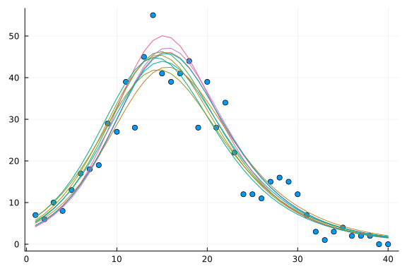

# Ordinary differential equation model with inference using Turing.jl
Simon Frost (@sdwfrost), 2020-05-27, updated 2024-06-15

## Introduction

In this notebook, we try to infer the parameter values from a simulated dataset using [Turing.jl](https://turing.ml).

## Libraries


```julia
using OrdinaryDiffEq
using SciMLSensitivity
using Random
using Distributions
using Turing
using DataFrames
using StatsPlots
using BenchmarkTools
```


## The model

The following is a standard SIR model, where we keep track of the cumulative number of infected individuals, `C`.

```julia
function sir_ode!(du,u,p,t)
    (S,I,R,C) = u
    (β,c,γ) = p
    N = S+I+R
    infection = β*c*I/N*S
    recovery = γ*I
    @inbounds begin
        du[1] = -infection
        du[2] = infection - recovery
        du[3] = recovery
        du[4] = infection
    end
    nothing
end;
```


```julia
tmax = 40.0
tspan = (0.0,tmax)
obstimes = 1.0:1.0:tmax
u0 = [990.0,10.0,0.0,0.0] # S,I.R,C
p = [0.05,10.0,0.25]; # β,c,γ
```


```julia
prob_ode = ODEProblem(sir_ode!,u0,tspan,p)
sol_ode = solve(prob_ode, Tsit5(), saveat = 1.0);
```


## Generating data

The data are assumed to be of daily new cases, which we can obtain from the cumulative number, `C`.

```julia
C = Array(sol_ode)[4,:] # Cumulative cases
X = C[2:end] - C[1:(end-1)];
```


We generate some random Poisson noise for the measurement error to generate the observations, `Y`.

```julia
Random.seed!(1234)
Y = rand.(Poisson.(X));
```


```julia
bar(obstimes,Y,legend=false)
plot!(obstimes,X,legend=false)
```


## Model specification using Turing

This model estimates the initial proportion of the population that is infected, `i₀`, and the infection probability, `β`, assuming uniform priors on each, with the remaining parameters fixed.

```julia
@model function bayes_sir(y)
  # Calculate number of timepoints
  l = length(y)
  i₀  ~ Uniform(0.0,1.0)
  β ~ Uniform(0.0,1.0)
  I = i₀*1000.0
  u0=[1000.0-I,I,0.0,0.0]
  p=[β,10.0,0.25]
  tspan = (0.0,float(l))
  prob = ODEProblem(sir_ode!,
          u0,
          tspan,
          p)
  sol = solve(prob,
              Tsit5(),
              saveat = 1.0)
  sol_C = Array(sol)[4,:] # Cumulative cases
  sol_X = sol_C[2:end] - sol_C[1:(end-1)]
  l = length(y)
  for i in 1:l
    y[i] ~ Poisson(abs(sol_X[i]))
  end
end;
```


### Fit using NUTS

The following fits the model using the No U-Turn Sampler, with 10000 samples.

```julia
@time ode_nuts = sample(bayes_sir(Y), NUTS(0.65), 10000, verbose=false, progress=false);
```

```
5.790118 seconds (47.31 M allocations: 4.158 GiB, 4.29% gc time, 25.25% c
ompilation time)
```


The `describe` function displays some summary statistics of the output.

```julia
describe(ode_nuts)
```

```
2-element Vector{MCMCChains.ChainDataFrame}:
 Summary Statistics (2 x 8)
 Quantiles (2 x 6)
```


```julia
plot(ode_nuts)
```


### Further plotting

The MCMC chains can be converted into a `DataFrame` for further plotting.

```julia
posterior = DataFrame(ode_nuts);
```


```julia
histogram2d(posterior[!,:β],posterior[!,:i₀],
                bins=80,
                xlabel="β",
                ylab="i₀",
                ylim=[0.006,0.016],
                xlim=[0.045,0.055],
                legend=false)
plot!([0.05,0.05],[0.0,0.01])
plot!([0.0,0.05],[0.01,0.01])
```


### Generate predictions

The following code generates predicted dynamics by sampling parameter values from the posterior distribution and running the model.

```julia
function predict(y,chain)
    # Length of data
    l = length(y)
    # Length of chain
    m = length(chain)
    # Choose random
    idx = sample(1:m)
    i₀ = chain[:i₀][idx]
    β = chain[:β][idx]
    I = i₀*1000.0
    u0=[1000.0-I,I,0.0,0.0]
    p=[β,10.0,0.25]
    tspan = (0.0,float(l))
    prob = ODEProblem(sir_ode!,
            u0,
            tspan,
            p)
    sol = solve(prob,
                Tsit5(),
                saveat = 1.0)
    out = Array(sol)
    sol_X = [0.0; out[4,2:end] - out[4,1:(end-1)]]
    hcat(sol_ode.t,out',sol_X)
end;
```


Here is a plot of ten samples of the posterior for the number of daily cases against the simulated data.

```julia
Xp = []
for i in 1:10
    pred = predict(Y,ode_nuts)
    push!(Xp,pred[2:end,6])
end;
```


```julia
scatter(obstimes,Y,legend=false)
plot!(obstimes,Xp,legend=false)
```




## Benchmarking

```julia
@benchmark sample(bayes_sir(Y), NUTS(0.65), 10000, verbose=false, progress=false)
```

```
BenchmarkTools.Trial: 2 samples with 1 evaluation.
 Range (min … max):  4.227 s …    4.399 s  ┊ GC (min … max): 6.91% … 6.91%
 Time  (median):     4.313 s               ┊ GC (median):    6.91%
 Time  (mean ± σ):   4.313 s ± 121.877 ms  ┊ GC (mean ± σ):  6.91% ± 0.00%

  █                                                        █  
  █▁▁▁▁▁▁▁▁▁▁▁▁▁▁▁▁▁▁▁▁▁▁▁▁▁▁▁▁▁▁▁▁▁▁▁▁▁▁▁▁▁▁▁▁▁▁▁▁▁▁▁▁▁▁▁▁█ ▁
  4.23 s         Histogram: frequency by time          4.4 s <

 Memory estimate: 3.82 GiB, allocs estimate: 43119187.
```


## Coverage

```julia
using Base.Threads
```


We can check the number of threads available.

```julia
Threads.nthreads()
```

```
8
```


```julia
function sir_ode_solve(problem, l, i₀, β)
    I = i₀*1000.0
    S = 1000.0 - I
    u0 = [S, I, 0.0, 0.0]
    p = [β, 10.0, 0.25]
    prob = remake(problem; u0=u0, p=p)
    sol = solve(prob, Tsit5(), saveat = 1.0)
    sol_C = view(sol, 4, :) # Cumulative cases
    sol_X = Array{eltype(sol_C)}(undef, l)
    @inbounds @simd for i in 1:length(sol_X)
        sol_X[i] = sol_C[i + 1] - sol_C[i]
    end
    return sol_X
end;
```


```julia
function simulate_data(l, i₀, β)
    prob = ODEProblem(sir_ode!, [990.0, 10.0, 0.0, 0.0], (0.0, l), [β, 10.0, 0.25])
    X = sir_ode_solve(prob, l, i₀, β)
    Y = rand.(Poisson.(X))
    return X, Y
end;
```


We can now use the `Threads.@threads` macro to parallelize the simulation and inference process.

```julia
nsims = 1000
i₀_true = 0.01
β_true = 0.05
l = 40
i₀_mean = Array{Float64}(undef, nsims)
β_mean = Array{Float64}(undef, nsims)
i₀_coverage = Array{Float64}(undef, nsims)
β_coverage = Array{Float64}(undef, nsims)
Threads.@threads for i in 1:nsims
    X_sim, Y_sim = simulate_data(l, i₀_true, β_true)
    r = sample(bayes_sir(Y_sim), NUTS(0.65), 10000, verbose=false, progress=false)
    i₀_mean[i] = mean(r[:i₀])
    i0_cov = sum(r[:i₀] .<= i₀_true) / length(r[:i₀])
    β_mean[i] = mean(r[:β])
    b_cov = sum(r[:β] .<= β_true) / length(r[:β])
    i₀_coverage[i] = i0_cov
    β_coverage[i] = b_cov
end;
```


If the credible intervals are well calibrated, we expect that the distribution of the CDF of the true value (across multiple simulated datasets) should be uniform.

```julia
# Convenience function to check if the true value is within the credible interval
function in_credible_interval(x, lwr=0.025, upr=0.975)
    return x >= lwr && x <= upr
end;
```


```julia
pl_β_coverage = histogram(β_coverage, bins=0:0.1:1.0, label=false, title="β", ylabel="Density", density=true, xrotation=45, xlim=(0.0,1.0))
pl_i₀_coverage = histogram(i₀_coverage, bins=0:0.1:1.0, label=false, title="i₀", ylabel="Density", density=true, xrotation=45, xlim=(0.0,1.0))
plot(pl_β_coverage, pl_i₀_coverage, layout=(1,2), plot_title="Distribution of CDF of true value")
```


The coverage of the 95% credible intervals is given by the proportion of simulations where the true value is within the interval.

```julia
sum(in_credible_interval.(β_coverage)) / nsims
```

```
0.942
```


```julia
sum(in_credible_interval.(i₀_coverage)) / nsims
```

```
0.947
```


We can also look at the distribution of the posterior means, which should fall around the true value.

```julia
pl_β_mean = histogram(β_mean, label=false, title="β", ylabel="Density", density=true, xrotation=45, xlim=(0.045, 0.055))
vline!([β_true], label="True value")
pl_i₀_mean = histogram(i₀_mean, label=false, title="i₀", ylabel="Density", density=true, xrotation=45, xlim=(0.0,0.02))
vline!([i₀_true], label="True value")
plot(pl_β_mean, pl_i₀_mean, layout=(1,2), plot_title="Distribution of posterior means")
```


