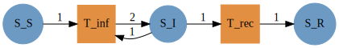
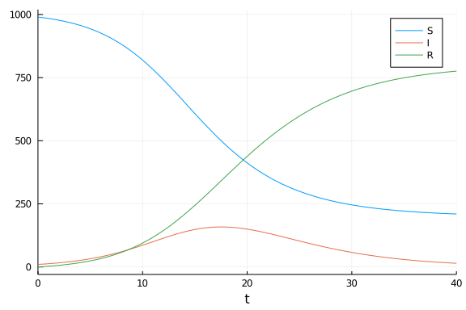
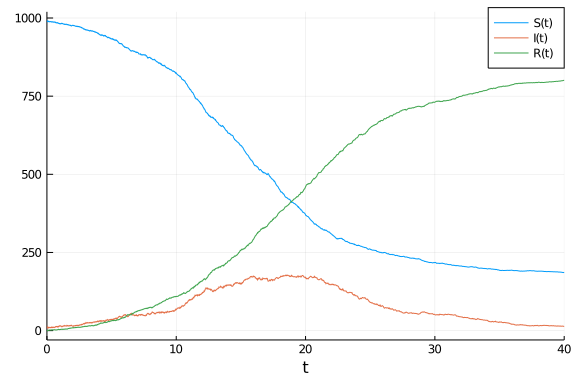
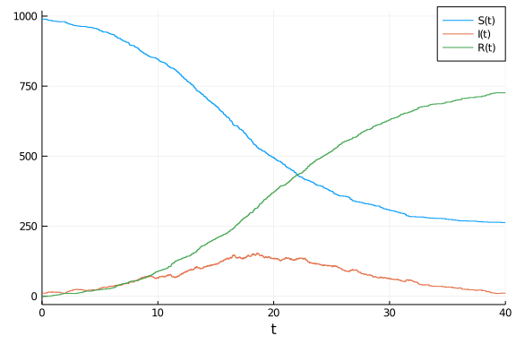

# Petri net model using Petri.jl
Micah Halter (@mehalter), 2020-07-14

## Introduction

This implementation considers the SIR model as a Petri net, using [`Petri.jl`](https://github.com/mehalter/Petri.jl), which is then used to generate ODE, SDE, and jump process models.

## Libraries

````julia
using Petri
using LabelledArrays
using OrdinaryDiffEq
using StochasticDiffEq
using DiffEqJump
using Random
using Plots
````


## Transitions

The Petri model is specified using a vector of the model states (as symbols), and a labelled vector of the transition rates; in this case, `inf` (infection) and `rec` (recovery). Each transition is a tuple of labeled vectors with inputs and outputs.

````julia
sir = Petri.Model([:S,:I,:R],LVector(
                                inf=(LVector(S=1,I=1), LVector(I=2)),
                                rec=(LVector(I=1),     LVector(R=1))))
````


````
Petri.Model{Array{Symbol,1},LabelledArrays.LArray{Tuple{LabelledArrays.LArr
ay{Int64,1,Array{Int64,1},Syms} where Syms,LabelledArrays.LArray{Int64,1,Ar
ray{Int64,1},Syms} where Syms},1,Array{Tuple{LabelledArrays.LArray{Int64,1,
Array{Int64,1},Syms} where Syms,LabelledArrays.LArray{Int64,1,Array{Int64,1
},Syms} where Syms},1},(:inf, :rec)}}([:S, :I, :R], 2-element LabelledArray
s.LArray{Tuple{LabelledArrays.LArray{Int64,1,Array{Int64,1},Syms} where Sym
s,LabelledArrays.LArray{Int64,1,Array{Int64,1},Syms} where Syms},1,Array{Tu
ple{LabelledArrays.LArray{Int64,1,Array{Int64,1},Syms} where Syms,LabelledA
rrays.LArray{Int64,1,Array{Int64,1},Syms} where Syms},1},(:inf, :rec)}:
 :inf => (2-element LabelledArrays.LArray{Int64,1,Array{Int64,1},(:S, :I)}:
 :S => 1
 :I => 1, 1-element LabelledArrays.LArray{Int64,1,Array{Int64,1},(:I,)}:
 :I => 2)
 :rec => (1-element LabelledArrays.LArray{Int64,1,Array{Int64,1},(:I,)}:
 :I => 1, 1-element LabelledArrays.LArray{Int64,1,Array{Int64,1},(:R,)}:
 :R => 1))
````


Using Graphviz, a graph showing the states and transitions can also be generated from the Petri net.

````julia
Graph(sir)
````





## Time domain

````julia
tmax = 40.0
tspan = (0.0,tmax);
````


````
(0.0, 40.0)
````


## Initial conditions

````julia
u0 = LVector(S=990.0, I=10.0, R=0.0)
````


````
3-element LabelledArrays.LArray{Float64,1,Array{Float64,1},(:S, :I, :R)}:
 :S => 990.0
 :I => 10.0
 :R => 0.0
````


## Parameter values

````julia
p = LVector(inf=0.5/sum(u0), rec=0.25);
````


````
2-element LabelledArrays.LArray{Float64,1,Array{Float64,1},(:inf, :rec)}:
 :inf => 0.0005
 :rec => 0.25
````


## Random number seed

We set a random number seed for reproducibility.

````julia
Random.seed!(1234);
````


````
Random.MersenneTwister(UInt32[0x000004d2], Random.DSFMT.DSFMT_state(Int32[-
1393240018, 1073611148, 45497681, 1072875908, 436273599, 1073674613, -20437
16458, 1073445557, -254908435, 1072827086  …  -599655111, 1073144102, 36765
5457, 1072985259, -1278750689, 1018350124, -597141475, 249849711, 382, 0]),
 [0.0, 0.0, 0.0, 0.0, 0.0, 0.0, 0.0, 0.0, 0.0, 0.0  …  0.0, 0.0, 0.0, 0.0, 
0.0, 0.0, 0.0, 0.0, 0.0, 0.0], UInt128[0x00000000000000000000000000000000, 
0x00000000000000000000000000000000, 0x00000000000000000000000000000000, 0x0
0000000000000000000000000000000, 0x00000000000000000000000000000000, 0x0000
0000000000000000000000000000, 0x00000000000000000000000000000000, 0x0000000
0000000000000000000000000, 0x00000000000000000000000000000000, 0x0000000000
0000000000000000000000  …  0x00000000000000000000000000000000, 0x0000000000
0000000000000000000000, 0x00000000000000000000000000000000, 0x0000000000000
0000000000000000000, 0x00000000000000000000000000000000, 0x0000000000000000
0000000000000000, 0x00000000000000000000000000000000, 0x0000000000000000000
0000000000000, 0x00000000000000000000000000000000, 0x0000000000000000000000
0000000000], 1002, 0)
````


## Generating and running models

### As ODEs

````julia
prob_ode = ODEProblem(sir,u0,tspan,p)
sol_ode = solve(prob_ode, Tsit5());
plot(sol_ode)
````





### As SDEs

````julia
prob_sde,cb = SDEProblem(sir,u0,tspan,p)
sol_sde = solve(prob_sde,LambaEM(),callback=cb);
plot(sol_sde)
````





### As jump process

````julia
prob_jump = JumpProblem(sir, u0, tspan, p)
sol_jump = solve(prob_jump,SSAStepper());
plot(sol_jump)
````





## Appendix
### Computer Information
```
Julia Version 1.4.2
Commit 44fa15b150* (2020-05-23 18:35 UTC)
Platform Info:
  OS: Linux (x86_64-pc-linux-gnu)
  CPU: Intel(R) Core(TM) i7-8850H CPU @ 2.60GHz
  WORD_SIZE: 64
  LIBM: libopenlibm
  LLVM: libLLVM-8.0.1 (ORCJIT, skylake)
Environment:
  JULIA_HOME = /home/micah/.local/share/julia
  JULIA_LOAD_PATH = :
  JULIA_DEPOT_PATH = /home/micah/Documents/git/sir-julia/env/.julia
  SPACESHIP_JULIA_SYMBOL = ∴

```

### Package Information

```
Status `~/Documents/git/sir-julia/Project.toml`
[46ada45e-f475-11e8-01d0-f70cc89e6671] Agents 3.2.1
[4f99eebe-17bf-4e98-b6a1-2c4f205a959b] AlgebraicPetri 0.3.1
[b19378d9-d87a-599a-927f-45f220a2c452] ArrayFire 1.0.6
[c52e3926-4ff0-5f6e-af25-54175e0327b1] Atom 0.12.16
[6e4b80f9-dd63-53aa-95a3-0cdb28fa8baf] BenchmarkTools 0.5.0
[be33ccc6-a3ff-5ff2-a52e-74243cff1e17] CUDAnative 3.2.0
[134e5e36-593f-5add-ad60-77f754baafbe] Catlab 0.7.1
[3a865a2d-5b23-5a0f-bc46-62713ec82fae] CuArrays 2.2.2
[717857b8-e6f2-59f4-9121-6e50c889abd2] DSP 0.6.7
[2445eb08-9709-466a-b3fc-47e12bd697a2] DataDrivenDiffEq 0.2.0
[a93c6f00-e57d-5684-b7b6-d8193f3e46c0] DataFrames 0.21.4
[459566f4-90b8-5000-8ac3-15dfb0a30def] DiffEqCallbacks 2.13.3
[aae7a2af-3d4f-5e19-a356-7da93b79d9d0] DiffEqFlux 1.17.0
[c894b116-72e5-5b58-be3c-e6d8d4ac2b12] DiffEqJump 6.9.3
[41bf760c-e81c-5289-8e54-58b1f1f8abe2] DiffEqSensitivity 6.23.0
[6d1b261a-3be8-11e9-3f2f-0b112a9a8436] DiffEqTutorials 0.1.0
[0c46a032-eb83-5123-abaf-570d42b7fbaa] DifferentialEquations 6.15.0
[31c24e10-a181-5473-b8eb-7969acd0382f] Distributions 0.23.4
[634d3b9d-ee7a-5ddf-bec9-22491ea816e1] DrWatson 1.14.3
[587475ba-b771-5e3f-ad9e-33799f191a9c] Flux 0.10.4
[0c68f7d7-f131-5f86-a1c3-88cf8149b2d7] GPUArrays 3.4.1
[28b8d3ca-fb5f-59d9-8090-bfdbd6d07a71] GR 0.50.1
[523d8e89-b243-5607-941c-87d699ea6713] Gillespie 0.1.0
[7073ff75-c697-5162-941a-fcdaad2a7d2a] IJulia 1.21.2
[e5e0dc1b-0480-54bc-9374-aad01c23163d] Juno 0.8.2
[2ee39098-c373-598a-b85f-a56591580800] LabelledArrays 1.3.0
[961ee093-0014-501f-94e3-6117800e7a78] ModelingToolkit 3.13.0
[429524aa-4258-5aef-a3af-852621145aeb] Optim 0.22.0
[1dea7af3-3e70-54e6-95c3-0bf5283fa5ed] OrdinaryDiffEq 5.41.0
[4259d249-1051-49fa-8328-3f8ab9391c33] Petri 1.1.0
[91a5bcdd-55d7-5caf-9e0b-520d859cae80] Plots 1.5.4
[e6cf234a-135c-5ec9-84dd-332b85af5143] RandomNumbers 1.4.0
[c5292f4c-5179-55e1-98c5-05642aab7184] ResumableFunctions 0.5.1
[428bdadb-6287-5aa5-874b-9969638295fd] SimJulia 0.8.0
[05bca326-078c-5bf0-a5bf-ce7c7982d7fd] SimpleDiffEq 1.1.0
[2913bbd2-ae8a-5f71-8c99-4fb6c76f3a91] StatsBase 0.33.0
[f3b207a7-027a-5e70-b257-86293d7955fd] StatsPlots 0.14.6
[789caeaf-c7a9-5a7d-9973-96adeb23e2a0] StochasticDiffEq 6.24.0
[44d3d7a6-8a23-5bf8-98c5-b353f8df5ec9] Weave 0.10.2
[37e2e46d-f89d-539d-b4ee-838fcccc9c8e] LinearAlgebra
[cf7118a7-6976-5b1a-9a39-7adc72f591a4] UUIDs
```
