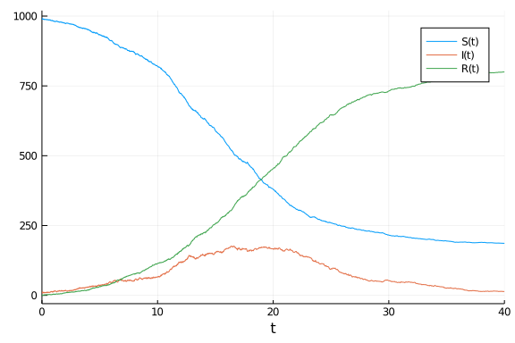
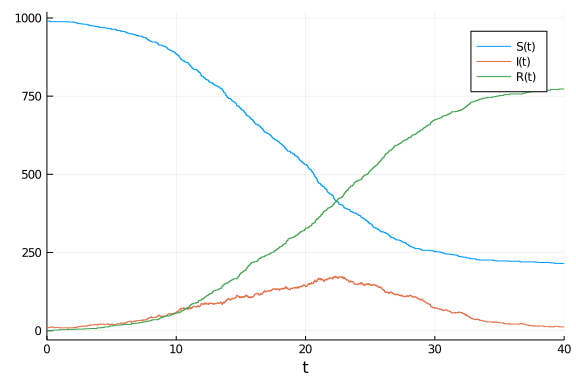

# Reaction network model using ModelingToolkit
Simon Frost (@sdwfrost), 2020-05-20

## Introduction

One high-level representation of the SIR model is as a reaction network, borrowed from systems biology. [ModelingToolkit](https://mtk.sciml.ai/) allows us to convert this representation to ODEs, SDEs, and jump processes. This example is a slightly tweaked version of [one in the ModelingToolkit documentation](https://mtk.sciml.ai/dev/systems/ReactionSystem/), using the population size as a derived variable in the rates for the transitions.

## Libraries

````julia
using DifferentialEquations
using ModelingToolkit
using OrdinaryDiffEq
using StochasticDiffEq
using DiffEqJump
using Random
using Plots
````


## Transitions

````julia
@parameters t β c γ
@variables S(t) I(t) R(t)

N=S+I+R # This is recognized as a derived variable
rxs = [Reaction((β*c)/N, [S,I], [I], [1,1], [2])
       Reaction(γ, [I], [R])]
````


````
2-element Array{ModelingToolkit.Reaction{ModelingToolkit.Variable,Int64},1}
:
 ModelingToolkit.Reaction{ModelingToolkit.Variable,Int64}((β * c) / ((S(t) 
+ I(t)) + R(t)), ModelingToolkit.Operation[S(t), I(t)], ModelingToolkit.Ope
ration[I(t)], [1, 1], [2], Pair{ModelingToolkit.Variable,Int64}[I => 1, S =
> -1], false)
 ModelingToolkit.Reaction{ModelingToolkit.Variable,Int64}(γ, ModelingToolki
t.Operation[I(t)], ModelingToolkit.Operation[R(t)], [1], [1], Pair{Modeling
Toolkit.Variable,Int64}[R => 1, I => -1], false)
````


````julia
rs  = ReactionSystem(rxs, t, [S,I,R], [β,c,γ])
````


````
ModelingToolkit.ReactionSystem(ModelingToolkit.Reaction[ModelingToolkit.Rea
ction{ModelingToolkit.Variable,Int64}((β * c) / ((S(t) + I(t)) + R(t)), Mod
elingToolkit.Operation[S(t), I(t)], ModelingToolkit.Operation[I(t)], [1, 1]
, [2], Pair{ModelingToolkit.Variable,Int64}[I => 1, S => -1], false), Model
ingToolkit.Reaction{ModelingToolkit.Variable,Int64}(γ, ModelingToolkit.Oper
ation[I(t)], ModelingToolkit.Operation[R(t)], [1], [1], Pair{ModelingToolki
t.Variable,Int64}[R => 1, I => -1], false)], t, ModelingToolkit.Variable[S,
 I, R], ModelingToolkit.Variable[β, c, γ], Symbol("##ReactionSystem#358"), 
ModelingToolkit.ReactionSystem[])
````


## Time domain

We set the timespan for simulations, `tspan`, initial conditions, `u0`, and parameter values, `p` (which are unpacked above as `[β,γ]`).

````julia
tmax = 40.0
tspan = (0.0,tmax);
````


````
(0.0, 40.0)
````


## Initial conditions

In `ModelingToolkit`, the initial values are defined by a dictionary.

````julia
u0 = [S => 990.0,
      I => 10.0,
      R => 0.0];
````


````
3-element Array{Pair{ModelingToolkit.Operation,Float64},1}:
 S(t) => 990.0
 I(t) => 10.0
 R(t) => 0.0
````


## Parameter values

Similarly, the parameter values are defined by a dictionary.

````julia
p = [β=>0.05,
     c=>10.0,
     γ=>0.25];
````


````
3-element Array{Pair{ModelingToolkit.Operation,Float64},1}:
 β => 0.05
 c => 10.0
 γ => 0.25
````


## Random number seed

````julia
Random.seed!(1234);
````


````
Random.MersenneTwister(UInt32[0x000004d2], Random.DSFMT.DSFMT_state(Int32[-
1393240018, 1073611148, 45497681, 1072875908, 436273599, 1073674613, -20437
16458, 1073445557, -254908435, 1072827086  …  -599655111, 1073144102, 36765
5457, 1072985259, -1278750689, 1018350124, -597141475, 249849711, 382, 0]),
 [0.0, 0.0, 0.0, 0.0, 0.0, 0.0, 0.0, 0.0, 0.0, 0.0  …  0.0, 0.0, 0.0, 0.0, 
0.0, 0.0, 0.0, 0.0, 0.0, 0.0], UInt128[0x00000000000000000000000000000000, 
0x00000000000000000000000000000000, 0x00000000000000000000000000000000, 0x0
0000000000000000000000000000000, 0x00000000000000000000000000000000, 0x0000
0000000000000000000000000000, 0x00000000000000000000000000000000, 0x0000000
0000000000000000000000000, 0x00000000000000000000000000000000, 0x0000000000
0000000000000000000000  …  0x00000000000000000000000000000000, 0x0000000000
0000000000000000000000, 0x00000000000000000000000000000000, 0x0000000000000
0000000000000000000, 0x00000000000000000000000000000000, 0x0000000000000000
0000000000000000, 0x00000000000000000000000000000000, 0x0000000000000000000
0000000000000, 0x00000000000000000000000000000000, 0x0000000000000000000000
0000000000], 1002, 0)
````


## Generating and running models

### As ODEs

````julia
odesys = convert(ODESystem, rs)
oprob = ODEProblem(odesys, u0, tspan, p)
osol = solve(oprob, Tsit5())
plot(osol)
````


### As SDEs

````julia
sdesys = convert(SDESystem, rs)
sprob = SDEProblem(sdesys, u0, tspan, p)
ssol = solve(sprob, SRA1())
plot(ssol)
````





### As jump process

To convert to a jump process, we need to set the initial conditions to `Int` rather than `Float`.

````julia
jumpsys = convert(JumpSystem, rs)
u0i = [S => 990, I => 10, R => 0]
dprob = DiscreteProblem(jumpsys, u0i, tspan, p)
jprob = JumpProblem(jumpsys, dprob, Direct())
jsol = solve(jprob, SSAStepper())
plot(jsol)
````





## Appendix
### Computer Information
```
Julia Version 1.4.1
Commit 381693d3df* (2020-04-14 17:20 UTC)
Platform Info:
  OS: Linux (x86_64-pc-linux-gnu)
  CPU: Intel(R) Core(TM) i7-1065G7 CPU @ 1.30GHz
  WORD_SIZE: 64
  LIBM: libopenlibm
  LLVM: libLLVM-8.0.1 (ORCJIT, icelake-client)
Environment:
  JULIA_NUM_THREADS = 4

```

### Package Information

```
Status `~/.julia/environments/v1.4/Project.toml`
[46ada45e-f475-11e8-01d0-f70cc89e6671] Agents 3.1.0
[c52e3926-4ff0-5f6e-af25-54175e0327b1] Atom 0.12.11
[6e4b80f9-dd63-53aa-95a3-0cdb28fa8baf] BenchmarkTools 0.5.0
[a134a8b2-14d6-55f6-9291-3336d3ab0209] BlackBoxOptim 0.5.0
[2445eb08-9709-466a-b3fc-47e12bd697a2] DataDrivenDiffEq 0.2.0
[a93c6f00-e57d-5684-b7b6-d8193f3e46c0] DataFrames 0.21.0
[ebbdde9d-f333-5424-9be2-dbf1e9acfb5e] DiffEqBayes 2.14.0
[459566f4-90b8-5000-8ac3-15dfb0a30def] DiffEqCallbacks 2.13.2
[c894b116-72e5-5b58-be3c-e6d8d4ac2b12] DiffEqJump 6.7.5
[1130ab10-4a5a-5621-a13d-e4788d82bd4c] DiffEqParamEstim 1.14.1
[0c46a032-eb83-5123-abaf-570d42b7fbaa] DifferentialEquations 6.14.0
[31c24e10-a181-5473-b8eb-7969acd0382f] Distributions 0.23.2
[634d3b9d-ee7a-5ddf-bec9-22491ea816e1] DrWatson 1.11.0
[587475ba-b771-5e3f-ad9e-33799f191a9c] Flux 0.8.3
[28b8d3ca-fb5f-59d9-8090-bfdbd6d07a71] GR 0.49.1
[523d8e89-b243-5607-941c-87d699ea6713] Gillespie 0.1.0
[7073ff75-c697-5162-941a-fcdaad2a7d2a] IJulia 1.21.2
[4076af6c-e467-56ae-b986-b466b2749572] JuMP 0.21.2
[e5e0dc1b-0480-54bc-9374-aad01c23163d] Juno 0.8.2
[093fc24a-ae57-5d10-9952-331d41423f4d] LightGraphs 1.3.3
[1914dd2f-81c6-5fcd-8719-6d5c9610ff09] MacroTools 0.5.5
[ee78f7c6-11fb-53f2-987a-cfe4a2b5a57a] Makie 0.9.5
[961ee093-0014-501f-94e3-6117800e7a78] ModelingToolkit 3.6.0
[76087f3c-5699-56af-9a33-bf431cd00edd] NLopt 0.6.0
[429524aa-4258-5aef-a3af-852621145aeb] Optim 0.21.0
[1dea7af3-3e70-54e6-95c3-0bf5283fa5ed] OrdinaryDiffEq 5.38.1
[91a5bcdd-55d7-5caf-9e0b-520d859cae80] Plots 1.3.1
[428bdadb-6287-5aa5-874b-9969638295fd] SimJulia 0.8.0
[05bca326-078c-5bf0-a5bf-ce7c7982d7fd] SimpleDiffEq 1.1.0
[f3b207a7-027a-5e70-b257-86293d7955fd] StatsPlots 0.14.6
[789caeaf-c7a9-5a7d-9973-96adeb23e2a0] StochasticDiffEq 6.23.0
[fce5fe82-541a-59a6-adf8-730c64b5f9a0] Turing 0.12.0
[44d3d7a6-8a23-5bf8-98c5-b353f8df5ec9] Weave 0.10.0
```
