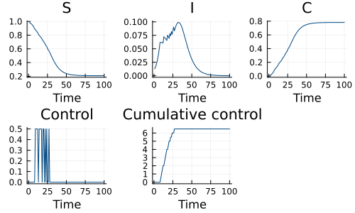

# Optimal control of an SIR epidemic with a non-pharmaceutical intervention using SDDP.jl
Sean L. Wu (@slwu89) and Simon Frost (@sdwfrost), 2023-5-9

## Introduction

[SDDP.jl](https://odow.github.io/SDDP.jl/stable/) (stochastic dual dynamic programming) is a package designed
to solve optimal policies in multi-stage (time or world state) linear programming problems with exogeneous stochasticity.
We can use it to optimize policy for a non-pharmaceutical intervention which decreses the transmission rate.

Because SDDP.jl solves an optimization problem for each node in a graph of nodes (which may represent the passage of time, or other changes
in world state), the model we solve is a discretization of following ODEs ($\upsilon$ is the intensity of intervention). 

$$
\begin{align*}
\dfrac{\mathrm dS}{\mathrm dt} &= -\beta (1 - \upsilon(t)) S I, \\
\dfrac{\mathrm dI}{\mathrm dt} &= \beta (1 - \upsilon(t)) S I - \gamma I,\\ 
\dfrac{\mathrm dC}{\mathrm dt} &= \beta (1 - \upsilon(t)) S I\\
\end{align*}
$$

The minimization objective at each node (time point) is a linear combination of cumulative intervention applied,
and cumulative cases. The total cumulative intervention force applied cannot exceed some maximum value.
The decision variable is the intensity of the intervention at each time point (node).

## Libraries

```julia
using SDDP, JuMP, Ipopt, Plots;
```


## Parameters

We set the parameters, which includes the maximum intervention level at any node, `υ_max`, and the cost, which is the integral of the intervention level over time, `υ_total`.

```julia
β = 0.5 # infectivity rate
γ = 0.25 # recovery rate
υ_max = 0.5 # maximum intervention
υ_total = 10.0; # maximum cost
```


## Time domain

We set the time horizon to be long enough for the system to settle down to an equilibrium. We use a grid of timepoints fine enough to capture a wide variety of policy shapes, but coarse enough to keep the number of policy parameters to optimize low.

```julia
tmax = 100.0
δt = 1.0
nsteps = Int(tmax / δt);
```


## Initial conditions

We set the initial conditions for the proportion of susceptibles and infecteds.

```julia
u0 = [0.99, 0.01]; # S,I
```


## Model setup

We specify a model using `SDDP.LinearPolicyGraph`. Because the nodes in the policy graph represent the
passage of time, we use a linear policy graph. We set the `optimizer` to the one from the `Ipopt`.

We set `S`, `I`, and `C` to be `SDDP.State` variables, meaning the values from the previous node in the policy
graph will be available to the current node. We specify 2 constraints on the intervention. While the second
constraint is mathematically the same as specifying `υ_cumulative.out ≤ υ_total` we must write it in
the form shown so that `υ` appears in the constraint.

We then set up the differences as non-linear expressions and the update rules as non-linear constraints.
Finally, we use `@stageobjective` to set the minimization objective for this node to be a linear combination
of total intervention pressure and cumulative cases.

```julia
model = SDDP.LinearPolicyGraph(
    stages = nsteps,
    sense = :Min,
    lower_bound = 0,
    optimizer = Ipopt.Optimizer,
) do sp, t

    @variable(sp, 0 ≤ S, SDDP.State, initial_value = u0[1])
    @variable(sp, 0 ≤ I, SDDP.State, initial_value = u0[2])
    @variable(sp, 0 ≤ C, SDDP.State, initial_value = 0)

    @variable(sp, 0 ≤ υ_cumulative, SDDP.State, initial_value = 0)
    @variable(sp, 0 ≤ υ ≤ υ_max)

    # constraints on control    
    @constraint(sp, υ_cumulative.out == υ_cumulative.in + (δt * υ))
    @constraint(sp, υ_cumulative.in + (δt * υ) ≤ υ_total)

    # expressions to simplify the state updates
    @NLexpression(sp, infection, (1-exp(-(1 - υ) * β * I.in * δt)) * S.in)
    @NLexpression(sp, recovery, (1-exp(-γ*δt)) * I.in)

    # state updating rules
    @NLconstraint(sp, S.out == S.in - infection)
    @NLconstraint(sp, I.out == I.in + infection - recovery)
    @NLconstraint(sp, C.out == C.in + infection)

    # linear weighting of objectives
    @stageobjective(sp, υ_cumulative.out + 40*C.out)

end;
```


## Running the model

We train the model for 100 iterations. SDDP.jl needs to iterate between forwards passes over the policy
graph where the policy is optimized given an approximation of the overall objective for each node,
and backwards passes to improve the approximation.

```julia
SDDP.train(model; iteration_limit = 100);
```

```
---------------------------------------------------------------------------
---
                      SDDP.jl (c) Oscar Dowson, 2017-21

Problem
  Nodes           : 100
  State variables : 4
  Scenarios       : 1.00000e+00
  Existing cuts   : false
  Subproblem structure                           : (min, max)
    Variables                                    : (10, 10)
    JuMP.VariableRef in MOI.GreaterThan{Float64} : (6, 6)
    JuMP.AffExpr in MOI.LessThan{Float64}        : (1, 1)
    JuMP.VariableRef in MOI.LessThan{Float64}    : (1, 2)
    JuMP.AffExpr in MOI.EqualTo{Float64}         : (1, 1)
Options
  Solver          : serial mode
  Risk measure    : SDDP.Expectation()
  Sampling scheme : SDDP.InSampleMonteCarlo

Numerical stability report
  Non-zero Matrix range     [1e+00, 1e+00]
  Non-zero Objective range  [1e+00, 4e+01]
  Non-zero Bounds range     [5e-01, 5e-01]
  Non-zero RHS range        [1e+01, 1e+01]
No problems detected

 Iteration    Simulation       Bound         Time (s)    Proc. ID   # Solve
s
        1    2.897411e+03   2.897409e+03   8.194709e-01          1        2
00
        2    2.897411e+03   2.897409e+03   1.703254e+00          1        4
00
        3    2.897411e+03   2.897409e+03   2.586747e+00          1        6
00
        4    2.897411e+03   2.897409e+03   3.467102e+00          1        8
00
        5    2.897411e+03   2.897409e+03   4.348803e+00          1       10
00
        6    2.897411e+03   2.897409e+03   5.226218e+00          1       12
00
        7    2.897411e+03   2.897409e+03   6.091468e+00          1       14
00
        8    2.897411e+03   2.897409e+03   6.938409e+00          1       16
00
        9    2.897411e+03   2.897409e+03   7.773034e+00          1       18
00
       10    2.897411e+03   2.897409e+03   8.599907e+00          1       20
00
       11    2.897411e+03   2.897409e+03   9.423607e+00          1       22
00
       12    2.897411e+03   2.897409e+03   1.068410e+01          1       24
00
       13    2.897411e+03   2.897409e+03   1.156619e+01          1       26
00
       14    2.897411e+03   2.897409e+03   1.245485e+01          1       28
00
       15    2.897411e+03   2.897409e+03   1.333690e+01          1       30
00
       16    2.897411e+03   2.897409e+03   1.421676e+01          1       32
00
       17    2.897411e+03   2.897409e+03   1.509825e+01          1       34
00
       18    2.897411e+03   2.897409e+03   1.597554e+01          1       36
00
       19    2.897411e+03   2.897409e+03   1.683564e+01          1       38
00
       20    2.897411e+03   2.897409e+03   1.767872e+01          1       40
00
       21    2.897411e+03   2.897409e+03   1.850900e+01          1       42
00
       22    2.897411e+03   2.897409e+03   1.932916e+01          1       44
00
       23    2.897411e+03   2.897409e+03   2.057549e+01          1       46
00
       24    2.897411e+03   2.897409e+03   2.144544e+01          1       48
00
       25    2.897411e+03   2.897409e+03   2.229921e+01          1       50
00
       26    2.897411e+03   2.897409e+03   2.315815e+01          1       52
00
       27    2.897411e+03   2.897409e+03   2.402121e+01          1       54
00
       28    2.897411e+03   2.897409e+03   2.488419e+01          1       56
00
       29    2.897411e+03   2.897409e+03   2.575154e+01          1       58
00
       30    2.897411e+03   2.897409e+03   2.661957e+01          1       60
00
       31    2.897411e+03   2.897409e+03   2.747348e+01          1       62
00
       32    2.897411e+03   2.897409e+03   2.831110e+01          1       64
00
       33    2.897411e+03   2.897409e+03   2.914736e+01          1       66
00
       34    2.897411e+03   2.897409e+03   2.999017e+01          1       68
00
       35    2.897411e+03   2.897409e+03   3.127122e+01          1       70
00
       36    2.897411e+03   2.897409e+03   3.216139e+01          1       72
00
       37    2.897411e+03   2.897409e+03   3.304863e+01          1       74
00
       38    2.897411e+03   2.897409e+03   3.393051e+01          1       76
00
       39    2.897411e+03   2.897409e+03   3.481471e+01          1       78
00
       40    2.897411e+03   2.897409e+03   3.569469e+01          1       80
00
       41    2.897411e+03   2.897409e+03   3.657230e+01          1       82
00
       42    2.897411e+03   2.897409e+03   3.744776e+01          1       84
00
       43    2.897411e+03   2.897409e+03   3.832601e+01          1       86
00
       44    2.897411e+03   2.897409e+03   3.918520e+01          1       88
00
       45    2.897411e+03   2.897409e+03   4.003159e+01          1       90
00
       46    2.897411e+03   2.897409e+03   4.086637e+01          1       92
00
       47    2.897411e+03   2.897409e+03   4.212832e+01          1       94
00
       48    2.897411e+03   2.897409e+03   4.300518e+01          1       96
00
       49    2.897411e+03   2.897409e+03   4.387303e+01          1       98
00
       50    2.897411e+03   2.897409e+03   4.474002e+01          1      100
00
       51    2.897411e+03   2.897409e+03   4.561628e+01          1      102
00
       52    2.897411e+03   2.897409e+03   4.648704e+01          1      104
00
       53    2.897411e+03   2.897409e+03   4.735280e+01          1      106
00
       54    2.897411e+03   2.897409e+03   4.821485e+01          1      108
00
       55    2.897411e+03   2.897409e+03   4.908538e+01          1      110
00
       56    2.897411e+03   2.897409e+03   4.994738e+01          1      112
00
       57    2.897411e+03   2.897409e+03   5.079795e+01          1      114
00
       58    2.897411e+03   2.897409e+03   5.164374e+01          1      116
00
       59    2.897411e+03   2.897409e+03   5.291231e+01          1      118
00
       60    2.897411e+03   2.897409e+03   5.378718e+01          1      120
00
       61    2.897411e+03   2.897409e+03   5.465367e+01          1      122
00
       62    2.897411e+03   2.897409e+03   5.552097e+01          1      124
00
       63    2.897411e+03   2.897409e+03   5.639663e+01          1      126
00
       64    2.897411e+03   2.897409e+03   5.725841e+01          1      128
00
       65    2.897411e+03   2.897409e+03   5.811986e+01          1      130
00
       66    2.897411e+03   2.897409e+03   5.898460e+01          1      132
00
       67    2.897411e+03   2.897409e+03   5.985261e+01          1      134
00
       68    2.897411e+03   2.897409e+03   6.070795e+01          1      136
00
       69    2.897411e+03   2.897409e+03   6.155854e+01          1      138
00
       70    2.897411e+03   2.897409e+03   6.240237e+01          1      140
00
       71    2.897411e+03   2.897409e+03   6.366727e+01          1      142
00
       72    2.897411e+03   2.897409e+03   6.454937e+01          1      144
00
       73    2.897411e+03   2.897409e+03   6.543287e+01          1      146
00
       74    2.897411e+03   2.897409e+03   6.631481e+01          1      148
00
       75    2.897411e+03   2.897409e+03   6.722557e+01          1      150
00
       76    2.897411e+03   2.897409e+03   6.812100e+01          1      152
00
       77    2.897411e+03   2.897409e+03   6.899871e+01          1      154
00
       78    2.897411e+03   2.897409e+03   6.988193e+01          1      156
00
       79    2.897411e+03   2.897409e+03   7.075682e+01          1      158
00
       80    2.897411e+03   2.897409e+03   7.162959e+01          1      160
00
       81    2.897411e+03   2.897409e+03   7.248756e+01          1      162
00
       82    2.897411e+03   2.897409e+03   7.333853e+01          1      164
00
       83    2.897411e+03   2.897409e+03   7.463003e+01          1      166
00
       84    2.897411e+03   2.897409e+03   7.550575e+01          1      168
00
       85    2.897411e+03   2.897409e+03   7.636261e+01          1      170
00
       86    2.897411e+03   2.897409e+03   7.721669e+01          1      172
00
       87    2.897411e+03   2.897409e+03   7.808113e+01          1      174
00
       88    2.897411e+03   2.897409e+03   7.893219e+01          1      176
00
       89    2.897411e+03   2.897409e+03   7.978309e+01          1      178
00
       90    2.897411e+03   2.897409e+03   8.064057e+01          1      180
00
       91    2.897411e+03   2.897409e+03   8.149784e+01          1      182
00
       92    2.897411e+03   2.897409e+03   8.234655e+01          1      184
00
       93    2.897411e+03   2.897409e+03   8.318699e+01          1      186
00
       94    2.897411e+03   2.897409e+03   8.402762e+01          1      188
00
       95    2.897411e+03   2.897409e+03   8.530371e+01          1      190
00
       96    2.897411e+03   2.897409e+03   8.618788e+01          1      192
00
       97    2.897411e+03   2.897409e+03   8.705901e+01          1      194
00
       98    2.897411e+03   2.897409e+03   8.792865e+01          1      196
00
       99    2.897411e+03   2.897409e+03   8.880500e+01          1      198
00
      100    2.897411e+03   2.897409e+03   8.966779e+01          1      200
00

Terminating training
  Status         : iteration_limit
  Total time (s) : 8.966779e+01
  Total solves   : 20000
  Best bound     :  2.897409e+03
  Simulation CI  :  2.897411e+03 ± 8.335862e-09
---------------------------------------------------------------------------
---
```


## Plotting

After the model has been trained, we can simulate from the model under the final optimal policy.
The second argument is the number of trajectories to draw (because the model is deterministic, a single
trajectory will suffice). The third argument is the variables to record during simulation.

```julia
sims = SDDP.simulate(model, 1, [:S,:I, :C, :υ, :υ_cumulative]);
```


We can use the plotting utilities of SDDP.jl to show the optimal policy and state variables.

```julia
Plots.plot(
    SDDP.publication_plot(sims, title = "S") do data
        return data[:S].out
    end,
    SDDP.publication_plot(sims, title = "I") do data
        return data[:I].out
    end,
    SDDP.publication_plot(sims, title = "C") do data
        return data[:C].out
    end,
    SDDP.publication_plot(sims, title = "Control") do data
        return data[:υ]
    end,
    SDDP.publication_plot(sims, title = "Cumulative control") do data
        return data[:υ_cumulative].out
    end;
    xlabel = "Time"
)
```


