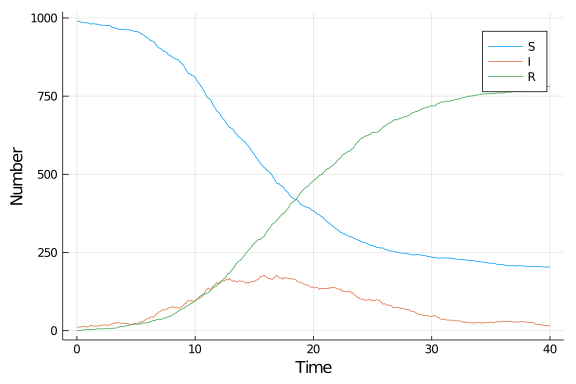

# Stochastic differential equation
Simon Frost (@sdwfrost), 2020-04-27

## Introduction

A stochastic differential equation version of the SIR model is:

- Stochastic
- Continuous in time
- Continuous in state

## Libraries

````julia
using DifferentialEquations
using SimpleDiffEq
using Distributions
using Random
using DataFrames
using StatsPlots
using BenchmarkTools
````


## Transitions

````julia
function sir_sde!(du,u,p,t)
    (S,I,R) = u
    (β,c,γ,δt) = p
    N = S+I+R
    ifrac = β*c*I/N*S*δt
    rfrac = γ*I*δt
    ifrac_noise = sqrt(ifrac)*rand(Normal(0,1))
    rfrac_noise = sqrt(rfrac)*rand(Normal(0,1))
    @inbounds begin
        du[1] = S-(ifrac+ifrac_noise)
        du[2] = I+(ifrac+ifrac_noise) - (rfrac + rfrac_noise)
        du[3] = R+(rfrac+rfrac_noise)
    end
    for i in 1:3
        if du[i] < 0 du[i]=0 end
    end
    nothing
end;
````


## Time domain

Note that even though we're using fixed time steps, `DifferentialEquations.jl` complains if I pass integer timespans, so I set the timespan to be `Float64`.

````julia
δt = 0.1
nsteps = 400
tmax = nsteps*δt
tspan = (0.0,nsteps)
t = 0.0:δt:tmax;
````


## Initial conditions

````julia
u0 = [990.0,10.0,0.0]; # S,I,R
````


## Parameter values

````julia
p = [0.05,10.0,0.25,δt]; # β,c,γ,δt
````


## Random number seed

````julia
Random.seed!(1234);
````


## Running the model

````julia
prob_sde = DiscreteProblem(sir_sde!,u0,tspan,p)
````


````
DiscreteProblem with uType Array{Float64,1} and tType Float64. In-place: tr
ue
timespan: (0.0, 400.0)
u0: [990.0, 10.0, 0.0]
````


````julia
sol_sde = solve(prob_sde,solver=FunctionMap);
````


## Post-processing

We can convert the output to a dataframe for convenience.

````julia
df_sde = DataFrame(sol_sde')
df_sde[!,:t] = t;
````


## Plotting

We can now plot the results.

````julia
@df df_sde plot(:t,
    [:x1 :x2 :x3],
    label=["S" "I" "R"],
    xlabel="Time",
    ylabel="Number")
````





## Benchmarking

````julia
@benchmark solve(prob_sde,solver=FunctionMap)
````


````
BenchmarkTools.Trial: 
  memory estimate:  58.73 KiB
  allocs estimate:  472
  --------------
  minimum time:     82.199 μs (0.00% GC)
  median time:      104.799 μs (0.00% GC)
  mean time:        112.439 μs (6.38% GC)
  maximum time:     18.659 ms (99.21% GC)
  --------------
  samples:          10000
  evals/sample:     1
````


## Appendix
### Computer Information
```
Julia Version 1.4.0
Commit b8e9a9ecc6 (2020-03-21 16:36 UTC)
Platform Info:
  OS: Windows (x86_64-w64-mingw32)
  CPU: Intel(R) Core(TM) i7-8550U CPU @ 1.80GHz
  WORD_SIZE: 64
  LIBM: libopenlibm
  LLVM: libLLVM-8.0.1 (ORCJIT, skylake)
Environment:
  JULIA_NUM_THREADS = 4

```

### Package Information

```
Status `~\.julia\environments\v1.4\Project.toml`
[80f14c24-f653-4e6a-9b94-39d6b0f70001] AbstractMCMC 1.0.1
[46ada45e-f475-11e8-01d0-f70cc89e6671] Agents 3.1.0
[b19378d9-d87a-599a-927f-45f220a2c452] ArrayFire 1.0.6
[c52e3926-4ff0-5f6e-af25-54175e0327b1] Atom 0.12.10
[6e4b80f9-dd63-53aa-95a3-0cdb28fa8baf] BenchmarkTools 0.5.0
[a134a8b2-14d6-55f6-9291-3336d3ab0209] BlackBoxOptim 0.5.0
[336ed68f-0bac-5ca0-87d4-7b16caf5d00b] CSV 0.6.2
[be33ccc6-a3ff-5ff2-a52e-74243cff1e17] CUDAnative 3.1.0
[3a865a2d-5b23-5a0f-bc46-62713ec82fae] CuArrays 2.2.0
[717857b8-e6f2-59f4-9121-6e50c889abd2] DSP 0.6.6
[2445eb08-9709-466a-b3fc-47e12bd697a2] DataDrivenDiffEq 0.3.1
[a93c6f00-e57d-5684-b7b6-d8193f3e46c0] DataFrames 0.21.0
[1313f7d8-7da2-5740-9ea0-a2ca25f37964] DataFramesMeta 0.5.1
[ebbdde9d-f333-5424-9be2-dbf1e9acfb5e] DiffEqBayes 2.1.1
[eb300fae-53e8-50a0-950c-e21f52c2b7e0] DiffEqBiological 4.3.0
[459566f4-90b8-5000-8ac3-15dfb0a30def] DiffEqCallbacks 2.13.1
[aae7a2af-3d4f-5e19-a356-7da93b79d9d0] DiffEqFlux 1.10.2
[c894b116-72e5-5b58-be3c-e6d8d4ac2b12] DiffEqJump 6.7.5
[1130ab10-4a5a-5621-a13d-e4788d82bd4c] DiffEqParamEstim 1.14.1
[41bf760c-e81c-5289-8e54-58b1f1f8abe2] DiffEqSensitivity 6.14.1
[6d1b261a-3be8-11e9-3f2f-0b112a9a8436] DiffEqTutorials 0.1.0
[0c46a032-eb83-5123-abaf-570d42b7fbaa] DifferentialEquations 6.14.0
[31c24e10-a181-5473-b8eb-7969acd0382f] Distributions 0.23.2
[634d3b9d-ee7a-5ddf-bec9-22491ea816e1] DrWatson 1.11.0
[587475ba-b771-5e3f-ad9e-33799f191a9c] Flux 0.10.4
[0c68f7d7-f131-5f86-a1c3-88cf8149b2d7] GPUArrays 3.3.0
[28b8d3ca-fb5f-59d9-8090-bfdbd6d07a71] GR 0.49.1
[523d8e89-b243-5607-941c-87d699ea6713] Gillespie 0.1.0
[7073ff75-c697-5162-941a-fcdaad2a7d2a] IJulia 1.21.2
[e5e0dc1b-0480-54bc-9374-aad01c23163d] Juno 0.8.1
[23fbe1c1-3f47-55db-b15f-69d7ec21a316] Latexify 0.13.2
[961ee093-0014-501f-94e3-6117800e7a78] ModelingToolkit 3.4.0
[d41bc354-129a-5804-8e4c-c37616107c6c] NLSolversBase 7.6.1
[76087f3c-5699-56af-9a33-bf431cd00edd] NLopt 0.6.0
[d9ec5142-1e00-5aa0-9d6a-321866360f50] NamedTupleTools 0.13.2
[73a701b4-84e1-5df0-88ff-1968ee2ee8dc] NamedTuples 5.0.0
[429524aa-4258-5aef-a3af-852621145aeb] Optim 0.20.1
[1dea7af3-3e70-54e6-95c3-0bf5283fa5ed] OrdinaryDiffEq 5.38.1
[91a5bcdd-55d7-5caf-9e0b-520d859cae80] Plots 1.2.6
[e6cf234a-135c-5ec9-84dd-332b85af5143] RandomNumbers 1.4.0
[c5292f4c-5179-55e1-98c5-05642aab7184] ResumableFunctions 0.5.1
[428bdadb-6287-5aa5-874b-9969638295fd] SimJulia 0.8.0
[05bca326-078c-5bf0-a5bf-ce7c7982d7fd] SimpleDiffEq 1.1.0
[8ce77f84-9b61-11e8-39ff-d17a774bf41c] Soss 0.12.0
[2913bbd2-ae8a-5f71-8c99-4fb6c76f3a91] StatsBase 0.32.2
[4c63d2b9-4356-54db-8cca-17b64c39e42c] StatsFuns 0.9.4
[f3b207a7-027a-5e70-b257-86293d7955fd] StatsPlots 0.14.6
[789caeaf-c7a9-5a7d-9973-96adeb23e2a0] StochasticDiffEq 6.22.0
[a759f4b9-e2f1-59dc-863e-4aeb61b1ea8f] TimerOutputs 0.5.5
[fce5fe82-541a-59a6-adf8-730c64b5f9a0] Turing 0.7.1
[44d3d7a6-8a23-5bf8-98c5-b353f8df5ec9] Weave 0.9.2
[37e2e46d-f89d-539d-b4ee-838fcccc9c8e] LinearAlgebra
[cf7118a7-6976-5b1a-9a39-7adc72f591a4] UUIDs
```
