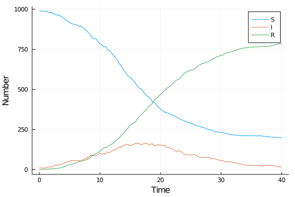

# Stochastic differential equation model using Bridge.jl
Simon Frost (@sdwfrost), 2021-03-13

## Introduction

A stochastic differential equation version of the SIR model is:

- Stochastic
- Continuous in time
- Continuous in state

This implementation uses `Bridge.jl`, and is modified from [here](http://www.math.chalmers.se/~smoritz/journal/2018/01/19/parameter-inference-for-a-simple-sir-model/).

## Libraries

```julia
using Bridge
using StaticArrays
using Random
using DataFrames
using StatsPlots
using BenchmarkTools
```


## Transitions

`Bridge.jl` uses structs and multiple dispatch, so we first have to write a struct that inherits from `Bridge.ContinuousTimeProcess`, giving the number of states (3) and their type, along with parameter values and their type.

```julia
struct SIR <: ContinuousTimeProcess{SVector{3,Float64}}
    β::Float64
    c::Float64
    γ::Float64
end
```


We now define the function `Bridge.b` to take this struct and return a static vector (`@SVector`) of the derivatives of S, I, and R.

```julia
function Bridge.b(t, u, P::SIR)
    (S,I,R) = u
    N = S + I + R
    dS = -P.β*P.c*S*I/N
    dI = P.β*P.c*S*I/N - P.γ*I
    dR = P.γ*I
    return @SVector [dS,dI,dR]
end
```


In order to avoid errors due to state variables becoming negative, we take the absolute values of the rates and can post-process the solutions to truncate the simulation if/when states become zero.

```julia
function Bridge.σ(t, u, P::SIR)
    (S,I,R) = u
    N = S + I + R
    ifrac = abs(P.β*P.c*I/N*S)
    rfrac = abs(P.γ*I)
    return @SMatrix Float64[
     sqrt(ifrac)      0.0
    -sqrt(ifrac)  -sqrt(rfrac)
     0.0   sqrt(rfrac)
    ]
end
```


## Time domain

```julia
δt = 0.1
tmax = 40.0
tspan = (0.0,tmax)
ts = 0.0:δt:tmax;
```


## Initial conditions

```julia
u0 = @SVector [990.0,10.0,0.0]; # S,I,R
```


## Parameter values

```julia
p = [0.05,10.0,0.25]; # β,c,γ
```


## Random number seed

```julia
Random.seed!(1234);
```


## Running the model

Set up object by passing the vector of parameters to the `SIR` struct - note the use of the splat operator `...` to turn the array into a list of arguments.

```julia
prob = SIR(p...);
```


`Bridge.jl` requires that we generate the noise first; here, we generate two Wiener processes corresponding to the infection and recovery processes.

```julia
W = sample(ts, Wiener{SVector{2,Float64}}());
```


We can now solve the model.

```julia
sol = solve(Bridge.EulerMaruyama(), u0, W, prob);
```


## Post-processing

We can convert the output to a dataframe for convenience.

```julia
df_sde = DataFrame(Bridge.mat(sol.yy)')
df_sde[!,:t] = ts;
```


## Plotting

We can now plot the results.

```julia
@df df_sde plot(:t,
    [:x1 :x2 :x3],
    label=["S" "I" "R"],
    xlabel="Time",
    ylabel="Number")
```




## Benchmarking

```julia
@benchmark begin
    W = sample(ts, Wiener{SVector{2,Float64}}());
    solve(Bridge.EulerMaruyama(), u0, W, prob);
end
```

```
BenchmarkTools.Trial: 
  memory estimate:  19.38 KiB
  allocs estimate:  5
  --------------
  minimum time:     23.721 μs (0.00% GC)
  median time:      25.514 μs (0.00% GC)
  mean time:        27.921 μs (3.69% GC)
  maximum time:     3.600 ms (96.83% GC)
  --------------
  samples:          10000
  evals/sample:     1
```


