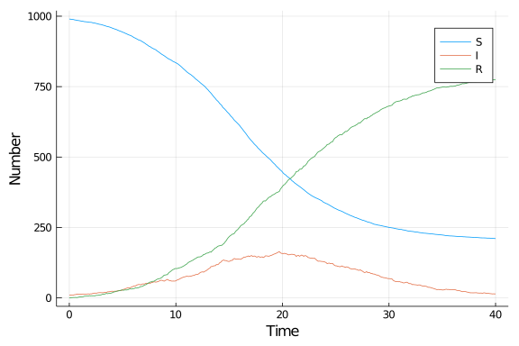

# Stochastic differential equation model using StochasticDiffEq.jl
Simon Frost (@sdwfrost), 2020-04-27

## Introduction

A stochastic differential equation version of the SIR model is:

- Stochastic
- Continuous in time
- Continuous in state

This implementation uses `StochasticDiffEq.jl`, which has a variety of SDE solvers.

## Libraries

````julia
using DifferentialEquations
using StochasticDiffEq
using Random
using SparseArrays
using DataFrames
using StatsPlots
````


## Transitions

We begin by specifying the ODE kernel.

````julia
function sir_ode!(du,u,p,t)
    (S,I,R) = u
    (β,c,γ) = p
    N = S+I+R
    @inbounds begin
        du[1] = -β*c*I/N*S
        du[2] = β*c*I/N*S - γ*I
        du[3] = γ*I
    end
    nothing
end;
````


````
sir_ode! (generic function with 1 method)
````


````julia
# Define a sparse matrix by making a dense matrix and setting some values as not zero
A = zeros(3,2)
A[1,1] = 1
A[2,1] = 1
A[2,2] = 1
A[3,2] = 1
A = SparseArrays.sparse(A);
````


````
3×2 SparseArrays.SparseMatrixCSC{Float64,Int64} with 4 stored entries:
  [1, 1]  =  1.0
  [2, 1]  =  1.0
  [2, 2]  =  1.0
  [3, 2]  =  1.0
````


````julia
# Make `g` write the sparse matrix values
function sir_noise!(du,u,p,t)
    (S,I,R) = u
    (β,c,γ) = p
    N = S+I+R
    ifrac = β*I/N*S
    rfrac = γ*I
    du[1,1] = -sqrt(ifrac)
    du[2,1] = sqrt(ifrac)
    du[2,2] = -sqrt(rfrac)
    du[3,2] = sqrt(rfrac)
end;
````


````
sir_noise! (generic function with 1 method)
````


## Time domain

Note that even though I'm using fixed time steps, `DifferentialEquations.jl` complains if I pass integer timespans, so I set the timespan to be `Float64`.

````julia
δt = 0.1
tmax = 40.0
tspan = (0.0,tmax)
t = 0.0:δt:tmax;
````


````
0.0:0.1:40.0
````


## Initial conditions

````julia
u0 = [990.0,10.0,0.0]; # S,I,R
````


````
3-element Array{Float64,1}:
 990.0
  10.0
   0.0
````


## Parameter values

````julia
p = [0.05,10.0,0.25]; # β,c,γ
````


````
3-element Array{Float64,1}:
  0.05
 10.0
  0.25
````


## Random number seed

````julia
Random.seed!(1234);
````


````
MersenneTwister(UInt32[0x000004d2], Random.DSFMT.DSFMT_state(Int32[-1393240
018, 1073611148, 45497681, 1072875908, 436273599, 1073674613, -2043716458, 
1073445557, -254908435, 1072827086  …  -599655111, 1073144102, 367655457, 1
072985259, -1278750689, 1018350124, -597141475, 249849711, 382, 0]), [0.0, 
0.0, 0.0, 0.0, 0.0, 0.0, 0.0, 0.0, 0.0, 0.0  …  0.0, 0.0, 0.0, 0.0, 0.0, 0.
0, 0.0, 0.0, 0.0, 0.0], UInt128[0x00000000000000000000000000000000, 0x00000
000000000000000000000000000, 0x00000000000000000000000000000000, 0x00000000
000000000000000000000000, 0x00000000000000000000000000000000, 0x00000000000
000000000000000000000, 0x00000000000000000000000000000000, 0x00000000000000
000000000000000000, 0x00000000000000000000000000000000, 0x00000000000000000
000000000000000  …  0x00000000000000000000000000000000, 0x00000000000000000
000000000000000, 0x00000000000000000000000000000000, 0x00000000000000000000
000000000000, 0x00000000000000000000000000000000, 0x00000000000000000000000
000000000, 0x00000000000000000000000000000000, 0x00000000000000000000000000
000000, 0x00000000000000000000000000000000, 0x00000000000000000000000000000
000], 1002, 0)
````


## Running the model

````julia
prob_sde = SDEProblem(sir_ode!,sir_noise!,u0,tspan,p,noise_rate_prototype=A)
````


````
SDEProblem with uType Array{Float64,1} and tType Float64. In-place: true
timespan: (0.0, 40.0)
u0: [990.0, 10.0, 0.0]
````


````julia
sol_sde = solve(prob_sde,SRA1());
````


````
retcode: Success
Interpolation: 1st order linear
t: 2114-element Array{Float64,1}:
  0.0
  0.0013234940139653045
  0.0015904068998148014
  0.0018906838963954854
  0.0022284955175487548
  0.002608533591346183
  0.0030360764243682896
  0.0035170621115181598
  0.004058171009561764
  0.004666918519860818
  ⋮
 39.761819213840994
 39.79386272660402
 39.825752687482236
 39.857586929913616
 39.88952439265792
 39.921402481110135
 39.95345017960425
 39.98539646738054
 40.0
u: 2114-element Array{Array{Float64,1},1}:
 [990.0, 10.0, 0.0]
 [989.9761270852332, 10.056375647942252, -0.03250273317542932]
 [989.966662728391, 10.072305171570525, -0.0389678999615637]
 [989.9841182464429, 10.002141900951974, 0.013739852605122081]
 [989.9669669056816, 9.979359433296839, 0.053673661021579805]
 [989.9936033115098, 10.005537386477844, 0.0008593020124306877]
 [989.9875034530462, 9.998626611481884, 0.013869935472110292]
 [989.9861334944472, 10.01542941304752, -0.0015629074945795844]
 [989.98301343037, 9.983628861486052, 0.03335770814424444]
 [989.9562894742284, 10.045423511247563, -0.0017129854756330262]
 ⋮
 [211.09354624278956, 14.33170143637165, 774.5747523208404]
 [211.08104178701177, 14.593738634796116, 774.3252195781937]
 [210.9857311980227, 14.462583263759116, 774.5516855382198]
 [210.92809762867358, 14.748380766464026, 774.323521604864]
 [210.8846868448652, 14.439716065260383, 774.675597089876]
 [210.78331946797357, 13.802586980817932, 775.4140935512099]
 [210.66391651160149, 13.684551392308618, 775.6515320960915]
 [210.70211556951813, 14.481250364995681, 774.8166340654878]
 [210.64375115884584, 14.362559820372002, 774.9936890207838]
````


## Post-processing

We can convert the output to a dataframe for convenience.

````julia
df_sde = DataFrame(sol_sde(t)')
df_sde[!,:t] = t;
````


````
0.0:0.1:40.0
````


## Plotting

We can now plot the results.

````julia
@df df_sde plot(:t,
    [:x1 :x2 :x3],
    label=["S" "I" "R"],
    xlabel="Time",
    ylabel="Number")
````





## Appendix
### Computer Information
```
Julia Version 1.4.1
Commit 381693d3df* (2020-04-14 17:20 UTC)
Platform Info:
  OS: Linux (x86_64-pc-linux-gnu)
  CPU: Intel(R) Core(TM) i7-1065G7 CPU @ 1.30GHz
  WORD_SIZE: 64
  LIBM: libopenlibm
  LLVM: libLLVM-8.0.1 (ORCJIT, icelake-client)
Environment:
  JULIA_NUM_THREADS = 4

```

### Package Information

```
Status `~/.julia/environments/v1.4/Project.toml`
[46ada45e-f475-11e8-01d0-f70cc89e6671] Agents 3.1.0
[c52e3926-4ff0-5f6e-af25-54175e0327b1] Atom 0.12.11
[6e4b80f9-dd63-53aa-95a3-0cdb28fa8baf] BenchmarkTools 0.5.0
[a134a8b2-14d6-55f6-9291-3336d3ab0209] BlackBoxOptim 0.5.0
[2445eb08-9709-466a-b3fc-47e12bd697a2] DataDrivenDiffEq 0.2.0
[a93c6f00-e57d-5684-b7b6-d8193f3e46c0] DataFrames 0.21.0
[ebbdde9d-f333-5424-9be2-dbf1e9acfb5e] DiffEqBayes 2.14.0
[459566f4-90b8-5000-8ac3-15dfb0a30def] DiffEqCallbacks 2.13.2
[c894b116-72e5-5b58-be3c-e6d8d4ac2b12] DiffEqJump 6.7.5
[1130ab10-4a5a-5621-a13d-e4788d82bd4c] DiffEqParamEstim 1.14.1
[0c46a032-eb83-5123-abaf-570d42b7fbaa] DifferentialEquations 6.14.0
[31c24e10-a181-5473-b8eb-7969acd0382f] Distributions 0.23.2
[634d3b9d-ee7a-5ddf-bec9-22491ea816e1] DrWatson 1.11.0
[587475ba-b771-5e3f-ad9e-33799f191a9c] Flux 0.8.3
[28b8d3ca-fb5f-59d9-8090-bfdbd6d07a71] GR 0.49.1
[523d8e89-b243-5607-941c-87d699ea6713] Gillespie 0.1.0
[7073ff75-c697-5162-941a-fcdaad2a7d2a] IJulia 1.21.2
[4076af6c-e467-56ae-b986-b466b2749572] JuMP 0.21.2
[e5e0dc1b-0480-54bc-9374-aad01c23163d] Juno 0.8.2
[093fc24a-ae57-5d10-9952-331d41423f4d] LightGraphs 1.3.3
[1914dd2f-81c6-5fcd-8719-6d5c9610ff09] MacroTools 0.5.5
[ee78f7c6-11fb-53f2-987a-cfe4a2b5a57a] Makie 0.9.5
[961ee093-0014-501f-94e3-6117800e7a78] ModelingToolkit 3.6.0
[76087f3c-5699-56af-9a33-bf431cd00edd] NLopt 0.6.0
[429524aa-4258-5aef-a3af-852621145aeb] Optim 0.21.0
[1dea7af3-3e70-54e6-95c3-0bf5283fa5ed] OrdinaryDiffEq 5.38.1
[91a5bcdd-55d7-5caf-9e0b-520d859cae80] Plots 1.3.1
[428bdadb-6287-5aa5-874b-9969638295fd] SimJulia 0.8.0
[05bca326-078c-5bf0-a5bf-ce7c7982d7fd] SimpleDiffEq 1.1.0
[f3b207a7-027a-5e70-b257-86293d7955fd] StatsPlots 0.14.6
[789caeaf-c7a9-5a7d-9973-96adeb23e2a0] StochasticDiffEq 6.23.0
[fce5fe82-541a-59a6-adf8-730c64b5f9a0] Turing 0.12.0
[44d3d7a6-8a23-5bf8-98c5-b353f8df5ec9] Weave 0.10.0
```
