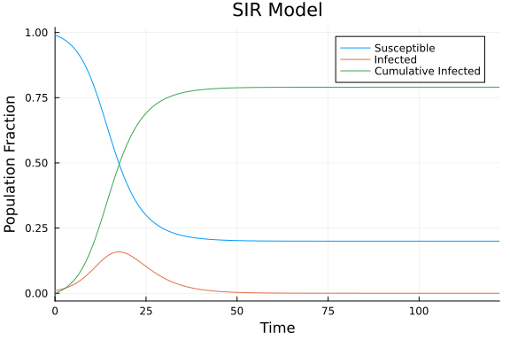
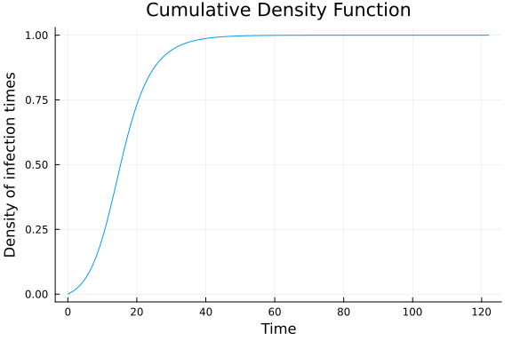

# Simulation of an SIR survival dynamical system (SDS)
Simon Frost (@sdwfrost)
2025-05-19

## Introduction

This notebook implements an SIR (Susceptible-Infected-Recovered) model based on the work of [KhudaBukhsh et al. (2019)](https://doi.org/10.1098/rsfs.2019.0048). Their approach, known as a survival dynamical system (SDS), can generate case line lists by simulation, and also allows the inference of population-level parameters such as infectivity as well as natural history parameters such as the infectious period from line lists. Here, we implement a version of Algorithm 2.1 of KhudaBukhsh et al. (2019) to simulate line lists of infection and recovery times in Julia, with some modifications for clarity.

## Libraries

```julia
using OrdinaryDiffEq
using DiffEqCallbacks
using Interpolations
using Distributions
using Random
using DataFrames
using Plots
```


## Transitions

We start with a deterministic SIR model, where we model the proportions of individuals in the susceptible and infected compartments, $S$ and $I$. For convenience, we will also keep track of the cumulative number of infections, $C$, which greatly simplifies the simulation algorithm. The model is defined by the following system of ordinary differential equations (ODEs).

```julia
function sir_ode!(du,u,p,t)
    (S,I,C) = u
    (β,γ) = p
    @inbounds begin
        du[1] = -β*S*I
        du[2] = β*S*I - γ*I
        du[3] = β*S*I
    end
    nothing
end;
```


## Parameter values, initial conditions, and time span

We define the settings for the model below, consistent with other examples in the repository.

```julia
tspan = (0.0, 10000.0)
dt = 0.1
u0 = [0.99, 0.01, 0.0]
p = [0.5, 0.25];
```


## Solving the model

The algorithm used by KhudaBukhsh et al. (2019) involves simulating the SIR ODE model until equilibrium in order to obtain the probability density function of the infection times. We implement this using a `TerminateSteadyState` callback from `DiffEqCallbacks.jl`.

```julia
prob = ODEProblem(sir_ode!, u0, tspan, p)
cb = TerminateSteadyState(1e-8)
sol = solve(prob, Tsit5(); dt=dt, dtmax=dt, callback=cb);
```


## Plotting

```julia
plot(sol,
     title="SIR Model",
     xlabel="Time",
     ylabel="Population Fraction",
     label=["Susceptible" "Infected" "Cumulative Infected"])
```




## Sampling a line list

The cumulative number of infections, `C`, when normalized to the final size (`τ`), gives the cumulative density function (CDF), from which we can draw samples of infection times using the inversion method. We use linear interpolation for the inverse function (CDF to infection time).

```julia
τ = sol[end][3] # Final size
times = sol.t # Simulation times
cdfτ = [sol[i][3]/τ for i in 1:length(sol.t)] # CDF evaluated at `times`, obtained by C/τ
invcdfτ = LinearInterpolation(cdfτ, times, extrapolation_bc=Line());
```


```julia
plot(times, cdfτ,
     title="Cumulative Density Function",
     xlabel="Time",
     ylabel="Density of infection times",
     label=false)
```




We consider a simulation where we sample $N$ individuals who are initially susceptible, and $M$ individuals who are initially infected. We sample the infection times using the inverse function defined above, and then add on random draws from the infectious period to simulate recovery times. Each step in the process is commented below.

```julia
N = 99 # Sample N initially susceptible
M = 1 # Sample M initially infected
K = rand(Binomial(N, τ)) # Number of infections during the epidemic
Tᵢ = zeros(M) # Assume times of infection for the M initially infected individuals are zero
Tᵢ = [Tᵢ; invcdfτ.(rand(K))] # Append infection times for K individuals
Tᵣ = Tᵢ .+ rand(Exponential(1/p[2]), M+K); # Recovery times for M+K infected individuals
```


We can then generate a dataframe of the infection and recovery times for further analysis.

```julia
df = DataFrame(infection_time=Tᵢ, recovery_time=Tᵣ)
```

```
80×2 DataFrame
 Row │ infection_time  recovery_time
     │ Float64         Float64
─────┼───────────────────────────────
   1 │        0.0            5.89809
   2 │        7.86056        9.8487
   3 │       15.83          16.4511
   4 │       26.3444        30.75
   5 │        7.2055        15.5016
   6 │       25.0911        34.6082
   7 │       25.5869        30.338
   8 │       21.0997        25.3224
  ⋮  │       ⋮               ⋮
  74 │        9.78415       11.9463
  75 │        3.58814       24.3936
  76 │       30.4535        32.2539
  77 │        7.96843       14.3423
  78 │       25.6141        34.0446
  79 │       15.3823        20.5103
  80 │       20.6359        21.9287
                      65 rows omitted
```


## Discussion

A survival dynamical system offers a simple way to simulate case line lists. Real line lists often contain censored measurements e.g. observations, for example, if observations end before the end of the epidemic. The above output can be modified to censor the infection and recovery times, or the simulation code can be modified to allow simulation up to a fixed time point, `T`, rather than until equilibrium. The SDS approach, subsequently referred to as dynamical survival analysis, can be readily extended to consider more complex models than the SIR one used above.
