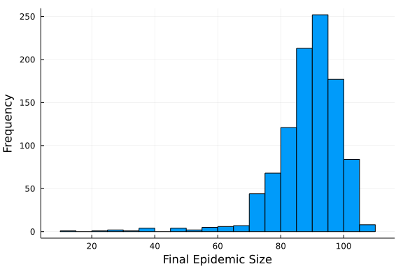

# Sellke construction of the SIR model
Sean L. Wu (@slwu89), 2021-11-30

## Introduction

The Sellke construction is an alternative stochastic process to the standard stochastic epidemic
process that can be used to sample the final size distribution of an SIR epidemic in a finite population,
originally described in [On the asymptotic distribution of the size of a stochastic epidemic](https://doi.org/10.2307/3213811).

Rather than sampling next events and times under a race condition to update the system as in
standard stochastic epidemics, the Sellke construction samples at once a "threshold" value
for each susceptible individual. The "infection pressure" generated by the infectious population
is tracked, and when it exceeds the threshold for a given susceptible person, they become infected.

This construction is similar to a [random time change](http://bactra.org/notebooks/random-time-changes.html) such
that the thresholds are independent and identically distributed exponential random variates with a mean of 1,
and infection pressure is the cumulative hazard $\beta \, I/N$.

## Libraries

```julia
using Distributions
using Random
using BenchmarkTools
using Plots
```


## Sellke model

Code to draw a final epidemic size from a standard continuous-time Markov SIR model
is below. The Sellke construction can handle non-exponentially distributed infectious
periods, which simply require the the infectious durations to be sampled from the appropriate
distribution. Another nice feature of the Sellke epidemic model is that parameters can
easily be changed without needing to draw new random numbers.

Because the construction samples the final epidemic size, and then creates a corresponding
temporal trajectory, we do not specify the time domain.

This particular implementation is described in the paper [How big is an outbreak likely to be? Methods for epidemic final-size calculation](https://royalsocietypublishing.org/doi/full/10.1098/rspa.2012.0436).

```julia
function sellke(u0, p)
    (S, I, R) = u0
    N = S + I + R
    (β, c, γ) = p
    λ = β*c/N

    Q = rand(Exponential(), S)
    sort!(Q)

    T0 = rand(Exponential(1/γ), I)
    T = rand(Exponential(1/γ), S)

    ST0 = sum(T0)
    Y = [ST0; ST0 .+ cumsum(T[1:end-1])]

    Z = findfirst(Q .> Y*λ)

    if isnothing(Z)
        Z = S + I # entire population infected
    else
        Z = Z + I - 1
    end

    TT = [T0; T] # all infectious periods
    QQ = [T0 * 0; Q] # all thresholds 
    R = T[1:I] # recovery times of the initial infectives

    # max num of events possible
    max = I + 2*S

    t = zeros(max)
    St = zeros(max)
    It = zeros(max)
    It[1:I] = (1:I)
    St[1:I] = N .- (1:I)

    tt = 0
    La = 0
    j = I+1
    k = j

    while It[k-1] > 0
        (minR, i) = findmin(R)
        dtprop = minR-tt
        Laprop = La + (λ * It[k-1] * dtprop)
        if j > length(QQ) # only recoveries remain
            R = R[setdiff(1:length(R), i)]
            tt = minR
            t[k] = minR
            It[k] = It[k-1]-1
            St[k] = St[k-1]
            La = Laprop
            k = k+1
        else # infections
            if QQ[j] > Laprop
                R = R[setdiff(1:length(R), i)]
                tt = minR
                t[k] = minR
                It[k] = It[k-1]-1
                St[k] = St[k-1]
                La = Laprop
            else
                tt = tt + ((QQ[j]-La)/(Laprop-La))*dtprop
                La = QQ[j]
                t[k] = tt
                It[k] = It[k-1]+1
                St[k] = St[k-1]-1
                R = [R; tt+TT[j]]
                j = j+1
            end
            k = k+1
        end
    end
    
    trajectory = hcat(t, St, It, N .- (St + It))
    trajectory = trajectory[I:k-1, :]

    return trajectory
end
```

```
sellke (generic function with 1 method)
```


## Initial conditions

```julia
u0 = [990,10,0]; # S,I,R
```


## Parameter values

```julia
p = [0.05,10.0,0.25]; # β,c,γ
```


## Random number seed

We set a random number seed for reproducibility.

```julia
Random.seed!(1234);
```


## Running the model

```julia
out = sellke(u0, p)
```


## Plotting

We plot a histogram of final epidemic sizes.

```julia
plot(out[:, 1], out[:, 2:end],
    label=["S" "I" "R"],
    xlabel="Time",
    ylabel="Number")
```




## Benchmarking

```julia
@benchmark sellke(u0, p)
```

```
BenchmarkTools.Trial: 2419 samples with 1 evaluation.
 Range (min … max):  52.159 μs …   5.396 ms  ┊ GC (min … max): 0.00% … 40.4
4%
 Time  (median):      1.891 ms               ┊ GC (median):    0.00%
 Time  (mean ± σ):    2.064 ms ± 699.651 μs  ┊ GC (mean ± σ):  8.85% ± 14.2
9%

                      ▁▄█▇▇▆▄▄▂                                 
  ▃▁▁▁▁▁▁▁▁▁▁▁▁▂▂▃▃▄▅▇██████████▆▆▄▃▃▂▂▂▂▂▂▂▂▂▂▂▃▃▃▃▃▃▃▃▃▃▂▂▃▂ ▃
  52.2 μs         Histogram: frequency by time         4.44 ms <

 Memory estimate: 228.33 KiB, allocs estimate: 117.
```


