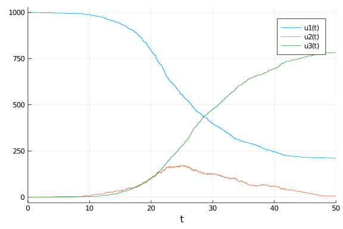

````julia
using DifferentialEquations
using SimpleDiffEq
using Random
using Plots
using BenchmarkTools
````


````julia
function infection_rate(u,p,t)
    (S,I,R) = u
    (β,γ) = p
    N = S+I+R
    β*S*I/N
end
function infection!(integrator)
  integrator.u[1] -= 1
  integrator.u[2] += 1
end
infection_jump = ConstantRateJump(infection_rate,infection!)
````


````
DiffEqJump.ConstantRateJump{typeof(Main.WeaveSandBox20.infection_rate),type
of(Main.WeaveSandBox20.infection!)}(Main.WeaveSandBox20.infection_rate, Mai
n.WeaveSandBox20.infection!)
````


````julia
function recovery_rate(u,p,t)
    (S,I,R) = u
    (β,γ) = p
    γ*I
end
function recovery!(integrator)
  integrator.u[2] -= 1
  integrator.u[3] += 1
end
recovery_jump = ConstantRateJump(recovery_rate,recovery!)
````


````
DiffEqJump.ConstantRateJump{typeof(Main.WeaveSandBox20.recovery_rate),typeo
f(Main.WeaveSandBox20.recovery!)}(Main.WeaveSandBox20.recovery_rate, Main.W
eaveSandBox20.recovery!)
````


````julia
tspan = (0.0,50.0)
u0 = [999.0,1.0,0.0]
p = [0.5,0.25]
Random.seed!(1234)
````


````
Random.MersenneTwister(UInt32[0x000004d2], Random.DSFMT.DSFMT_state(Int32[-
1393240018, 1073611148, 45497681, 1072875908, 436273599, 1073674613, -20437
16458, 1073445557, -254908435, 1072827086  …  -599655111, 1073144102, 36765
5457, 1072985259, -1278750689, 1018350124, -597141475, 249849711, 382, 0]),
 [0.0, 0.0, 0.0, 0.0, 0.0, 0.0, 0.0, 0.0, 0.0, 0.0  …  0.0, 0.0, 0.0, 0.0, 
0.0, 0.0, 0.0, 0.0, 0.0, 0.0], UInt128[0x00000000000000000000000000000000, 
0x00000000000000000000000000000000, 0x00000000000000000000000000000000, 0x0
0000000000000000000000000000000, 0x00000000000000000000000000000000, 0x0000
0000000000000000000000000000, 0x00000000000000000000000000000000, 0x0000000
0000000000000000000000000, 0x00000000000000000000000000000000, 0x0000000000
0000000000000000000000  …  0x00000000000000000000000000000000, 0x0000000000
0000000000000000000000, 0x00000000000000000000000000000000, 0x0000000000000
0000000000000000000, 0x00000000000000000000000000000000, 0x0000000000000000
0000000000000000, 0x00000000000000000000000000000000, 0x0000000000000000000
0000000000000, 0x00000000000000000000000000000000, 0x0000000000000000000000
0000000000], 1002, 0)
````


````julia
prob = DiscreteProblem(u0,tspan,p)
prob_sir_jump = JumpProblem(prob,Direct(),infection_jump,recovery_jump)
sol_sir_jump = solve(prob_sir_jump,FunctionMap())
````


````
retcode: Success
Interpolation: left-endpoint piecewise constant
t: 3151-element Array{Float64,1}:
  0.0
  0.0
  1.0
  2.0
  2.215004782899086
  2.215004782899086
  2.6506894802326073
  2.6506894802326073
  3.6506894802326073
  3.9639892224020175
  ⋮
 48.19448263110623
 49.19448263110623
 49.24586855215085
 49.24586855215085
 49.65703941639901
 49.65703941639901
 49.671067280710226
 49.671067280710226
 50.0
u: 3151-element Array{Array{Float64,1},1}:
 [999.0, 1.0, 0.0]
 [999.0, 1.0, 0.0]
 [999.0, 1.0, 0.0]
 [999.0, 1.0, 0.0]
 [999.0, 1.0, 0.0]
 [998.0, 2.0, 0.0]
 [998.0, 2.0, 0.0]
 [998.0, 1.0, 1.0]
 [998.0, 1.0, 1.0]
 [998.0, 1.0, 1.0]
 ⋮
 [212.0, 7.0, 781.0]
 [212.0, 7.0, 781.0]
 [212.0, 7.0, 781.0]
 [212.0, 6.0, 782.0]
 [212.0, 6.0, 782.0]
 [212.0, 5.0, 783.0]
 [212.0, 5.0, 783.0]
 [211.0, 6.0, 783.0]
 [211.0, 6.0, 783.0]
````


````julia
plot(sol_sir_jump,vars=[(0,1),(0,2),(0,3)])
````




````julia
@benchmark solve(prob_sir_jump,FunctionMap())
````


````
BenchmarkTools.Trial: 
  memory estimate:  13.48 KiB
  allocs estimate:  116
  --------------
  minimum time:     11.399 μs (0.00% GC)
  median time:      198.600 μs (0.00% GC)
  mean time:        1.104 ms (3.26% GC)
  maximum time:     35.880 ms (0.00% GC)
  --------------
  samples:          4483
  evals/sample:     1
````


