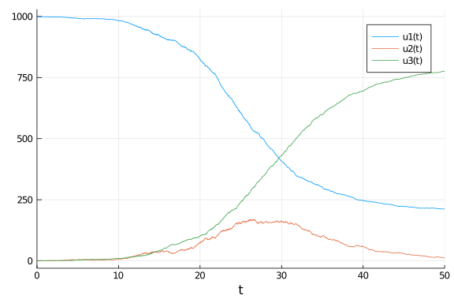

````julia
using DifferentialEquations
using StochasticDiffEq
using Random
using SparseArrays
using Plots
````


````julia
function sir_ode(du,u,p,t)
    (S,I,R) = u
    (β,γ) = p
    N = S+I+R
    @inbounds begin
        du[1] = -β*S*I/N
        du[2] = β*S*I/N - γ*I
        du[3] = γ*I
    end
    nothing
end
````


````
sir_ode (generic function with 1 method)
````


````julia
# Define a sparse matrix by making a dense matrix and setting some values as not zero
A = zeros(3,2)
A[1,1] = 1
A[2,1] = 1
A[2,2] = 1
A[3,2] = 1
A = SparseArrays.sparse(A)
````


````
3×2 SparseArrays.SparseMatrixCSC{Float64,Int64} with 4 stored entries:
  [1, 1]  =  1.0
  [2, 1]  =  1.0
  [2, 2]  =  1.0
  [3, 2]  =  1.0
````


````julia
# Make `g` write the sparse matrix values
function sir_noise(du,u,p,t)
    (S,I,R) = u
    (β,γ) = p
    N = S+I+R
    ifrac = β*I/N*S
    rfrac = γ*I
    du[1,1] = -sqrt(ifrac)
    du[2,1] = sqrt(ifrac)
    du[2,2] = -sqrt(rfrac)
    du[3,2] = sqrt(rfrac)
end
````


````
sir_noise (generic function with 1 method)
````


````julia
tspan = (0.0,50.0)
u0 = [999.0,1.0,0.0]
p = [0.5,0.25]
Random.seed!(1234)
````


````
Random.MersenneTwister(UInt32[0x000004d2], Random.DSFMT.DSFMT_state(Int32[-
1393240018, 1073611148, 45497681, 1072875908, 436273599, 1073674613, -20437
16458, 1073445557, -254908435, 1072827086  …  -599655111, 1073144102, 36765
5457, 1072985259, -1278750689, 1018350124, -597141475, 249849711, 382, 0]),
 [0.0, 0.0, 0.0, 0.0, 0.0, 0.0, 0.0, 0.0, 0.0, 0.0  …  0.0, 0.0, 0.0, 0.0, 
0.0, 0.0, 0.0, 0.0, 0.0, 0.0], UInt128[0x00000000000000000000000000000000, 
0x00000000000000000000000000000000, 0x00000000000000000000000000000000, 0x0
0000000000000000000000000000000, 0x00000000000000000000000000000000, 0x0000
0000000000000000000000000000, 0x00000000000000000000000000000000, 0x0000000
0000000000000000000000000, 0x00000000000000000000000000000000, 0x0000000000
0000000000000000000000  …  0x00000000000000000000000000000000, 0x0000000000
0000000000000000000000, 0x00000000000000000000000000000000, 0x0000000000000
0000000000000000000, 0x00000000000000000000000000000000, 0x0000000000000000
0000000000000000, 0x00000000000000000000000000000000, 0x0000000000000000000
0000000000000, 0x00000000000000000000000000000000, 0x0000000000000000000000
0000000000], 1002, 0)
````


````julia
prob_sir_sde = SDEProblem(sir_ode,sir_noise,u0,tspan,p,noise_rate_prototype=A)
sol_sir_sde = solve(prob_sir_sde,SRA1())
````


````
retcode: Success
Interpolation: 1st order linear
t: 2301-element Array{Float64,1}:
  0.0
  0.0028241570871901473
  0.0037569107538692
  0.004806258628883135
  0.005986774988273811
  0.007314855892588322
  0.008808946909942147
  0.0104897993044652
  0.012380758248303637
  0.014508087060121877
  ⋮
 49.75523533431953
 49.787415581163984
 49.81967515909253
 49.851758878619414
 49.8839062607085
 49.91606500714664
 49.948319973891095
 49.98060260983176
 50.0
u: 2301-element Array{Array{Float64,1},1}:
 [999.0, 1.0, 0.0]
 [998.9731512423181, 1.0426734179343828, -0.01582466025245144]
 [998.9571056898658, 1.062769178992927, -0.019874868858805073]
 [998.9931164509287, 0.9949426129267545, 0.011940936144535994]
 [998.9635332153165, 1.001181429296603, 0.035285355386925565]
 [999.0165128733427, 0.9797075405293867, 0.0037795861280098472]
 [999.0083806313305, 0.9804900428476405, 0.011129325821887012]
 [999.0094318504565, 0.9887582028436326, 0.0018099466999458268]
 [999.0076815119223, 0.9703295746983102, 0.021988913379408483]
 [998.9627192725673, 1.0360800852379282, 0.0012006421949703784]
 ⋮
 [212.3796825632129, 12.858667879018249, 774.7616495577685]
 [212.0494719127545, 12.8018730324737, 775.1486550547714]
 [212.2231916845521, 12.613681416738066, 775.1631268987095]
 [212.08412785194776, 12.554963118203451, 775.3609090298485]
 [212.08777511051156, 12.721096009604155, 775.191128879884]
 [212.02048198407414, 12.599698225757999, 775.3798197901675]
 [211.99332296108477, 12.383552672149058, 775.6231243667658]
 [212.0870564845884, 11.419181402058177, 776.493762113353]
 [212.1876534892215, 11.33136093912622, 776.4809855716518]
````


````julia
plot(sol_sir_sde,vars=[(0,1),(0,2),(0,3)])
````



