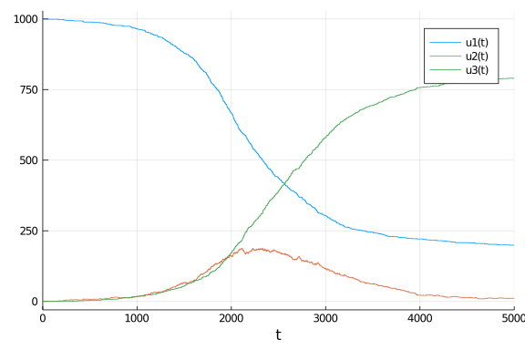

````julia
using DifferentialEquations
using SimpleDiffEq
using Distributions
using Random
using Plots
using BenchmarkTools
````


````julia
@inline function rate_to_proportion(r::Float64,t::Float64)
    1-exp(-r*t)
end
````


````
rate_to_proportion (generic function with 1 method)
````


````julia
function sir_discrete_stochastic(du,u,p,t)
    (S,I,R) = u
    (β,γ,δt) = p
    N = S+I+R
    ifrac = rate_to_proportion(β*I/N,δt)
    rfrac = rate_to_proportion(γ,δt)
    infection=rand(Binomial(S,ifrac))
    recovery=rand(Binomial(I,rfrac))
    @inbounds begin
        du[1] = S-infection
        du[2] = I+infection-recovery
        du[3] = R+recovery
    end
    nothing
end
````


````
sir_discrete_stochastic (generic function with 1 method)
````


````julia
δt = 0.01
nsteps = 5000
tf = nsteps*δt
tspan = (0.0,nsteps)
````


````
(0.0, 5000)
````


````julia
u0 = [999,1,0]
p = [0.5,0.25,0.01]
````


````
3-element Array{Float64,1}:
 0.5
 0.25
 0.01
````


````julia
Random.seed!(1234)
````


````
Random.MersenneTwister(UInt32[0x000004d2], Random.DSFMT.DSFMT_state(Int32[-
1393240018, 1073611148, 45497681, 1072875908, 436273599, 1073674613, -20437
16458, 1073445557, -254908435, 1072827086  …  -599655111, 1073144102, 36765
5457, 1072985259, -1278750689, 1018350124, -597141475, 249849711, 382, 0]),
 [0.0, 0.0, 0.0, 0.0, 0.0, 0.0, 0.0, 0.0, 0.0, 0.0  …  0.0, 0.0, 0.0, 0.0, 
0.0, 0.0, 0.0, 0.0, 0.0, 0.0], UInt128[0x00000000000000000000000000000000, 
0x00000000000000000000000000000000, 0x00000000000000000000000000000000, 0x0
0000000000000000000000000000000, 0x00000000000000000000000000000000, 0x0000
0000000000000000000000000000, 0x00000000000000000000000000000000, 0x0000000
0000000000000000000000000, 0x00000000000000000000000000000000, 0x0000000000
0000000000000000000000  …  0x00000000000000000000000000000000, 0x0000000000
0000000000000000000000, 0x00000000000000000000000000000000, 0x0000000000000
0000000000000000000, 0x00000000000000000000000000000000, 0x0000000000000000
0000000000000000, 0x00000000000000000000000000000000, 0x0000000000000000000
0000000000000, 0x00000000000000000000000000000000, 0x0000000000000000000000
0000000000], 1002, 0)
````


````julia
prob_sir_discrete_stochastic = DiscreteProblem(sir_discrete_stochastic,u0,tspan,p)
sol_sir_discrete_stochastic = solve(prob_sir_discrete_stochastic,solver=FunctionMap)
````


````
retcode: Success
Interpolation: left-endpoint piecewise constant
t: 5001-element Array{Float64,1}:
    0.0
    1.0
    2.0
    3.0
    4.0
    5.0
    6.0
    7.0
    8.0
    9.0
    ⋮
 4992.0
 4993.0
 4994.0
 4995.0
 4996.0
 4997.0
 4998.0
 4999.0
 5000.0
u: 5001-element Array{Array{Int64,1},1}:
 [999, 1, 0]
 [999, 1, 0]
 [999, 1, 0]
 [999, 1, 0]
 [999, 1, 0]
 [999, 1, 0]
 [999, 1, 0]
 [999, 1, 0]
 [999, 1, 0]
 [999, 1, 0]
 ⋮
 [199, 11, 790]
 [199, 11, 790]
 [199, 11, 790]
 [199, 11, 790]
 [199, 11, 790]
 [199, 11, 790]
 [199, 11, 790]
 [199, 11, 790]
 [199, 10, 791]
````


````julia
plot(sol_sir_discrete_stochastic)
````




````julia
@benchmark solve(prob_sir_discrete_stochastic,solver=FunctionMap)
````


````
BenchmarkTools.Trial: 
  memory estimate:  670.05 KiB
  allocs estimate:  5079
  --------------
  minimum time:     1.376 ms (0.00% GC)
  median time:      2.108 ms (0.00% GC)
  mean time:        2.384 ms (3.07% GC)
  maximum time:     28.511 ms (0.00% GC)
  --------------
  samples:          2088
  evals/sample:     1
````


