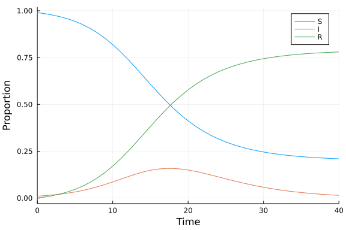
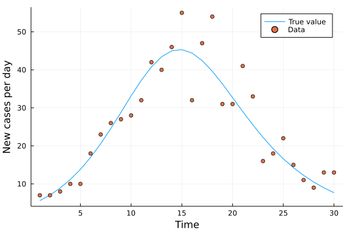
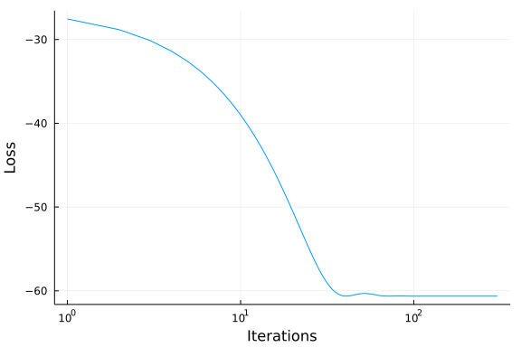
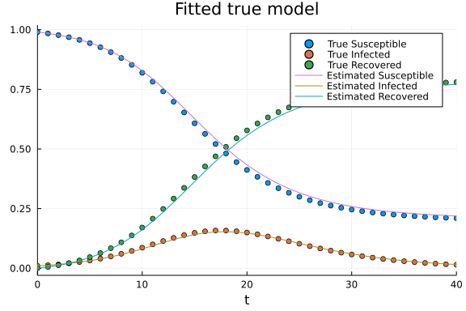
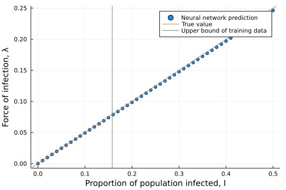
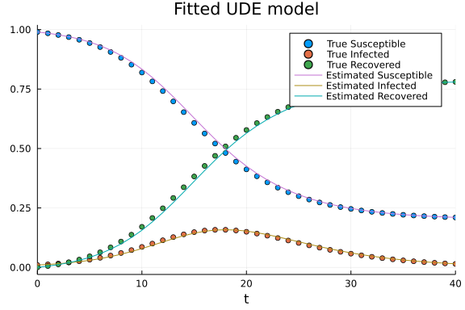
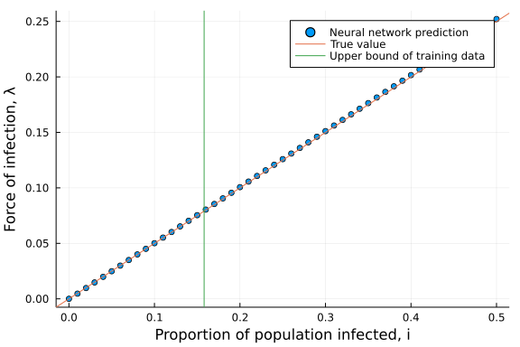

# Universal differential equation
Simon Frost (@sdwfrost), 2022-03-28

## Introduction

[Universal differential equations](https://arxiv.org/abs/2001.04385) combine neural networks with differential equation models, in order to combine domain-specific knowledge with data-driven insights. In this tutorial, we use a neural network to model the force of infection without making prior assumptions of the functional form, using noisy data of the number of new infections per day.

## Libraries

```julia
using OrdinaryDiffEq
using Distributions
using DiffEqFlux, Flux
using Random
using Plots;
```


```julia
Random.seed!(123);
```


## Transitions

```julia
function sir_ode(u,p,t)
    (S,I,C) = u
    (β,γ) = p
    dS = -β*S*I
    dI = β*S*I - γ*I
    dC = β*S*I
    [dS,dI,dC]
end;
```


## Settings

```julia
solver = RadauIIA3();
```


Although the model is in terms of proportions of susceptible, infected, and recovered individuals, we define the total population size, `N`, so we can generate random data of the number of new cases per day.

```julia
N = 1000.0
p = [0.5,0.25]
u0 = [0.99, 0.01, 0.0]
tspan = (0., 40.)
δt = 1;
```


## Solving the true model

```julia
sir_prob = ODEProblem(sir_ode, u0, tspan, p)
sir_sol = solve(sir_prob, solver, saveat = δt);
```


```julia
plot(sir_sol,
     xlabel = "Time",
     ylabel = "Proportion",
     labels = ["S" "I" "R"])
```




## Generating 'observed' data

We define the time over which the training data are generated, and generate noisy data corresponding to the number of new cases per day.

```julia
train_time = 30.0
tsdata = Array(sir_sol(0:δt:train_time))
cdata = diff(tsdata[3,:])
noisy_data = rand.(Poisson.(N .* cdata));
```


```julia
plot(1:δt:train_time, N .* cdata,
     xlabel = "Time",
     ylabel = "New cases per day",
     label = "True value")
scatter!(1:δt:train_time, noisy_data, label="Data")
```




##  Single layer network

We start by defining a single neural network layer with one input and one output and no bias parameter, which is the true relationship between `i` and the force of infection.

```julia
foi1 = FastDense(1, 1, relu, bias=false)
p1_ = Float64.(initial_params(foi1))
length(p1_)
```

```
1
```


The following model allows one to change the function used to describe the force of infection, i.e. the per-capita rate at which susceptible individuals become infected.

```julia
function sir_ude(u,p_,t,foi)
    S,I,C = u
    β,γ = p
    λ = foi([I],p_)[1]
    dS = -λ*S
    dI = λ*S - γ*I
    dC = λ*S
    [dS, dI, dC]
end;
```


```julia
tspan_train = (0,train_time)
sir_ude1 = (u,p_,t) -> sir_ude(u,p_,t,foi1)
prob_ude1 = ODEProblem(sir_ude1,
                      u0,
                      tspan_train,
                      p1_);
```


To fit this model, we first need to define a function that predicts the outcome given a set of parameters.

```julia
function predict(θ, prob)
    Array(solve(prob,
                solver;
                u0 = u0,
                p = θ,
                saveat = δt,
                sensealg = InterpolatingAdjoint(autojacvec=ReverseDiffVJP())))
end;
```


Secondly, we define a loss function that uses this predict function to calculate the loss between the predicted data and the true data. We employ a Poisson loss, as we are comparing our model against counts of new cases.

```julia
function loss(θ, prob)
    pred = predict(θ, prob)
    cpred = abs.(N*diff(pred[3,:]))
    Flux.poisson_loss(cpred, float.(noisy_data)), cpred
end;
```


We run this function once to make sure it is precompiled.

```julia
loss(prob_ude1.p, prob_ude1);
```


To keep track of the running of the model, we store the losses in a `Vector` and use a callback to report on the model fit every 10 epochs.

```julia
const losses1 = []
callback1 = function (p, l, pred)
    push!(losses1, l)
    numloss = length(losses1)
    if numloss % 10 == 0
        display("Epoch: " * string(numloss) * " Loss: " * string(l))
    end
    return false
end;
```


```julia
res_ude1 = DiffEqFlux.sciml_train((θ)->loss(θ,prob_ude1),
                                  p1_,
                                  cb=callback1);
```

```
"Epoch: 10 Loss: -39.00099155197511"
"Epoch: 20 Loss: -50.51312002278301"
"Epoch: 30 Loss: -58.34133397521935"
"Epoch: 40 Loss: -60.628328769882685"
"Epoch: 50 Loss: -60.33309908772984"
"Epoch: 60 Loss: -60.4812262990612"
"Epoch: 70 Loss: -60.63218291538371"
"Epoch: 80 Loss: -60.618518919438685"
"Epoch: 90 Loss: -60.62672523575849"
"Epoch: 100 Loss: -60.63346389057615"
"Epoch: 110 Loss: -60.63250890232074"
"Epoch: 120 Loss: -60.63335399125655"
"Epoch: 130 Loss: -60.63342412764017"
"Epoch: 140 Loss: -60.63343148266851"
"Epoch: 150 Loss: -60.633476158575405"
"Epoch: 160 Loss: -60.63347027838894"
"Epoch: 170 Loss: -60.633476185991725"
"Epoch: 180 Loss: -60.633475628270716"
"Epoch: 190 Loss: -60.633476230633306"
"Epoch: 200 Loss: -60.63347628181289"
"Epoch: 210 Loss: -60.63347631887935"
"Epoch: 220 Loss: -60.63347631585506"
"Epoch: 230 Loss: -60.63347632102643"
"Epoch: 240 Loss: -60.63347632765214"
"Epoch: 250 Loss: -60.633476327484836"
"Epoch: 260 Loss: -60.63347632596865"
"Epoch: 270 Loss: -60.633476326231936"
"Epoch: 280 Loss: -60.633476326866415"
"Epoch: 290 Loss: -60.633476326761304"
"Epoch: 300 Loss: -60.633476326553755"
```


The fitted parameter in this model corresponds to the infectivity parameter, `β`.

```julia
res_ude1.minimizer, losses1[end]
```

```
([0.492454443625518], -60.633476326647084)
```


This model is fast to converge to an optimum due to the small number of trainable parameters.

```julia
plot(losses1, xaxis = :log, xlabel = "Iterations", ylabel = "Loss", legend=false)
```




The fitted model provides a good fit to all the states, despite only being trained on a noisy representation of the number of new infections.

```julia
prob_ude1_fit = ODEProblem(sir_ude1, u0, tspan, res_ude1.minimizer)
sol_ude1_fit = solve(prob_ude1_fit, solver, saveat = δt)
scatter(sir_sol, label=["True Susceptible" "True Infected" "True Recovered"],title="Fitted true model")
plot!(sol_ude1_fit, label=["Estimated Susceptible" "Estimated Infected" "Estimated Recovered"])
```




This plots the relationship between `i` and the force of infection, `λ`, which shows a good match.

```julia
Imax = maximum(tsdata[2,:])
Igrid = 0:0.01:0.5
λ = [foi1([I],res_ude1.minimizer)[1] for I in Igrid]
scatter(Igrid,λ,xlabel="Proportion of population infected, I",ylab="Force of infection, λ",label="Neural network prediction")
Plots.abline!(p[1],0,label="True value")
Plots.vline!([Imax],label="Upper bound of training data")
```




## Multiple layer network

In the absence of prior knowledge, we use a neural network with multiple layers.

```julia
Random.seed!(1234)
nhidden = 4
foi2 = FastChain(FastDense(1, nhidden, relu),
                     FastDense(nhidden, nhidden, relu),
                     FastDense(nhidden, 1, relu))
p2_ = Float64.(initial_params(foi2))
length(p2_)
```

```
33
```


We wrap this neural network in a new `ODEProblem`.

```julia
sir_ude2 = (u,p_,t) -> sir_ude(u,p_,t,foi2)
prob_ude2 = ODEProblem(sir_ude2,
                      u0,
                      tspan_train,
                      p2_);
```


We define a new data structure to store the losses from the fitting of this more complex model.

```julia
const losses2 = []
callback2 = function (p, l, pred)
    push!(losses2, l)
    numloss = length(losses2)
    if numloss % 10 == 0
        display("Epoch: " * string(numloss) * " Loss: " * string(l))
    end
    return false
end;
```


```julia
res_ude2 = DiffEqFlux.sciml_train((θ)->loss(θ,prob_ude2),
                                  p2_,
                                  cb = callback2);
```

```
"Epoch: 10 Loss: -52.526479241048214"
"Epoch: 20 Loss: -49.66919878523091"
"Epoch: 30 Loss: -49.426796587351234"
"Epoch: 40 Loss: -50.19110894239793"
"Epoch: 50 Loss: -51.15213349741302"
"Epoch: 60 Loss: -52.032606104623184"
"Epoch: 70 Loss: -52.7788667977758"
"Epoch: 80 Loss: -53.40288357842423"
"Epoch: 90 Loss: -53.92299123291672"
"Epoch: 100 Loss: -54.348585124718205"
"Epoch: 110 Loss: -54.679957396225"
"Epoch: 120 Loss: -54.91506107537768"
"Epoch: 130 Loss: -55.05892361670163"
"Epoch: 140 Loss: -55.12980523871493"
"Epoch: 150 Loss: -55.15545776653773"
"Epoch: 160 Loss: -55.16146058044731"
"Epoch: 170 Loss: -55.1627054661243"
"Epoch: 180 Loss: -55.163764014261716"
"Epoch: 190 Loss: -55.165087583868264"
"Epoch: 200 Loss: -55.166456867854116"
"Epoch: 210 Loss: -55.167807114361736"
"Epoch: 220 Loss: -55.16917239985154"
"Epoch: 230 Loss: -55.170580966651386"
"Epoch: 240 Loss: -55.17204061788331"
"Epoch: 250 Loss: -55.17355100731457"
"Epoch: 260 Loss: -55.17510997305975"
"Epoch: 270 Loss: -55.17673134595732"
"Epoch: 280 Loss: -55.178408074784215"
"Epoch: 290 Loss: -55.180138878780475"
"Epoch: 300 Loss: -55.18192719866335"
"Epoch: 310 Loss: -60.648178097248795"
```


Overall, the 'true' model and the more flexible model give a comparable fit to the data in terms of the loss function.

```julia
losses1[end],losses2[end]
```

```
(-60.633476326647084, -60.6481780973237)
```


Consistent with this, the multilayer model gives a good fit when plotted alongside the data.

```julia
prob_ude2_fit = ODEProblem(sir_ude2, u0, tspan, res_ude2.minimizer)
sol_ude2_fit = solve(prob_ude2_fit, solver, saveat = δt)
scatter(sir_sol, label=["True Susceptible" "True Infected" "True Recovered"],title="Fitted UDE model")
plot!(sol_ude2_fit, label=["Estimated Susceptible" "Estimated Infected" "Estimated Recovered"])
```




This is the inferred functional relationship between the proportion of infected individuals and the force of infection.

```julia
λ = [foi2([I],res_ude2.minimizer)[1] for I in Igrid]
scatter(Igrid, λ, xlabel="Proportion of population infected, i", ylab="Force of infection, λ", label="Neural network prediction")
Plots.abline!(p[1], 0,label="True value")
Plots.vline!([Imax], label="Upper bound of training data")
```




## Discussion

The number of new infections per day is sufficient to fit an SIR model assuming the correct functional form for the force of infection. A universal differential equation that uses a multilayer neural network to infer the relationship between the proportion of infected individuals and the force of infection recovers the true relationship, at least for the range of the size of the infected subpopulation seen in the training data. As we would expect that the force of infection would be higher when there are more infected individuals, we could adapt the neural network to reflect a monotonic relationship, either by constraining the neural network, or by introducing a penalty term in the loss function.
